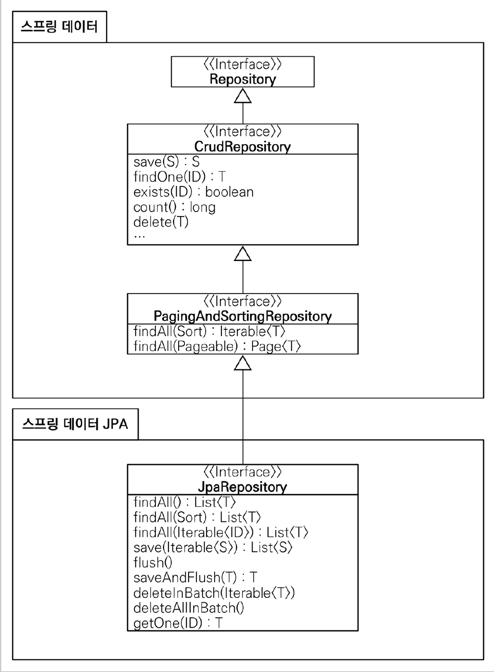

# 실전! 스프링 데이터 JPA

김영한 님의 인프런 강좌 `실전! 스프링 데이터 JPA` 를 실습한 프로젝트 입니다.
(https://www.inflearn.com/course/%EC%8A%A4%ED%94%84%EB%A7%81-%EB%8D%B0%EC%9D%B4%ED%84%B0-JPA-%EC%8B%A4%EC%A0%84)

## 공통 인터페이스



- 패키지 구조를 유심히 보자!
- 공통 인터페이스는 기본 CRUD의 반복 작업을 줄이는(노가다를 줄이는) 기술
- `save(S)`: 새로운엔티티 저장, 이미 있는 엔티티는 merge
- `getOne(ID)` : 엔티티 프록시 조회. `EntityManager.getReference()` 호출
- `findAll(...)` : 모든 엔티티 조회. 정렬(`Sort`), 페이징(`Pageable`) 조건 파라메터로 제공

## 메소드 이름으로 쿼리 생성

메소드 이름으로 where, count, exists, limit 절 등을 정의

Query Creation: https://docs.spring.io/spring-data/jpa/docs/current/reference/html/#jpa.query-methods.query-creation

### 필요성
- 조건이 2개 이하일때만 유효하다. 2개 이상이면 QueryDSL 로 푼다.
- 짧은 쿼리를 빠르게 만들때 필요


## NamedQuery

- NamedQuery -> 메소드 이름 쿼리 생성 우선순위 순으로 쿼리 생성
- 장점: application 로딩 시점에 JPQL의 오류를 찾아낸다.
- 실무에선 크게 사용성이 떨어짐 (@Query 로 대체 가능하기 때문)

## @Query

- 장점
  - application 로딩 시점에 JPQL의 오류를 찾아낸다(NamedQuery랑 같음)
  - Repository 에 직접 쿼리를 작성함으로 보기 편함.
  - 메소드 이름으로 작성하는 것에 비해 조건이 길어지면 유리하다

## 파라메터 바인딩

- 이름 기반 vs 위치 기반? -> 무조건 이름 기반으로..
- 컬렉션 파라메터 바인딩

## 반환 타입

- 컬랙션 반환에서 결과가 없으면 `size()` 는 0인 빈 컬랙션 반환된다.  
- JPA 에서는 `getSingleResuit()` 결과가 없다면 `NoResultException`이 발생
- Spring Data Jpa 에서 1개 반환 타입이면 `null` 이 온다.
- 자세한 것 : https://docs.spring.io/spring-data/jpa/docs/current/reference/html/#repository-query-return-types

## 페이징과 정렬

### 파라미터

- `org.springframework.data.domain.Sort` : 정렬기능
- `org.springframework.data.domain.Pageable` : 페이징 기능(내부 `Sort` 포함)
  - page index 는 `0` 부터 시작한다.

### 특별한 반환타입

- `org.springframework.data.domain.Page` : count 쿼리 결과 포함된 페이징
- `org.springframework.data.domain.Slice` : count 쿼리 없음. 다음 페이지 확인 가능
- `List` : 추가 count 쿼리 없이 결과만 반환
- *(중요)* API 단에 반환하지 마라. DTO 로 변환하여 반환해라.

## 벌크성 수정 쿼리

- `@Modifying` 
  - `@Query` 가 변경 쿼리임을 선언해 줘야 함
  - `(주의)` 벌크 연산 전의 영속성 컨텍스트와 불일치 이슈 존재 -> clear()를 꼭 해야주어야 한다.

## @EntityGraph

- 지연 로딩 - 연관관계를 실제 사용할 때 DB 조회를 함
  - 지연 상태의 엔티티는 (임시로) 엔티티 프록시 객체로 채워 놓는다(초기화 한다).
  - 실제 연관관계 객체의 프로퍼티를 사용할 때! -> 조회쿼리를 실행(lazy loading)한다. 
- 지연 로딩 인한 문제점
  - N + 1 문제 : 지연로딩으로 인해 나중에 추가로 N건 으로 조회를 나중에 하는 것
- 해결책 : 페치 조인
  - JPQL 의 join fetch
  - 패치조인 기능 wrapper `@EntityGraph`
- 응용
  - 간단한 join 쿼리 경우 `@EntityGraph`
  - 복잡해지면 JPQL(`@Query`) 에서 직접 지정이 더 낫다. 

## JPA Hint & Lock

### JPA Hint

- 예) `@QueryHints(value = @QueryHint(name = "org.hibernate.readOnly", value = "true"))`
  - dirty checking skip
- QueryHint 는 JPA 구현체의 특정 기능 사용 가능하게 구멍을 만듦

### Lock

- `select for update` - 비관적 락: 해당 레코드를 변경 시도할 때 잠시 막음
- 자세한 것은 영한님 JPA 책 마지막 장 보기
- 응용: 실시간 서비스에는 지양, 정합성이 중요한 경우에 쓴다.

## 확장 기능

### 사용자 정의 리포지토리 구현

- 스프링 데이터 JPA 리포지토리는 인터페이스로만 정의됨, 구현은 없음
- 스프링 데이터 JPA 리포지토리로 한계가 있는 기능이 존재
  - 복잡한 쿼리(통계)
  - 동적 쿼리
  - etc..
- 다양한 이유로 인터페이스의 메서드를 직접 구현하고 싶을 때
  - JPA 직접 사용
  - JDBCTemplate
  - MyBatis
  - 데이터베이스 커넥션 직접 사용
  - (추천) Querydsl 사용
  

- 규칙!: 구현체의 class 명
  - (과거) `{리포지토리 인터페이스 이름} + Impl`
  - (추천) `{사용자 정의 인터페이스 명} + Impl`

  
- Impl 대신 다른 이름으로 변경하고 싶으면?(왠만하면 관례를 따라 만드는걸 권장!)
```java
@EnableJpaRepositories(basePackages = "study.datajpa.repository",  repositoryImplementationPostfix = "Impl")
```

#### 응용
- 모든 레포지토리를 사용자 정의로 만들진 말자.
- 성격에 따라 아예 분리하는게 나을 수 있다.
  - 커멘드 vs 쿼리 분리
  - 핵심 비즈니스로직 vs 그 외(단순 화면조회용) 

### Auditing

- 모든 테이블에 공통적으로 들어갈 칼럼
  - 등록일
  - 수정일
  - 등록자
  - 수정자

- JPA 주요 이벤트 어노테이션
  - `@PrePersis`
  - `@PostPersis`
  - `@PreUpdate`
  - `@PostUpdate`

- 좋은점
  - 공통화: 모든 엔티티에 대해 한번에 적용할 수 있다.
  
### web 확장

- 다음 객체들이 컨트롤러의 파라메터로 설정 가능하다. 
  - 도메인 클래스
    - (추천하지 않음) 엔티티를 컨트롤러 단에서 쓰는건 좋지 않음
  - 페이징과 정렬
    - 예) `members?page=2&size=3&sort=username,desc`
    - 접두사: 페이징 정보가 2개 이상일때 사용
      - 예) `/members?member_page=0&order_page=1`
      - ```java
        public String list(
        @Qualifier("member") Pageable memberPageable,
        @Qualifier("order") Pageable orderPageable, ...
        ```
    - (중요!!) 페이지의 내용을 DTO 로 변환
      - 엔티티를 API 에 노출하지 말자!
      - 엔티티는 DTO 의존 X, DTO 는 엔티티에 의존 해도 됨
    - 스프링 데이터는 Page를 0부터 시작한다.
      - 만약 1부터 시작하려면?
        1. Pageable, Page를 파리미터와 응답 값으로 사용히자 않고, 직접 클래스를 만들어서 처리한다. 그리고
           직접 PageRequest(Pageable 구현체)를 생성해서 리포지토리에 넘긴다. 물론 응답값도 Page 대신에
           직접 만들어서 제공해야 한다.
        2. `spring.data.web.pageable.one-indexed-parameters` 를 `true` 로 설정한다. 그런데 이 방법은
           web에서 page 파라미터를 -1 처리 할 뿐이다. 따라서 응답값인 Page 에 모두 0 페이지 인덱스를
           사용하는 한계가 있다.

## 스프링 데이터 JPA 구현체 분석

### `SimpleJpaRepository<T, ID>`

- `@Repository` 
  - 스프링 빈 컴포넌트 스캔 대상
  - 영속성 계층의 예외들을 서로 다른 기술의 Exception -> 스프링 Exception 으로 변환

- `@Transactional`
  - 일단 기본 메서드들은 읽기전용 트랜젝션을 결고 시작한다는 의미
  - JPA 의 변경은 모든 것들이 트렌젝션 안에서 실행되어야 한다
  - 서비스 계층에서 트랜잭션을 시작하지 않으면 리파지토리에서 트랜잭션 시작 
  - 서비스 계층에서 트랜잭션을 시작하면 리파지토리는 해당 트랜잭션을 전파 받아서 사용
  - 트렌젝션이 없어도 등록,변경 가능한 이유
    - 예) `save(S entity)`
  
- `@Transactional(readOnly = true)`
  - flush 생략함 -> 약간의 성능향상
  - dirty checking(변경감지) 없음
  
- (중요!!)`save()` 메시드
  - 새로운 엔티티면 저장 `persist`
  - 새로운 엔티티가 아니면 병합 `merge`
    - DB에 이미 존재하는지 읽기 쿼리를 먼저 1번 함(성능상 불리함)
    - update 용도가 아님!
    - (중요) merge 는 쓸 일이 별로 없다.


### 새로운 엔티티를 구별하는 방법
  - 식별자가 객체일 때 null 로 판단 
  - 식별자가 자바 기본 타입(primitive type)일 때 0 으로 판단
  - `Persistable` 인터페이스를 구현해서 판단 로직 변경 가능

참고: 엔티티의 JPA 식별자 생성 전략이 `@Id` 만 사용해서 직접 할당할 경우
  - 이미 식별자 값이 있는 상태로 save() 를 호출
  - 따라서 이 경우 merge() 가 호출
  - (결론) Persistable 를 사용해서 새로운 엔티티 확인 여부를 직접 구현하게는 효과적

## 나머지 기능들

### Projections

엔티티 대신에 DTO를 조회할 때 사용
- 예) 전체 엔티티가 아니라 회원 이름만 조회하기

- 종류
  - 인터페이스 기반 Closed Projections
  - 인터페이스 기반 Open Proejctions
  - 클래스 기반 Projection
  - 동적 프로젝션
  - 중첩 구조 처리
    - 프로젝션 대상이 root 엔티티면, JPQL SELECT 절 최적화 가능 
    - 프로젝션 대상이 ROOT가 아니면
      - LEFT OUTER JOIN 처리
      - 모든 필드를 SELECT해서 엔티티로 조회한 다음에 계산
  
- 정리
  - 프로젝션 대상이 root 엔티티면 유용하다.
  - 프로젝션 대상이 root 엔티티를 넘어가면 JPQL SELECT 최적화가 안된다!
  - 실무의 복잡한 쿼리를 해결하기에는 한계가 있다.
  - 실무에서는 단순할 때만 사용하고, 조금만 복잡해지면 `QueryDSL` 을 사용하자

### Native Query

가급적 사용하지 않도록 함 -> *네이티브 SQL을 DTO로 조회할 때는 `JdbcTemplate` or `myBatis` 권장*

#### Projections 활용

- 새로 들어온 기능

#### 동적 네이티브 쿼리

- 하이버네이트를 직접 활용
- 스프링 `JdbcTemplate`, `myBatis`, `jooq` 같은 외부 라이브러리 사용
