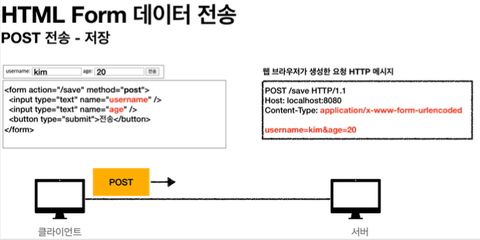
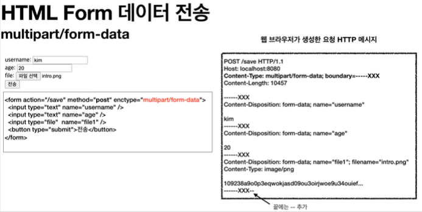

# Spring : 파일 업로드

## 파일 업로드 소개

HTML 폼 전송 방식

- `application/x-www-form-urlencoded`
- `multipart/form-data`

### application/x-www-form-urlencoded 방식



- 파일을 업로드 하려면 파일은 문자가 아니라 **바이너리 데이터**를 전송
- 보통 폼을 전송할 때 파일만 전송하는 것이 아님
  - 예)
    - 이름
    - 나이
    - 첨부파일
- **문자와 바이너리를 동시에 전송하는 수단**이 필요함

### multipart/form-data 방식



- Form 태그에 별도의 `enctype="multipart/form-data"` 를 지정
- 다른 종류의 여러 파일과 폼의 내용 함께 전송
- `Content-Disposition` 항목별 헤더, 부가정보
  - 이름, 나이 : 항목별로 문자가 전송
  - 첨부 파일 : 이름, Content-Type, 바이너리 데이터
- 각각의 항목(**Part**)을 구분해서, 한번에 전송

## 서블릿과 파일 업로드

### ServletUploadControllerV1

(소스코드 참고)

### 멀티파트 사용 옵션

업로드 사이즈 제한

```properties
spring.servlet.multipart.max-file-size=1MB
spring.servlet.multipart.max-request-size=10MB
```

- `max-file-size` : 파일 하나의 최대 사이즈, 기본 1MB
- `max-request-size` : 멀티파트 요청 하나에 여러 파일을 업로드 할 수 있는데, 그 전체 합이다. 기본 10MB
- 사이즈를 넘으면 예외( `SizeLimitExceededException` )가 발생

`spring.servlet.multipart.enabled=true` (기본 true)

> 참고
>
> `spring.servlet.multipart.enabled` 옵션을 켜면 스프링의 `DispatcherServlet` 에서 멀티파트 리졸버( `MultipartResolver` )를 실행한다.
> 멀티파트 리졸버는 멀티파트 요청인 경우 서블릿 컨테이너가 전달하는 일반적인 `HttpServletRequest` 를 `MultipartHttpServletRequest` 로 변환해서 반환한다.
> `MultipartHttpServletRequest` 는 `HttpServletRequest` 의 자식 인터페이스이고, 멀티파트와 관련된 추가 기능을 제공한다.
> 스프링이 제공하는 기본 멀티파트 리졸버는 `MultipartHttpServletRequest` 인터페이스를 구현한 `StandardMultipartHttpServletRequest` 를 반환한다.
> 이제 컨트롤러에서 `HttpServletRequest` 대신에 `MultipartHttpServletRequest` 를 주입받을 수 있는데, 이것을 사용하면 멀티파트와 관련된 여러가지 처리를 편리하게 할 수 있다. 그런데 이후 강의에서 설명할 MultipartFile 이라는 것을 사용하는 것이 더 편하기 때문에 `MultipartHttpServletRequest` 를 잘 사용하지는 않는다. 더 자세한 내용은 `MultipartResolver` 를 검색해보자.

### 실제 파일을 서버에 업로드 하기

application.properties

```properties
file.dir=파일 업로드 경로 설정(예): /Users/kimyounghan/study/file/
```

주의

1. 꼭해당경로에실제폴더를미리만들어두자.
2. application.properties 에서 설정할 때 마지막에 / (슬래시)가 포함된 것에 주의하자.

### ServletUploadControllerV2

(소스코드 참고)

### 파일 경로 셋업

application.properties 에서 설정한 file.dir 의 값을 주입한다.

```java
   @Value("${file.dir}")
  private String fileDir;
```

### Part 클래스

멀티파트 형식은 전송 데이터를 하나하나 각각 부분( Part )으로 나누어 전송한다. 
parts 에는 이렇게 나누어진 데이터가 각각 담긴다.

Part 주요 메서드

- `part.getSubmittedFileName()` : 클라이언트가 전달한 파일명
- `part.getInputStream()`: Part의 전송 데이터를 읽을 수 있다.
- `part.write(...)`: Part를 통해 전송된 데이터를 저장할 수 있다.

서블릿이 제공하는 Part 는 편하기는 하지만, `HttpServletRequest` 를 사용해야 하고, 추가로 파일 부분만 구분하려면 여러가지 코드를 넣어야 한다.

## 스프링과 파일 업로드

스프링은 `MultipartFile` 이라는 인터페이스로 멀티파트 파일을 매우 편리하게 지원한다.

### SpringUploadController

(소스코드 참고)

### `@RequestParam MultipartFile file`

- HTML Form의 name에 맞추어 @RequestParam 을 적용
- `@ModelAttribute` 에서도 MultipartFile 을 동일하게 사용

### MultipartFile 주요 메서드

- `file.getOriginalFilename()` : 업로드 파일 명
- `file.transferTo(...)` : 파일 저장

## 예제로 구현하는 파일 업로드, 다운로드

### 요구사항

- 상품을 관리
  - 상품 이름
  - 첨부파일 하나
  - 이미지 파일 여러개
- 첨부파일을 업로드 다운로드 할 수 있다.
- 업로드한 이미지를 웹 브라우저에서 확인할 수 있다.

### UploadFile, FileStore, ItemForm, ItemController

(소스코드 참고)

### 유의점

고객이 업로드한 파일명으로 서버 내부에 파일을 저장하면 안된다. 왜냐하면 서로 다른 고객이 같은 파일이름을 업로드 하는 경우 기존 파일 이름과 충돌이 날 수 있다. 서버에서는 저장할 파일명이 겹치지 않도록 내부에서 관리하는 별도의 파일명이 필요하다.

### 다중파일 업로드 하는법

다중 파일 업로드를 하려면 multiple="multiple" 옵션을 주면 된다.
ItemForm 의 다음 코드에서 여러 이미지 파일을 받을 수 있다.
`private List<MultipartFile> imageFiles;`
