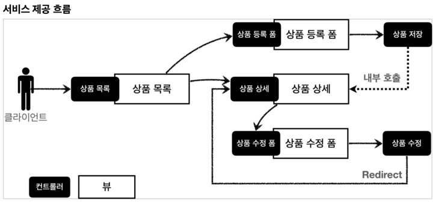
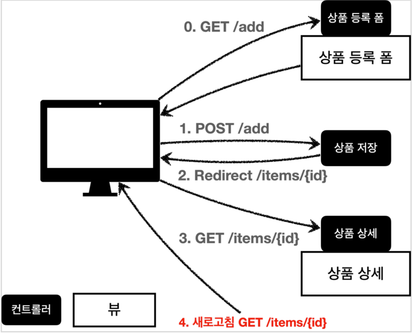
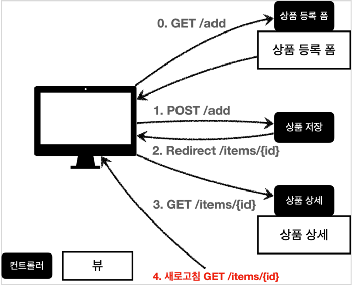
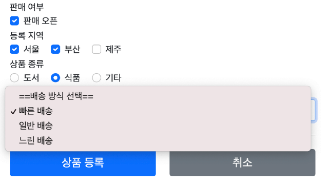
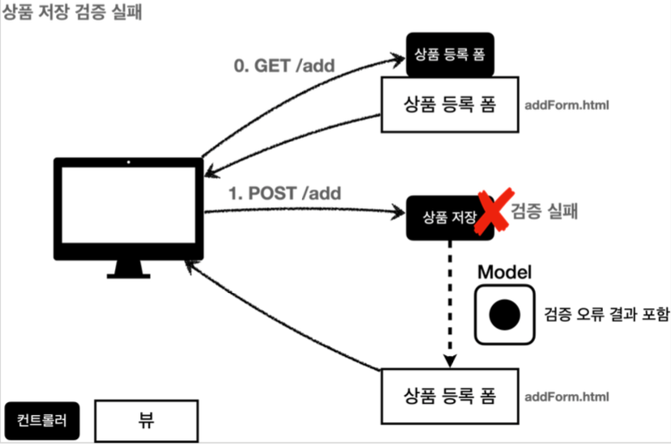

# 스프링 MVC -웹 페이지 만들기

## 요구사항 분석

### 상품 도메인 모델
- 상품 ID 
- 상품명 
- 가격 
- 수량

### 상품 관리 기능
- 상품 목록
- 상품 상세
- 상품 등록
- 상품 수정



## 타임리프
- 네츄럴 템플릿 = 순수 HTML 그대로 유지 + 뷰 템플릿도 사용

### 타임리프 핵심
- 핵심은 th:xxx 가 붙은 부분은 서버사이드에서 렌더링 되고, 기존 것을 대체한다. th:xxx 이 없으면 기존 html의 xxx 속성이 그대로 사용된다.
- HTML을 파일로 직접 열었을 때, th:xxx 가 있어도 웹 브라우저는 ht: 속성을 알지 못하므로 무시한다. 따라서 HTML을 파일 보기를 유지하면서 템플릿 기능도 할 수 있다.

### URL 링크 표현식
- URL 링크 표현식 - `@{...}, th:href="@{/css/bootstrap.min.css}"`
- `@{...}` : 타임리프는 URL 링크를 사용하는 경우 @{...} 를 사용한다. 이것을 URL 링크 표현식이라 한다. URL 링크 표현식을 사용하면 서블릿 컨텍스트를 자동으로 포함한다.

### URL 링크 표현식2 - @{...}, 
- `th:href="@{/basic/items/{itemId}(itemId=${item.id})}"`
- 상품 ID를 선택하는 링크를 확인해보자.
- URL 링크 표현식을 사용하면 경로를 템플릿처럼 편리하게 사용할 수 있다.
- 경로 변수( {itemId} ) 뿐만 아니라 쿼리 파라미터도 생성한다.
- 예) `th:href="@{/basic/items/{itemId}(itemId=${item.id}, query='test')}"`
    - 생성 링크: `http://localhost:8080/basic/items/1?query=test`

### 리터럴 대체 - |...|
- `|...|` :이렇게 사용한다.
- 타임리프에서 문자와 표현식 등은 분리되어 있기 때문에 더해서 사용해야 한다.
    - `<span th:text="'Welcome to our application, ' + ${user.name} + '!'">`
- 다음과 같이 리터럴 대체 문법을 사용하면, 더하기 없이 편리하게 사용할 수 있다.
    - `<span th:text="|Welcome to our application, ${user.name}!|">`
  
## POST - HTML Form
- `content-type: application/x-www-form-urlencoded`
- 메시지 바디에 쿼리 파리미터 형식으로 전달 `itemName=itemA&price=10000&quantity=10`
- 예) 회원 가입, 상품 주문, HTML Form 사용

### @ModelAttribute - 요청 파라미터 처리

- `@ModelAttribute` 는 Item 객체를 생성하고, 요청 파라미터의 값을 프로퍼티 접근법(setXxx)으로 입력해준다.

### @ModelAttribute - Model 추가

- 모델(Model)에 `@ModelAttribute` 로 지정한 객체를 자동으로 넣어준다. 
- `model.addAttribute("item", item)` 가 주석처리 되어 있어도 잘 동작하는 것을 확인할 수 있다.
- `@ModelAttribute` 의 이름을 생략하면 모델에 저장될 때 클래스명을 사용한다. 이때 클래스의 첫글자만 소문자로 변경해서 등록한다. 

## 리다이렉트

- 상품 수정은 마지막에 뷰 템플릿을 호출하는 대신에 상품 상세 화면으로 이동하도록 리다이렉트를 호출한다.
- 스프링은 `redirect:/...` 으로 편리하게 리다이렉트를 지원한다.
- `redirect:/basic/items/{itemId}"` 컨트롤러에 매핑된 @PathVariable 의 값은 redirect 에도 사용 할 수 있다.

## PRG Post/Redirect/Get



1. 상품 등록 폼에서 데이터를 입력하고 저장을 선택하면 POST /add + 상품 데이터를 서버로 전송한다. 
2. 이 상태에서 새로 고침을 또 선택하면 마지막에 전송한 POST /add + 상품 데이터를 서버로 다시 전송하게 된다.
3. 웹 브라우저의 새로 고침은 마지막에 서버에 전송한 데이터를 다시 전송한다.



- 해결책(`PRG Post/Redirect/Get`) : 상품 저장 후에 뷰 템플릿으로 이동하는 것이 아니라, 상품 상세 화면으로 리다이렉트를 호출

### RedirectAttributes

- RedirectAttributes 를 사용하면 URL 인코딩도 해주고, pathVarible, 쿼리 파라미터까지 처리해준다.
- `${param.status}` : 타임리프에서 쿼리 파라미터를 편리하게 조회하는 기능
  - 원래는 컨트롤러에서 모델에 직접 담고 값을 꺼내야 한다. 그런데 쿼리 파라미터는 자주 사용해서 타임리프에서 직접 지원

## 타임리프 스프링 통합

- 기본 메뉴얼 : https://www.thymeleaf.org/doc/tutorials/3.0/usingthymeleaf.html
- 스프링 통합 메뉴얼 : https://www.thymeleaf.org/doc/tutorials/3.0/thymeleafspring.html
- 스프링 부트가 제공하는 타임리프 설정 :
https://docs.spring.io/spring-boot/docs/current/reference/html/appendix-applicationproperties.html#common-application-properties-templating

### 입력 폼 처리

- `th:object` : 커맨드 객체 지정
- `*{...}` : 선택 변수식. `th:object` 에서 선택한 객체에 접근
- `th:field` : HTML 테그의 `id`, `name`, `value` 속성을 자동으로 처리함

`<input type="text" th:field="*{itemName}" />` -> 렌더링 -> `<input type="text" id="itemName" name="itemName" th:value="*{itemName}" />`

- 이 기능의 진가는 validation(검증)에서 나타난다.

### 요구사항 추가

- 판매여부
  - 판매 오픈 여부
  - 체크 박스로 선택할 수 있다.
- 등록 지역
  - 서울, 부산, 제주
  - 체그 박스로 다중 선택할 수 있다.
- 상품 종류
  - 도서, 식품, 기타
  - 라디오 버튼으로 하나만 선택할 수 있다.
- 배송 방식
  - 빠른 배송
  - 일반 배송
  - 느린 배송
  - 셀렉트 박스로 하나만 선택할 수 있다.



### 체크 박스 - 단일 Ver 1

| 주의) HTML checkbox는 선택이 안되면 클라이언트에서 서버로 값 자체를 보내지 않음!

- 서버 구현에 따라서 값이 오지 않은 것으로 판단해서 값을 변경하지 않게 하면 문제가 될수 있다.
- 이런 문제 해결을 위해 스프링 MVC는 약간의 트릭을 사용
  - 히든 필드 `_open` 과 같이 기존 체크박스 이름앞에 `_`를 붙여 전송하며 체크를 해제했다고 인식하게 한다.

- 체크 해제를 인식하기 위한 히든 필드
`<input type="hidden" name="_open" value="on"/>`

- 체크 박스 체크
  - `open=on&_open=on`
  - _open 무시하고, open 값 확인
- 체크 박스 미체크
  - `_open=on`
  - _open 만 있는 것을 확인, open 값이 체크되지 않았다고 인식!

### 체크 박스 - 단일 Ver 2

- 하지만 위의 기능을 타임리프가 간결하게 제공한다.
- `<input type="checkbox" id="open" th:field="*{open}" class="form-checkinput">`

### 체크 박스 - 멀티

```java
@ModelAttribute("regions")
public Map<String, String> regions() {
    Map<String, String> regions = new LinkedHashMap<>();
    regions.put("SEOUL", "서울");
    regions.put("BUSAN", "부산");
    regions.put("JEJU", "제주");
    return regions;
}
```

- @ModelAttribute 의 특별 사용법
  - 컨트롤러 안에서 별도의 메서드에 위에처럼 적용해주면?
  - 해당 컨트롤러의 모든 요청에 model 에 `regions` 이름으로 어트리뷰트로 자동으로 다 담기게된다.

- `th:for="${#ids.prev('open')}"`
  - 멀티 체크박스는 같은 이름의 여러 체크박스를 만들 수 있다. 그런데 문제는 반복해서 HTML 태그를 생성할 때, 생성된 HTML 태그 속성에서 `name` 은 같아도 `id`는 모두 달라야 한다. 따라서 타임리프는 체크박스를 `each` 루프 안에서 반복해서 만들 때 임의로 1,2,3 숫자를 뒤에 붙여준다.

### 라디오 버튼

- 자바 ENUM을 활용해 보자!
- 라디오 버튼은 하나만 선택 가능!

```log
item.itemType=FOOD: 값이 있을 때
item.itemType=null: 값이 없을 때
```

- 타임리프에서 ENUM 적접 접근

```html
<div th:each="type : ${T(hello.itemservice.domain.item.ItemType).values()}">
```

- 패키지 위치 변경되면? 너무 귀찮아지니 권장하진 않음

### 셀렉트 박스

- 여러 선택지 중 하나 선택
- `selected="selected"` -> 타임리프가 자동으로 해주는 랜더링

## 메시지, 국제화

메시지란?

- 화면, API, email 등등 서비스에서 사용하는 각종 text 를 통합하여 관리하고 싶을 때
- 어떠한 비즈니스의 문구를 정의해 두고 여러 곳에서 정의한 것을 사용할 때

스프링의 해결책!

- `messages.properties` 에 정의해 두고 이 값들을 여러곳에서 사용할 수 있다.
- key - value 형식
- 예시

```properteis
item=상품
item.id=상품 ID
item.itemName=상품명   
item.price=가격
item.quantity=수량 
```

- 타임리프에서 사용

```html
<label for="itemName" th:text="#{item.itemName}"></label>
```

국제화란?

- 메시지에서 확장해 생각하자
- 이 메시지 파일을 각 나라별로 별도로 관리하도록 한다.
- 예) 영어: `messages_en.propertis`, 한국어: `messages_ko.propertis`
- 한국에서 접근한 것인지, 영어에서 접근한 것인지 인식하는 방법은 HTTP `accept-language` 해더 값을 보고나, 사용자가 직접 화면에서 선택하게 한다.

### 스프링 메시지 소스 설정

#### 직접 등록

```java
@Bean
public MessageSource messageSource() {
    ResourceBundleMessageSource messageSource = new
    ResourceBundleMessageSource();
    messageSource.setBasenames("messages", "errors");
    messageSource.setDefaultEncoding("utf-8");
    return messageSource;
}
```

#### 스프링 부트

- `MessageSource`를 자동으로 스프링 빈으로 등록함
- `application.properties` 에서 메시지 소스 설정을 할 수 있다.

```properties
spring.messages.basename=messages,config.i18n.messages
```

- 스프링 부트 메시지 소스 기본 값
  - `spring.messages.basename=messages`
  - 따라서 `messages_en.properties`, `messages_ko.properties`, `messages.properties` 파일만 자동으로 인식됨

### 웹 애플리케이션에 메시지 적용하기

`<h2 th:text="#{label.item}"></h2>` -> 렌더링 -> `<h2>상품</h2>`

- 페이지 이름에 적용
  - `<h2>상품 등록 폼</h2>`
    - `<h2 th:text="#{page.addItem}"> 상품 등록 </h2>`
- 레이블에 적용
  - `<label for="itemName">상품명</label>`
    - `<label for="itemName" th:text="#{label.item.itemName}">상품명</label>`
- 버튼에 적용
  - `<button type="submit">상품 등록</button>`
    - `<button type="submit" th:text="#{button.save}">저장</button>`

### 웹 애플리케이션에 국제화 적용하기

- `messages_en.properties` 영어 메시지는 여기다 적용
- 이걸로 거의 끝남~

#### 웹으로 확인하기

- 웹 브라우저 언어 설정 값을 변경해서 국제화 적용 확인
- 크롬 > 설정 > 언어 > 영어로 바꿈
- 크롬이 HTTP 요청시 Accept-Language 값 우선순위가 바뀐다.

#### 스프링의 국제화 메시지 선택

- LocaleResolver 인터페이스 : Locale 선택방식을 변경할 때 이 인터페이스를 구현함
- 스프링 부트 기본 : `Accept-Language` 사용하는 `AcceptHeaderLocaleResolver` 를 사용
- 커스텀한 Locale 정책을 개발하고 싶다면 `LocaleResolver` 상속받아 개발해 사용한다.

## 검증1 - Validation

- 상품 관리 시스템에 새로운 요구사항이 추가되었다.
- 요구사항: 검증 로직 추가
  - 타입 검증
    - 가격, 수량에 문자가 들어가면 검증 오류 처리 필드 검증
  - 상품명: 필수, 공백X
    - 가격: 1000원 이상, 1백만원 이하 수량: 최대 9999
  - 특정 필드의 범위를 넘어서는 검증
    - 가격 * 수량의 합은 10,000원 이상

#### 왜 적용해야 해?

- 웹 서비스는 폼 입력시 오류가 발생하면, 고객이 입력한 데이터를 유지한 상태로 어떤 오류가 발생했는지 친절하게 알려주어야 한다
- **컨트롤러의 중요한 역할중 하나는 HTTP 요청이 정상인지 검증하는 것**

> 참고: 클라이언트 검증, 서버 검증
> - 클라이언트 검증은 조작할 수 있으므로 보안에 취약하다.
> - 서버만으로 검증하면, 즉각적인 고객 사용성이 부족해진다.
> - 둘을 적절히 섞어서 사용하되, 최종적으로 서버 검증은 필수
> - API 방식을 사용하면 API 스펙을 잘 정의해서 검증 오류를 API 응답 결과에 잘 남겨주어야 함

### 검증 직접 처리 - 설명

#### 상품 저장 검증 실패



- 검증에 실패한 경우 고객에게 다시 상품 등록 폼을 보여줌
- 어떤 값을 잘못 입력했는지 알려 줌

### 검증 직접 처리 - 개발

- 아래 코드와 리소스로 확인한다.
- `ValidationItemControllerV1.java` - 컨트롤러
- `resources/templates/validation/v1/addForm.html` - 템플릿

> 참고 Safe Navigation Operator
> 만약 여기에서 `errors` 가 `null` 이라면 어떻게 될까?
> 생각해보면 등록폼에 진입한 시점에는 errors 가 없다.
> 따라서 `errors.containsKey()` 를 호출하는 순간 `NullPointerException` 이 발생한다.
> `errors?.` 은 errors 가 null 일때 NullPointerException 이 발생하는 대신, null 을 반환하는 문법이다.
> `th:if` 에서 `null` 은 실패로 처리되므로 오류 메시지가 출력되지 않는다.

### V1 방식의 문제점

- 뷰 템플릿에 중복이 많음
- 타입 오류는 처리가 불가
  - 컨트롤러에 진입 전에 예외가 발생
  - 400 응답
- 타입 오류가 발생해도 고객이 입력한 문자는 남겨야 함
  - 결론은 고객이 입력한 겂도 어딘가 별도 보관 필요

## 검증2 - Validation

### BindingResult

- 아래 코드와 리소스로 확인한다.
- `ValidationItemControllerV2.java` - 컨트롤러
- `resources/templates/validation/v2/addForm.html` - 템플릿

> 주의
> `BindingResult bindingResult` 파라미터의 위치는 @ModelAttribute Item item 다음에 와야 한다.

#### FieldError

```java
public FieldError(String objectName, String field, String defaultMessage) {}
```

필드에 오류가 있으면 FieldError 객체를 생성해서 bindingResult 에 담아두면 된다. 
- `objectName` : `@ModelAttribute` 이름
- `field` : 오류가 발생한 필드 이름
- `defaultMessage` : 오류 기본 메시지

#### ObjectError

```java
public ObjectError(String objectName, String defaultMessage) {}
```

특정 필드를 넘어서는 오류가 있으면 ObjectError 객체를 생성해서 bindingResult 에 담아두면 된다. 
- `objectName` : @ModelAttribute 의 이름
- `defaultMessage` : 오류 기본 메시지

타임리프 스프링 검증 오류 통합 기능
- 타임리프는 스프링의 `BindingResult` 를 활용해서 편리하게 검증 오류를 표현하는 기능을 제공한다. 
  - `#fields` : `#fields` 로 `BindingResult` 가 제공하는 검증 오류에 접근할 수 있다.
  - `th:errors` : 해당 필드에 오류가 있는 경우에 태그를 출력한다. `th:if` 의 편의 버전이다. 
  - `th:errorclass` : `th:field` 에서 지정한 필드에 오류가 있으면 `class` 정보를 추가한다.

#### BindingResult 정리

- `@ModelAttribute` 의 값을 binding 하고 있음
- binding 에 문제가 있는 결과를 담음
- 결과적으로 ModelAttribute 에 데이터 바인딩 시 오류가 발생해도 컨트롤러가 호출함
  - 개발자에게 처리와 선택을 맡김
  - 없으면 컨트롤러 호출 없이 400 에러 남

`BindingResult`에 검증 오류를 적용하는 3가지 방법
1. `@ModelAttribute` 의 객체에 타입 오류 등으로 바인딩이 실패하는 경우 **스프링이 FieldError 생성**해서 BindingResult 에 넣어준다.
2. 개발자가 직접 넣어준다.
3. Validator 사용 이것은 뒤에서 설명

주의
- `BindingResult` 는 검증할 대상 바로 다음에 와야한다. 순서가 중요하다. 
  - 예를 들어서 `@ModelAttribute Item item` , 바로 다음에 `BindingResult` 가 와야 한다.
- `BindingResult` 는 `Model`에 자동으로 포함된다.

`BeanPropertyBindingResult`(구현체) -> `BindingResult`(인터페이스) -> `Errors`(인터페이스)

남아있는 문제 - 오류가 발생하는 경우 고객이 입력한 내용이 모두 사라진다.

### FieldError, ObjectError

목표
- 사용자 입력 오류 메시지가 화면에 남도록 하자.
  - 예) 가격을 1000원 미만으로 설정시 입력한 값이 남아있어야 한다.
- `FieldError` , `ObjectError` 에 대해서 더 자세히 알아보자.

#### FieldError 생성자

```java
  public FieldError(String objectName, String field, String defaultMessage);
  public FieldError(String objectName, String field, @Nullable Object
  rejectedValue, boolean bindingFailure, @Nullable String[] codes, @Nullable
  Object[] arguments, @Nullable String defaultMessage)
```

파라미터 목록
- `objectName` : 오류가 발생한 객체 이름
- `field` : 오류 필드
- `rejectedValue` : **사용자가 입력한 값(거절된 값)**
- `bindingFailure` : 타입 오류 같은 바인딩 실패인지, 검증 실패인지 구분 값 
- `codes` : 메시지 코드
- `arguments` : 메시지에서 사용하는 인자
- `defaultMessage` : 기본 오류 메시지

`th:field="*{price}"`
  - 타임리프의 th:field 는 매우 똑똑하게 동작함
    - 정상 상황에는 모델 객체의 값을 사용 
    - 오류가 발생하면 FieldError 에서 보관한 값을 사용해서 값을 출력

### 오류 코드와 메시지 처리

목적 : 오류 메시지를 체계적으로 다루기

`FieldError` 의 2가지 파라메터 활용하면 된다.
- `codes` : required.item.itemName 를 사용해서 메시지 코드를 지정한다. 메시지 코드는 하나가 아니라 배열로 여러 값을 전달할 수 있는데, 순서대로 매칭해서 처음 매칭되는 메시지가 사용된다.
- `arguments` : `Object[]{1000, 1000000}` 를 사용해서 코드의 `{0}` , `{1}` 로 치환할 값을 전달한다.

목적 : `FieldError` , `ObjectError` 는 다루기 너무 번거롭다. 좀 더 코드를 줄여보자.

- **`BindingResult` 는 이미 본인이 검증해야 할 객체인 target 을 알고 있다.**

#### `rejectValue()`

```java
void rejectValue(@Nullable String field, String errorCode,
        @Nullable Object[] errorArgs, @Nullable String defaultMessage);
```

- `field` : 오류 필드명
- `errorCode` : 오류 코드(이 오류 코드는 메시지에 등록된 코드가 아니다. 뒤에서 설명할 messageResolver를 위한 오류 코드이다.)
- `errorArgs` : 오류 메시지에서 {0} 을 치환하기 위한 값 
- `defaultMessage` : 오류 메시지를 찾을 수 없을 때 사용하는 기본 메시지

#### 축약된 오류 코드

여기선 오류 코드를 `range` 로 간단하게 입력했다. 그래도 오류 메시지를 잘 찾아서 출력한다. 무언가 규칙이 있는 것 처럼 보인다. 이 부분을 이해하려면 **`₩MessageCodesResolver`** 를 이해해야 한다.

```properties
range.item.price=가격은 {0} ~ {1} 까지 허용합니다.
```

중요!
- 메시지를 단순하게 만들면 범용성이 좋아서 여러곳에서 사용할 수 있지만, 메시지를 세밀하게 작성하기 어렵다.
- 메시지를 너무 자세하게 만들면 범용성이 떨어진다.
- 가장 좋은 방법: **범용성으로 사용하다가, 세밀하게 작성해야 하는 경우에는 세밀한 내용이 적용되도록 메시지에 단계를 두는 방법**
- 에러 메시지 우선순위 : 디테일 -> 범용 (`required.item.itemName` -> `required` -> defaultMessage)
- 결론 : 스프링은 `MessageCodesResolver` 라는 것으로 이러한 기능을 지원

### MessageCodesResolver

- 검증 오류 코드로 메시지 코드들을 생성
- 기본 구현체 : `DefaultMessageCodesResolver`

#### DefaultMessageCodesResolver의 기본 메시지 생성 규칙

- 객체 오류
  1. code + "." + object name
  2. code
- 필드 오류
  1. code + "." + object name + "." + field
  2. code + "." + field
  3. code + "." + field type
  4. code

#### DefaultMessageCodesResolver 의 동작 방식

1. `rejectValue()`, `reject()` 는 내부에서 `MessageCodesResolver` 를 사용한다. 여기에서 메시지 코드들을 생성한다.
2. `FieldError` , `ObjectError` 의 생성자를 보면, 오류 코드를 하나가 아니라 여러 오류 코드를 가질 수 있다. MessageCodesResolver 를 통해서 생성된 순서대로 오류 코드를 보관한다.
3. 이 부분을 BindingResult 의 로그를 통해서 확인해보자.
     - `codes [range.item.price, range.price, range.java.lang.Integer, range]`

### 오류 코드 관리 전략

- 핵심은 구체적인 것에서! 덜 구체적인 것으로!
  - MessageCodesResolver 의 전략
  - 메시지와 관련된 공통 전략을 편리하게 도입이 목적
- 왜 이렇게 복잡하게 사용하는가?
  - 모든 오류 코드에 대해서 메시지를 각각 다 정의하기 힘듦
  - 정말 중요한 메시지를 구체적으로 정의하기

실행
- Level1 전부 주석해보자
- Level2,3 전부 주석해보자
- Level4 전부 주석해보자 못찾으면 코드에 작성한 디폴트 메시지를 사용한다. 
- Object 오류도 Level1, Level2로 재활용 가능하다.

#### ValidationUtils 활용

```java
if (!StringUtils.hasText(item.getItemName())) { bindingResult.rejectValue("itemName", "required", "기본: 상품 이름은
필수입니다."); }
```

```java
ValidationUtils.rejectIfEmptyOrWhitespace(bindingResult, "itemName",
     "required");
```

### 스프링이 직접 만든 오류 메시지 처리

price 필드에 문자 "A"를 입력해보자.
로그를 확인해보면 BindingResult 에 FieldError 가 담겨있고, 다음과 같은 메시지 코드들이 생성된 것을 확인할 수 있다.

다음과 같이 4가지 메시지 코드가 입력되어 있다.
- typeMismatch.item.price
- typeMismatch.price
- typeMismatch.java.lang.Integer
- typeMismatch

## Validation 분리

### ItemValidator 직접 호출하기

- 복잡한 검증로직 별도 분리!
- `ValidationItemControllerV2.addItemV5()` 메서드 참고
- 스프링은 검증을 체계적으로 제공하기 위해 다음 인터페이스를 제공한다.

```java
public interface Validator {
    boolean supports(Class<?> clazz);
    void validate(Object target, Errors errors);
}
```

- `supports() {}` : 해당 검증기를 지원하는 여부 확인(뒤에서 설명) 
- `validate(Object target, Errors errors)` : 검증 대상 객체와 `BindingResult`

### @Validated 적용

- `WebDataBinder` 로 검증기 추가
- `@Validated` 를 ModelAttribute 에 추가

#### @Validated 동작

`@Validated` 는 검증기를 실행하라는 애노테이션이다.
이 애노테이션이 붙으면 앞서 `WebDataBinder` 에 등록한 검증기를 찾아서 실행한다. 
그런데 여러 검증기를 등록한다면 그 중에 어떤 검증기가 실행되어야 할지 구분이 필요하다. 이때 `supports()` 가 사용된다.

#### Validator 글로벌 설정

```java
@SpringBootApplication
  public class ItemServiceApplication implements WebMvcConfigurer {
      public static void main(String[] args) {
          SpringApplication.run(ItemServiceApplication.class, args);
      }
      
      @Override
      public Validator getValidator() {
          return new ItemValidator();
      }
}
```

## 검증3 - Bean Validation

### Bean Validation 소개

- 검증로직의 공통화, 표준화
- 간편하게 `@`(에노테이션만) 붙이면 검증 로직 적용됨
- JSR-380(기술 표준) - 하이버네이터 Validator(구현체)

관련 링크
- 공식 사이트: http://hibernate.org/validator/
- 공식 메뉴얼: https://docs.jboss.org/hibernate/validator/6.2/reference/en-US/html_single/ 검증 
- 애노테이션 모음: https://docs.jboss.org/hibernate/validator/6.2/reference/en-US/ html_single/#validator-defineconstraints-spec

### 검증 애노테이션

- `@NotBlank` : 빈값 + 공백만 있는 경우를 허용하지 않는다.
- `@NotNull` : null 을 허용하지 않는다.
- `@Range(min = 1000, max = 1000000)` : 범위 안의 값이어야 한다. 
  - `org.hibernate.validator.constraints.Range` 하이버네이트 구현체에서만 제공한다.
- `@Max(9999)` : 최대 9999까지만 허용한다.

### 스프링 MVC는 어떻게 Bean Validator를 사용?

- `spring-boot-starter-validation` 라이브러리를 넣으면 자동으로 Bean Validator를 인지하고 스프링에 통합
- 스프링 부트는 자동으로 `LocalValidatorFactoryBean` 을 글로벌 Validator로 등록
- 검증 오류가 발생하면, `FieldError` , `ObjectError` 를 생성해서 BindingResult 에 담아줌

> 주의!
> 다음과 같이 직접 글로벌 Validator를 직접 등록하면 스프링 부트는 Bean Validator를 글로벌 Validator 로 등록하지 않는다. 따라서 애노테이션 기반의 빈 검증기가 동작하지 않는다. 다음 부분은 제거하자.

```java
@SpringBootApplication
    public class ItemServiceApplication implements WebMvcConfigurer {
// 글로벌 검증기 추가
@Override
public Validator getValidator() {
          return new ItemValidator();
      }
// ...
}
```

- `@Validated`
  - 스프링 전용 검증 애노테이션
  - 내부에 `groups` 라는 기능을 포함
- `@Valid`
  - 자바 표준 검증 애노테이션
  - 의존관계 추가 필요 `implementation 'org.springframework.boot:spring-boot-starter-validation'`

### 검증 순서

1. @ModelAttribute 각각의 필드에 타입 변환 시도
   1. 성공하면 다음으로
   2. 실패하면 typeMismatch 로 FieldError 추가
2. Validator 적용
   1. **바인딩에 성공한 필드만 Bean Validation 적용**
   2. 일단 모델 객체에 바인딩 받는 값이 정상으로 들어와야 검증도 의미가 있다

예시)
- `itemName` 에 문자 "A" 입력 -> 타입 변환 성공 -> `itemName` 필드에 BeanValidation 적용 
- `price` 에 문자 "A" 입력 -> "A"를 숫자 타입 변환 시도 실패 -> typeMismatch FieldError 추가 -> `price` 필드는 BeanValidation 적용 안함

### Bean Validation - 에러 코드

NotBlank 라는 오류 코드를 기반으로 MessageCodesResolver 를 통해 다양한 메시지 코드가 순서대로 생성

**@NotBlank**
- NotBlank.item.itemName
- NotBlank.itemName
- NotBlank.java.lang.String
- NotBlank

**@Range**
- Range.item.price
- Range.price
- Range.java.lang.Integer
- Range

### Bean Validation - 오브젝트 오류

- 실제 사용해보면 제약이 많고 복잡
- 실무에서는 검증 기능이 해당 객체의 범위를 넘어서는 경우들도 종종 등장하는데, 그런 경우 대응이 어렵다
- 이런 오브젝트 관련 오류는 직접 자바 코드로 작성하길 권장

