# 스프링 핵심 원리 - 고급편 2

## 예제 만들기

- 예제는 크게 3가지 상황으로 만든다.
  - v1 - 인터페이스와 구현 클래스 - 스프링 빈으로 수동 등록 
  - v2 - 인터페이스 없는 구체 클래스 - 스프링 빈으로 수동 등록 
  - v3 - 컴포넌트 스캔으로 스프링 빈 자동 등록

### v1 - 인터페이스와 구현 클래스 예제

- `OrderControllerV1`
  - @RequestMapping, @ResponseBody 는 인터페이스에 사용가능
  - @Controller 컴포넌트 스캔 대상이기 때문
  - 인터페이스에는 `@RequestParam("itemId")` 명시적으로 적용해야 함
  - `request()` 는 LogTrace 를 적용할 대상
  - `noLog()` 는 LogTrace 를 적용하지 않을 대상
- 빈 수동 등록
  - `AppV1Config`
  - `@Import(AppV1Config.class)`
    - AppV1Config 클래스를 스프링 빈으로 등록
    - 설정 파일을 등록하므로, 설정파일 하위 빈들도 같이 등록
  - `@SpringBootApplication(scanBasePackages = "dev.leonkim.proxy.app")`
    - 컴포넌트 스켄의 패키지 범위 지정: `dev.leonkim.proxy.app`
    - 왜? `dev.leonkim.proxy.trace` 나 `dev.leonkim.proxy.config` 패키지는 나중에 선택적으로 빈 등록 위함
    
### v2 - 인터페이스 없는 구체 클래스

- `AppV2Config`, `OrderControllerV2`, `OrderServiceV2`, `OrderRepositoryV2` 예제코드
- `@Import({AppV1Config.class, AppV2Config.class})` import 에너테이션 복수개의 빈 등록 방법 

### v3 - 컴포넌트 스캔으로 스프링 빈 자동 등록

- `OrderControllerV3`, `OrderServiceV3`, `OrderRepositoryV3` 예제코드
- `@SpringBootApplication(scanBasePackages = "dev.leonkim.proxy.app")` 컴포넌트 스켄 범위에 위의 3개 인스턴스가 잡혀 있음 따라서 빈 등록 됨

## 요구사항 추가

- **원본 코드를 전혀 수정하지 않고, 로그 추적기를 적용해라.(가장 어려운 문제)** 
- 특정 메서드는 로그를 출력하지 않는 기능
  - 보안상 일부는 로그를 출력하면 안된다.
- 다음과 같은 다양한 케이스에 적용할 수 있어야 한다. 
  - v1 - 인터페이스가 있는 구현 클래스에 적용 
  - v2 - 인터페이스가 없는 구체 클래스에 적용 
  - v3 - 컴포넌트 스캔 대상에 기능 적용

## 프록시 패턴과 데코레이터 패턴

### 프록시 소개

- 클라이언트와 서버의 개념은 더 넒게 사용한다. (단순 물리적 서버 컴퓨터 X)
  - 클라이언트: 서버에 필요한 것을 요청
  - 서버: 클라이언트의 요청을 처리
- 객체지향에 도입하면 >> 클라이언트 객체 - 서버 객체로 볼 수 있다.
  - 직접 호출
    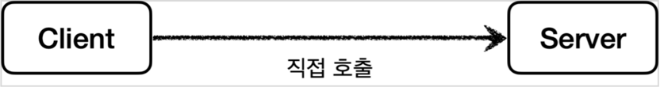
  - 간접 호출
    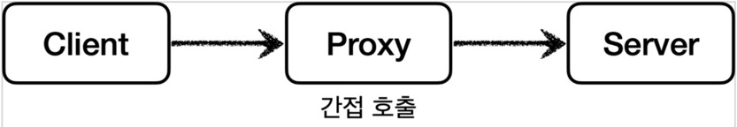
    - 중간에 대리자가 끼어든다.
    - 클라이언트 입장에서는 대리자를 통해 요청했기 때문에 이후 과정은 알수 없음
    - 프록시의 목적 - 대리자가 중간에 여러 일을 하도록 하는데 있음
    - 프록시의 주요 기능
      - **접근 제어**
        - 권한에 따른 접근 차단
        - 캐싱
        - 지연로딩
      - **부가기능 추가**
        - 원래 서버가 제공하는 기능에 더해서 부가기능 수행
        - 예 1) 요청 값이나, 응답 값을 중간에 변형
        - 예 2) 실행 시간을 측정해서 추가 로그를 남김
    - 프록시 체인
      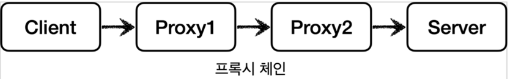
    - **대체 가능** - 클라이언트는 서버에게 요청을 한 것인지, 프록시에게 한 것인지 조차 몰라야 함
      - 클래스 의존관계
      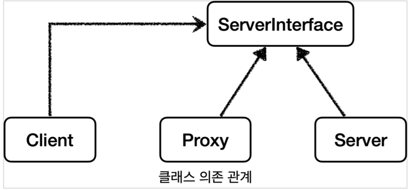
      - 런타임 객체 의존관계 - 프록시 도입 전
      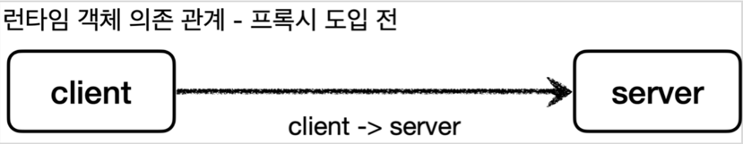
      - 런타임 객체 의존관계 - 프록시 도입 후
      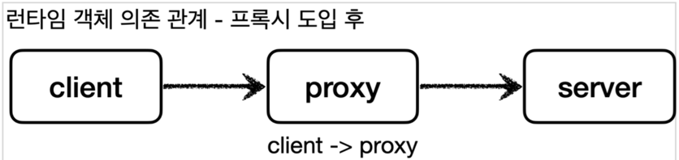


- **의도(intent)** 에 따라 프록시 패턴과 데코레이터 패턴을 구분
  - **프록시 패턴**: **접근 제어**가 주 목적
  - **데코레이터 패턴**: **새로운 기능 추가** 주 목적

- 결론 : 여기서의 `프록시` 는 객체의 역할이다.

### 프록시 패턴 예제

- 목표: 이미 개발된 로직을 전혀 수정하지 않고 프록시 객체를 통해 캐시 기능을 추가하기!
  - 프록시 도입 전 : `ProxyPatternTest.noProxyTest()` 참고
  - 프록시 도입 :`ProxyPatternTest.cacheProxyTest()` 참고
- 핵심
  - `RealSubject` 코드와 클라이언트 코드를 전혀 변경하지 않고, 프록시를 도입해서 접근 제어를 했다는 점
  - 클라이언트 코드의 변경 없이 자유롭게 프록시를 넣고 뺄 수 있다

### 데코레이터 패턴 예제

- 데코레이터 적용 전: `DecoratorPatternTest.noDecorator()` 참고하기
- 데코레이터 적용 후: `DecoratorPatternTestdecorator1()` 참고하기
  - 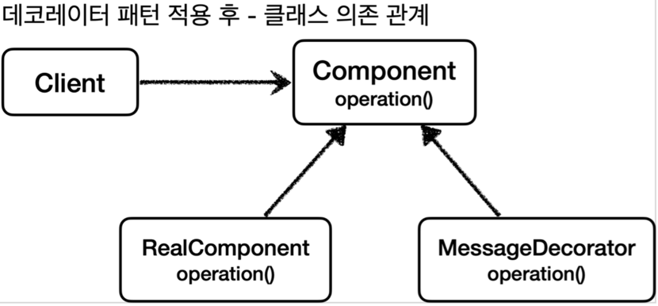
  - 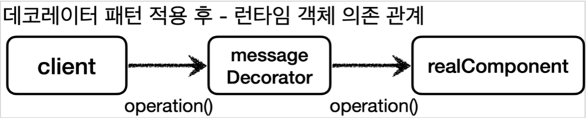
- 전/후 클라이언트 코드의 수정사항은 없다! `Component` 구현체 간의 구현만 바뀐다.
- 프록시 체인
  - 예제 : `DecoratorPatternTestdecorator2()` 참고하기
  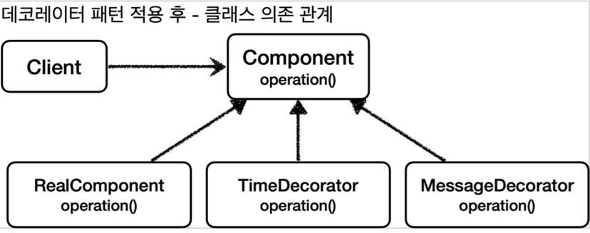
  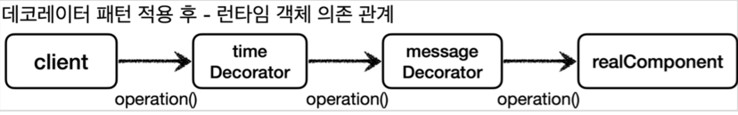

### 프록시 패턴 vs 데코레이터 패턴

- 프록시 패턴의 의도(intent): 다른 개체에 대한 **접근을 제어**하기 위해 대리자를 제공
- 데코레이터 패턴의 의도(intent): **객체에 추가 책임(기능)을 동적으로 추가**하고, 기능 확장을 위한 유연한 대안 제공

### 인터페이스 기반 프록시 - 적용

- 프록시 적용 전: `AppV1Config` config 인스턴스 참고
  - 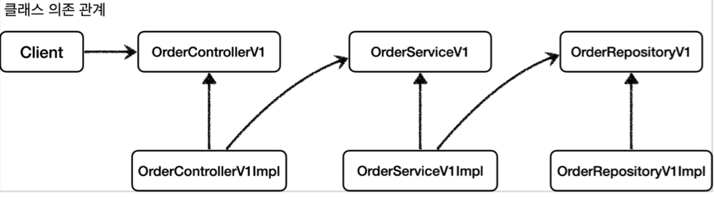
  - 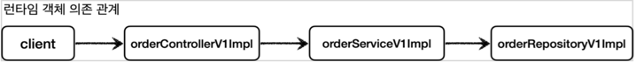
  - 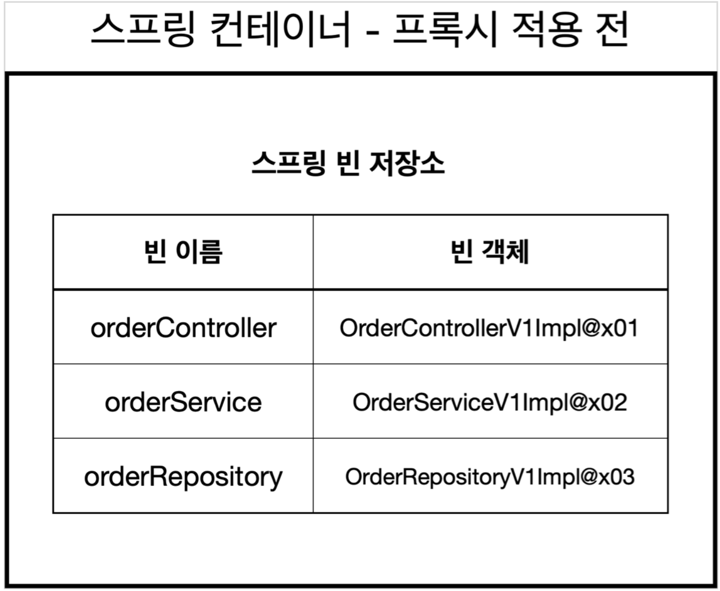
- 프록시 적용 후: `InterfaceProxyConfig` config 인스턴스 참고
  - 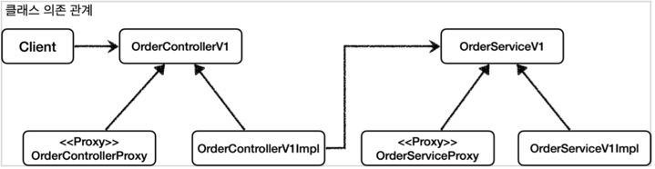
  - 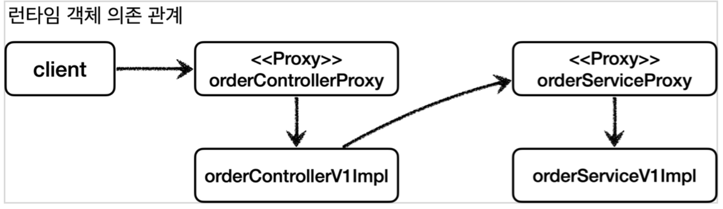
  - 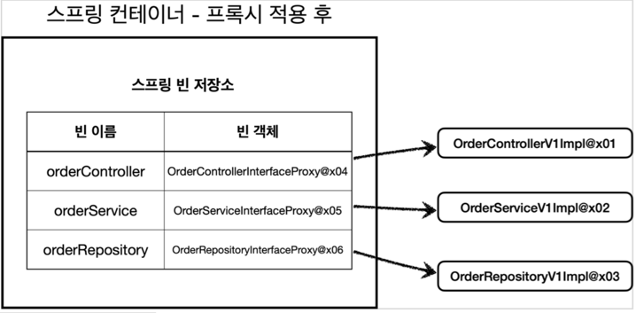

### 구체 클래스 기반 프록시

- 프록시 적용 전: `ConcreteProxyTest.noProxy()` 참고
  - 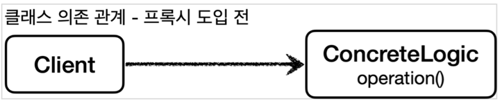
  - 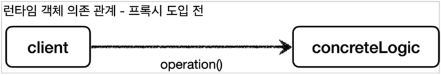
- 프록시 적용 후: `ConcreteProxyTest.addProxy()` 참고
  - 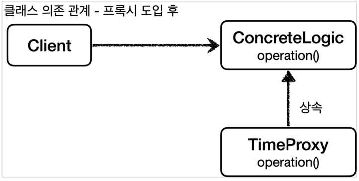
  - 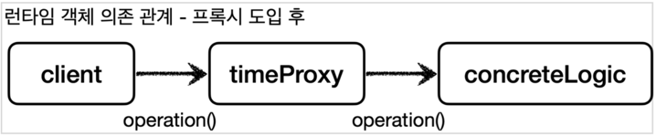
- 적용 : `ConcreteProxyConfig` 참고

### 인터페이스 기반 프록시 vs 클래스 기반 프록시

- 인터페이스가 없어도 클래스 기반으로 프록시를 생성할 수 있다.
- 클래스 기반 프록시는 해당 클래스에만 적용할 수 있다. 인터페이스 기반 프록시는 인터페이스만 같으면 모든 곳에 적용할 수 있다.
- 클래스 기반 프록시는 상속을 사용하기 때문에 몇가지 제약이 있다
  - 부모 클래스의 생성자를 호출해야 한다.(앞서 본 예제)
  - 클래스에 final 키워드가 붙으면 상속이 불가능하다.
  - 메서드에 final 키워드가 붙으면 해당 메서드를 오버라이딩 할 수 없다.
- 인터페이스 기반의 프록시는 상속이라는 제약에서 자유롭다.
- 이미 구현된 코드가 인터페이스 기반이 아니면 인터페이스 기반 프록시를 사용할 수 없다.

## 동적 프록시 기술

### 리플랙션

- JDK 동적 프록시 기술을 이해하려면 자바의 리플렉션 기술을 알아야 함
- 예제 `ReflectionTest` 참고하기
  - 클래스의 메타 정보 조회 : `Class.forName("dev.leonkim.proxy.jdkdynamic.ReflectionTest$Hello")`
  - 메서드의 메타 정보 조회 : `classHello.getMethod("callA")`
  - 획득한 메서드 메타 정보로 호출하기 : `methodCallA.invoke(target)`
- 왜 이렇게 번거롭게 호출하냐?
  - 클래스나 메서드의 정보를 동적으로 변경 가능하기 때문!
  - 메서드 자체를 추상화 했기 때문에 공통 로직으로 만들 수 있는 토대가 된다!
- `dynamicCall()` 메서드 참고하기
  - 드디어 까다로운 공통로직 처리를 해결함!
  - 파라메터 `Method method` - 호출할 메서드 정보. 기존 메서드 직접 호출대신 메서드 메타정보를 통해 호출한다.
  - 파라메터 `Object target` - 실제 실행할 인스턴스 정보. 어떤 인스턴스도 받을수 있도록 Object 타입. 
  - `invoke` 시 해당 실행 인스턴스(`target`)에 없는 메서드 정보로 호출하면 Exception 발생함.
- 주의점
  - 리플렉션은 런타임 시점에 동작하기에 컴파일 오류로 잡을 수 없음
  - 예를 들어 `getMethod("callA")` 의 문자 "callA" 가 틀리면 컴파일 오류는 발생하지 않지만, 실행시에 런타임 오류 발생한다. 
  - 가장 좋은 오류는 개발자가 즉시 확인할 수 있는 컴파일 오류, 가장 무서운 오류는 사용자가 직접 실행할 때 발생하는 런타임 오류
  - 리플렉션은 프레임워크 개발이나 또는 매우 일반적인 공통 처리가 필요할 때 부분적으로 주의해서 사용해야 한다.

### JDK 동적 프록시

- 문제 : 적용 대상이 100 개면 프록시 클래스도 100개 만들어야 함
- 현재 상황 복기
  - 프록시의 로직은 같음
  - 적용 대상만 차이가 있음
- 이 문제를 해결할 기술: 동적 프록시

> 주의
>
> JDK 동적 프록시는 인터페이스 기반으로 프록시를 동적으로 만들어준다. 인터페이스가 필수이다.

#### JDK 동적 프록시가 제공하는 `InvocationHandler`

```java
package java.lang.reflect;

public interface InvocationHandler {
    
    public Object invoke(Object proxy, Method method, Object[] args) throws Throwable;
}
```

- `Object proxy` : 프록시 자신
- `Method method` : 호출한 메서드
- `Object[] args` : 메서드를 호출할 때 전달한 인수

#### `ProxyPatternTest.dynamicA()` 실행 순서
1. 클라이언트는 JDK 동적 프록시의 `call()` 을 실행한다.
2. JDK 동적 프록시는 `InvocationHandler.invoke()` 를 호출한다. `TimeInvocationHandler` 가 구현체로 있으로 `TimeInvocationHandler.invoke()` 가 호출된다.
3. `TimeInvocationHandler` 가 내부 로직을 수행하고, `method.invoke(target, args)` 를 호출해서 target 인 실제 객체( `AImpl` )를 호출한다.
4. `AImpl` 인스턴스의 `call()` 이 실행된다.
5. `AImpl` 인스턴스의 `call()` 의 실행이 끝나면 `TimeInvocationHandler` 로 응답이 돌아온다. 시간 로그를 출력하고 결과를 반환한다.

- 직접 프록시 생성시 : `ProxyPatternTest`
  - 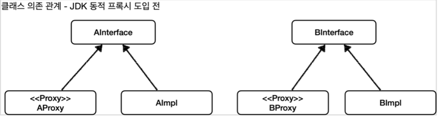
  - 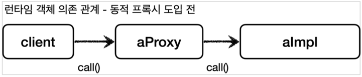
- JDK 동적 프록시 도입 : `JdkDynamicProxyTest`
  - 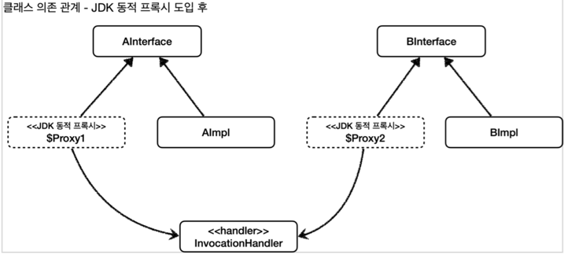
  - 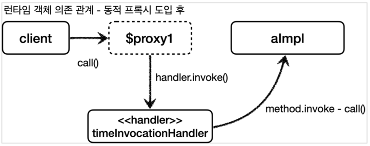

#### JDK 동적 프록시 - 적용

- `LogTraceBasicHandler`, `DynamicProxyBasicConfig` 참고
  - 프록시 생성한 모든 메서드가 적용된다는 문제가 있음
  - 특정 메소드만 적용되도록 filter 기능 추가 필요
  - 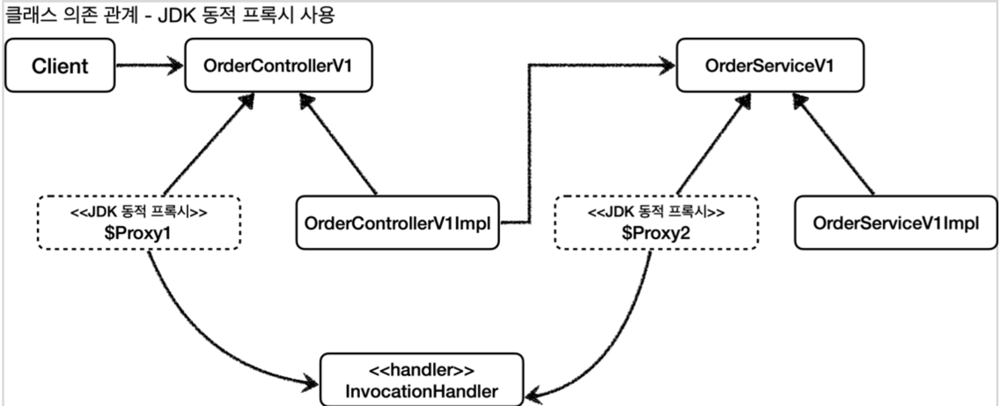
  - 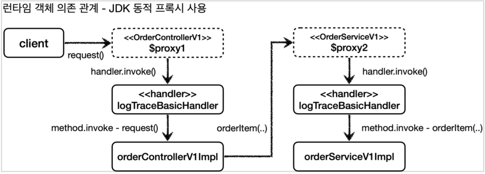
- `LogTraceFilterHandler`, `DynamicProxyFilterConfig` 참고
  - Handler 에 메서드 이름 필터 추가
  - 스프링의 `PatternMatchUtils.simpleMatch(..)` 을 사용해 단순 메서드 이름 매칭 사용
  - Config 에 프록시 빈 생성시 Filter 헨들러를 적용

### CGLIB

#### 소개

- 바이트코드를 조작해서 동적으로 클래스를 생성하는 기술을 제공하는 라이브러리
- 사용하는 이유 : 인터페이스가 없어도 구체 클래스만 가지고 동적 프록시를 만들어 낼 수 있음
- 스프링 프레임워크가 스프링 내부 소스 코드에 포함했다. 따라서 스프링을 사용한다면 별도의 외부 라이브러리를 추가하지 않아도 사용할 수 있음
- 직접 사용하는 경우는 거의 없다. (그러나 개념은 이해해야 AOP를 이해할 수 있다)

#### 예제

- `class TimeMethodInterceptor` 
  - `MethodInterceptor` 인터페이스를 구현해서 CGLIB 프록시의 실행 로직을 정의
  - `Object target` : 프록시가 호출할 실제 대상
  - `proxy.invoke(target, args)` : 실제 대상을 동적으로 호출
    - 참고로 `method` 를 사용해도 되지만, CGLIB는 성능상 `MethodProxy proxy` 를 사용하는 것을 권장
- `class CglibTest` - Cglib 사용 예제
  - `Enhancer` : 프록시를 생성하는 주체
  - `enhancer.setSuperclass(ConcreteService.class)` : 어떤 구체 클래스를 상속 받을지 지정
  - `enhancer.setCallback(new TimeMethodInterceptor(target))` : 프록시에 적용할 실행 로직을 할당
  - `enhancer.create()` : 프록시를 생성. `setSuperclass()` 에서 지정한 클래스를 상속 받은 프록시이다.

- 클래스 의존 관계
  - 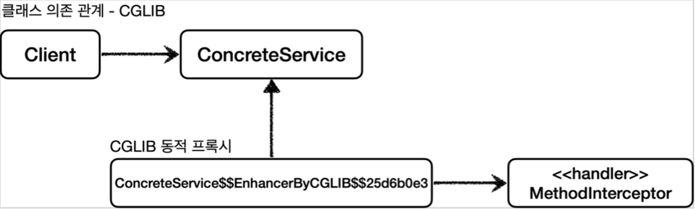
- 런타임 의존 관계
  - 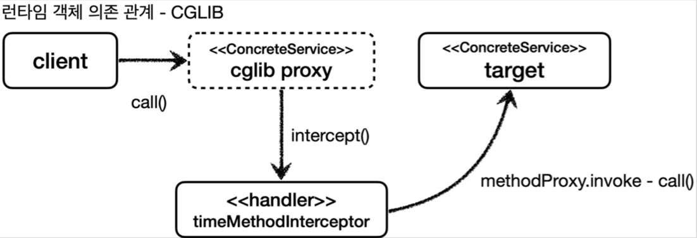

- CGLIB 제약
  - 클래스 기반 프록시는 상속을 사용하기 때문에 몇가지 제약이 존재함 (JPA Entity 도 동일한 제약)
  - 부모 클래스의 생성자를 체크 필요 -> CGLIB 는 자식 클래스를 동적으로 생성하기 때문에 기본 생성자가 필요
  - 클래스에 `final` 키워드가 붙으면 상속이 불가능 -> CGLIB 에서 예외가 발생
  - 메서드에 `final` 키워드가 붙으면 해당 메서드를 오버라이딩 할 수 없음 -> CGLIB 에서 프록시 로직이 동작하지 않음

#### 남은 문제

- 2기술을 같이 적용?
  - 인터페이스 정의 : JDK 동적 프록시 사용
  - 구체 클래스만 정의 : CGLIB 사용
- 문제는 2기술이 쓰는 Handler 인터페이스가 다름 -> 즉 구현체들이 중복 관리필요
- 케이스에 맞게 프록시 로직을 적용하는 기능도 필요함

## 스프링이 지원하는 프록시

### 프록시 팩토리

#### 소개

- PSA((Portable Service Abstraction)): 
  - 유사한 구체적인 기술들이 있을 때, 
  - 그것들을 통합해서 일관성 있게 접근할 수 있고, 
  - 더욱 편리하게 사용할 수 있는 추상화된 기술을 제공
- 프록시 팩토리 : 동적 프록시를 통합해서 편리하게 만들어 줌 
  - 인터페이스가 있으면 JDK 동적 프록시를 사용 
  - 구체 클래스만 있다면 CGLIB를 사용
  - 이런 동작 설정들 또한 변경가능
  
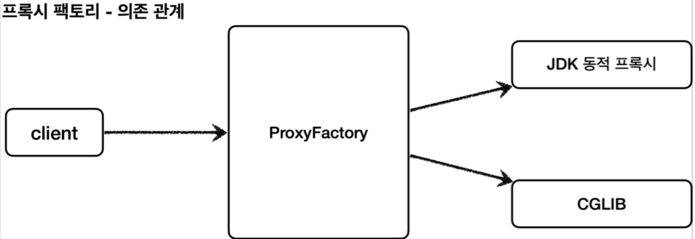

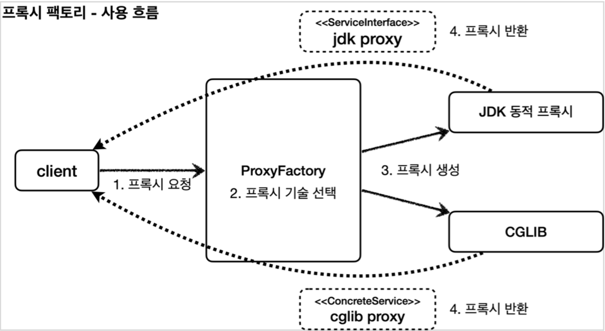

- InvocationHandler, MethodInterceptor 의 중복으로 사용해야 하는 문제는 어떻게 해결했을까?
  - 부가 기능을 적용할 때 `Advice` 라는 새로운 개념을 도입
  - 결과적으로 `InvocationHandler` 나 `MethodInterceptor`는 설정한 Advice 를 무조건 호출
  - 프록시 팩토리를 사용하면 Advice 를 호출하는 전용 `InvocationHandler`, `MethodInterceptor`(스프링이 정의한) 를 내부에서 사용

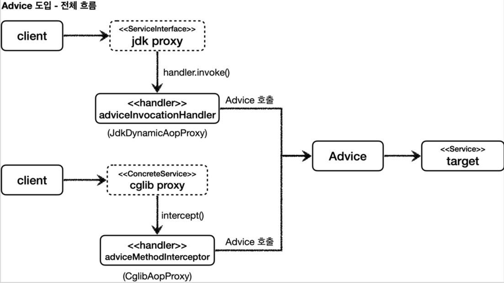

- 특정 조건에 맞을 때 프록시 로직을 적용하는 기능은 어떻게 해결되었을까?
  - `Pointcut` 이라는 개념을 도입해 해결하였음 (이후에 다룸)

#### MethodInterceptor - 스프링이 제공하는 코드

```java
package org.aopalliance.intercept;
  public interface MethodInterceptor extends Interceptor {
      Object invoke(MethodInvocation invocation) throws Throwable;
}
```
- `MethodInvocation invocation` : 
  - 내부에는 다음 메서드를 호출하는 방법, 현재 프록시 객체 인스턴스, args , 메서드 정보 등이 포함
  - 기존에 파라미터로 제공되는 부분들이 이 클래스로 통합되었다고 보면 됨
- (주의) CGLIB의 `MethodInterceptor` 와 이름은 같고 패키지 경로만 다르다
- 상속 관계 : `MethodInterceptor` -> `Interceptor` -> `Advice` 따라서 이들을 상송하는 것들을 다 어드바이스 라고 부름
- 사용예제 : `TimeAdvice` 참고

#### 사용 예제

- `ProxyFactoryTest.interfaceProxy()`
  - 대상에 인터페이스가 있으면: JDK 동적 프록시, 인터페이스 기반 프록시
- `ProxyFactoryTest.concreteProxy()`
  - 대상에 인터페이스가 없으면: CGLIB, 구체 클래스 기반 프록시
- `ProxyFactoryTest.proxyTargetClass()`
  - `proxyTargetClass=true` 설정. CGLIB, 구체 클래스 기반 프록시, 인터페이스 여부와 상관없음

결론: 프록시 팩토리 덕분에 같은 역할의 2가지 다른 구현 기술을 하나로 통일해서 쓸수있게 됨

> #### 스프링에서의 참고 사항
> 스프링 부트는 AOP를 적용할 때 기본적으로 proxyTargetClass=true 로 설정해서 사용. 
> 따라서 인터페이스가 있어도 항상 CGLIB를 사용해서 구체 클래스를 기반으로 프록시를 생성
