# 스프링 핵심 원리 - 고급편 2

## 예제 만들기

- 예제는 크게 3가지 상황으로 만든다.
  - v1 - 인터페이스와 구현 클래스 - 스프링 빈으로 수동 등록 
  - v2 - 인터페이스 없는 구체 클래스 - 스프링 빈으로 수동 등록 
  - v3 - 컴포넌트 스캔으로 스프링 빈 자동 등록

### v1 - 인터페이스와 구현 클래스 예제

- `OrderControllerV1`
  - @RequestMapping, @ResponseBody 는 인터페이스에 사용가능
  - @Controller 컴포넌트 스캔 대상이기 때문
  - 인터페이스에는 `@RequestParam("itemId")` 명시적으로 적용해야 함
  - `request()` 는 LogTrace 를 적용할 대상
  - `noLog()` 는 LogTrace 를 적용하지 않을 대상
- 빈 수동 등록
  - `AppV1Config`
  - `@Import(AppV1Config.class)`
    - AppV1Config 클래스를 스프링 빈으로 등록
    - 설정 파일을 등록하므로, 설정파일 하위 빈들도 같이 등록
  - `@SpringBootApplication(scanBasePackages = "dev.leonkim.proxy.app")`
    - 컴포넌트 스켄의 패키지 범위 지정: `dev.leonkim.proxy.app`
    - 왜? `dev.leonkim.proxy.trace` 나 `dev.leonkim.proxy.config` 패키지는 나중에 선택적으로 빈 등록 위함
    
### v2 - 인터페이스 없는 구체 클래스

- `AppV2Config`, `OrderControllerV2`, `OrderServiceV2`, `OrderRepositoryV2` 예제코드
- `@Import({AppV1Config.class, AppV2Config.class})` import 에너테이션 복수개의 빈 등록 방법 

### v3 - 컴포넌트 스캔으로 스프링 빈 자동 등록

- `OrderControllerV3`, `OrderServiceV3`, `OrderRepositoryV3` 예제코드
- `@SpringBootApplication(scanBasePackages = "dev.leonkim.proxy.app")` 컴포넌트 스켄 범위에 위의 3개 인스턴스가 잡혀 있음 따라서 빈 등록 됨

## 요구사항 추가

- **원본 코드를 전혀 수정하지 않고, 로그 추적기를 적용해라.(가장 어려운 문제)** 
- 특정 메서드는 로그를 출력하지 않는 기능
  - 보안상 일부는 로그를 출력하면 안된다.
- 다음과 같은 다양한 케이스에 적용할 수 있어야 한다. 
  - v1 - 인터페이스가 있는 구현 클래스에 적용 
  - v2 - 인터페이스가 없는 구체 클래스에 적용 
  - v3 - 컴포넌트 스캔 대상에 기능 적용

## 프록시 패턴과 데코레이터 패턴

### 프록시 소개

- 클라이언트와 서버의 개념은 더 넒게 사용한다. (단순 물리적 서버 컴퓨터 X)
  - 클라이언트: 서버에 필요한 것을 요청
  - 서버: 클라이언트의 요청을 처리
- 객체지향에 도입하면 >> 클라이언트 객체 - 서버 객체로 볼 수 있다.
  - 직접 호출
    
  - 간접 호출
    
    - 중간에 대리자가 끼어든다.
    - 클라이언트 입장에서는 대리자를 통해 요청했기 때문에 이후 과정은 알수 없음
    - 프록시의 목적 - 대리자가 중간에 여러 일을 하도록 하는데 있음
    - 프록시의 주요 기능
      - **접근 제어**
        - 권한에 따른 접근 차단
        - 캐싱
        - 지연로딩
      - **부가기능 추가**
        - 원래 서버가 제공하는 기능에 더해서 부가기능 수행
        - 예 1) 요청 값이나, 응답 값을 중간에 변형
        - 예 2) 실행 시간을 측정해서 추가 로그를 남김
    - 프록시 체인
      
    - **대체 가능** - 클라이언트는 서버에게 요청을 한 것인지, 프록시에게 한 것인지 조차 몰라야 함
      - 클래스 의존관계
      
      - 런타임 객체 의존관계 - 프록시 도입 전
      
      - 런타임 객체 의존관계 - 프록시 도입 후
      


- **의도(intent)** 에 따라 프록시 패턴과 데코레이터 패턴을 구분
  - **프록시 패턴**: **접근 제어**가 주 목적
  - **데코레이터 패턴**: **새로운 기능 추가** 주 목적

- 결론 : 여기서의 `프록시` 는 객체의 역할이다.

### 프록시 패턴 예제

- 목표: 이미 개발된 로직을 전혀 수정하지 않고 프록시 객체를 통해 캐시 기능을 추가하기!
  - 프록시 도입 전 : `ProxyPatternTest.noProxyTest()` 참고
  - 프록시 도입 :`ProxyPatternTest.cacheProxyTest()` 참고
- 핵심
  - `RealSubject` 코드와 클라이언트 코드를 전혀 변경하지 않고, 프록시를 도입해서 접근 제어를 했다는 점
  - 클라이언트 코드의 변경 없이 자유롭게 프록시를 넣고 뺄 수 있다

### 데코레이터 패턴 예제

- 데코레이터 적용 전: `DecoratorPatternTest.noDecorator()` 참고하기
- 데코레이터 적용 후: `DecoratorPatternTestdecorator1()` 참고하기
  - 
  - 
- 전/후 클라이언트 코드의 수정사항은 없다! `Component` 구현체 간의 구현만 바뀐다.
- 프록시 체인
  - 예제 : `DecoratorPatternTestdecorator2()` 참고하기
  
  

### 프록시 패턴 vs 데코레이터 패턴

- 프록시 패턴의 의도(intent): 다른 개체에 대한 **접근을 제어**하기 위해 대리자를 제공
- 데코레이터 패턴의 의도(intent): **객체에 추가 책임(기능)을 동적으로 추가**하고, 기능 확장을 위한 유연한 대안 제공

### 인터페이스 기반 프록시 - 적용

- 프록시 적용 전: `AppV1Config` config 인스턴스 참고
  - 
  - 
  - 
- 프록시 적용 후: `InterfaceProxyConfig` config 인스턴스 참고
  - 
  - 
  - 

### 구체 클래스 기반 프록시

- 프록시 적용 전: `ConcreteProxyTest.noProxy()` 참고
  - 
  - 
- 프록시 적용 후: `ConcreteProxyTest.addProxy()` 참고
  - 
  - 
- 적용 : `ConcreteProxyConfig` 참고

### 인터페이스 기반 프록시 vs 클래스 기반 프록시

- 인터페이스가 없어도 클래스 기반으로 프록시를 생성할 수 있다.
- 클래스 기반 프록시는 해당 클래스에만 적용할 수 있다. 인터페이스 기반 프록시는 인터페이스만 같으면 모든 곳에 적용할 수 있다.
- 클래스 기반 프록시는 상속을 사용하기 때문에 몇가지 제약이 있다
  - 부모 클래스의 생성자를 호출해야 한다.(앞서 본 예제)
  - 클래스에 final 키워드가 붙으면 상속이 불가능하다.
  - 메서드에 final 키워드가 붙으면 해당 메서드를 오버라이딩 할 수 없다.
- 인터페이스 기반의 프록시는 상속이라는 제약에서 자유롭다.
- 이미 구현된 코드가 인터페이스 기반이 아니면 인터페이스 기반 프록시를 사용할 수 없다.

## 동적 프록시 기술

### 리플랙션

- JDK 동적 프록시 기술을 이해하려면 자바의 리플렉션 기술을 알아야 함
- 예제 `ReflectionTest` 참고하기
  - 클래스의 메타 정보 조회 : `Class.forName("dev.leonkim.proxy.jdkdynamic.ReflectionTest$Hello")`
  - 메서드의 메타 정보 조회 : `classHello.getMethod("callA")`
  - 획득한 메서드 메타 정보로 호출하기 : `methodCallA.invoke(target)`
- 왜 이렇게 번거롭게 호출하냐?
  - 클래스나 메서드의 정보를 동적으로 변경 가능하기 때문!
  - 메서드 자체를 추상화 했기 때문에 공통 로직으로 만들 수 있는 토대가 된다!
- `dynamicCall()` 메서드 참고하기
  - 드디어 까다로운 공통로직 처리를 해결함!
  - 파라메터 `Method method` - 호출할 메서드 정보. 기존 메서드 직접 호출대신 메서드 메타정보를 통해 호출한다.
  - 파라메터 `Object target` - 실제 실행할 인스턴스 정보. 어떤 인스턴스도 받을수 있도록 Object 타입. 
  - `invoke` 시 해당 실행 인스턴스(`target`)에 없는 메서드 정보로 호출하면 Exception 발생함.
- 주의점
  - 리플렉션은 런타임 시점에 동작하기에 컴파일 오류로 잡을 수 없음
  - 예를 들어 `getMethod("callA")` 의 문자 "callA" 가 틀리면 컴파일 오류는 발생하지 않지만, 실행시에 런타임 오류 발생한다. 
  - 가장 좋은 오류는 개발자가 즉시 확인할 수 있는 컴파일 오류, 가장 무서운 오류는 사용자가 직접 실행할 때 발생하는 런타임 오류
  - 리플렉션은 프레임워크 개발이나 또는 매우 일반적인 공통 처리가 필요할 때 부분적으로 주의해서 사용해야 한다.

### JDK 동적 프록시

- 문제 : 적용 대상이 100 개면 프록시 클래스도 100개 만들어야 함
- 현재 상황 복기
  - 프록시의 로직은 같음
  - 적용 대상만 차이가 있음
- 이 문제를 해결할 기술: 동적 프록시

> 주의
>
> JDK 동적 프록시는 인터페이스 기반으로 프록시를 동적으로 만들어준다. 인터페이스가 필수이다.

#### JDK 동적 프록시가 제공하는 `InvocationHandler`

```java
package java.lang.reflect;

public interface InvocationHandler {
    
    public Object invoke(Object proxy, Method method, Object[] args) throws Throwable;
}
```

- `Object proxy` : 프록시 자신
- `Method method` : 호출한 메서드
- `Object[] args` : 메서드를 호출할 때 전달한 인수

#### `ProxyPatternTest.dynamicA()` 실행 순서
1. 클라이언트는 JDK 동적 프록시의 `call()` 을 실행한다.
2. JDK 동적 프록시는 `InvocationHandler.invoke()` 를 호출한다. `TimeInvocationHandler` 가 구현체로 있으로 `TimeInvocationHandler.invoke()` 가 호출된다.
3. `TimeInvocationHandler` 가 내부 로직을 수행하고, `method.invoke(target, args)` 를 호출해서 target 인 실제 객체( `AImpl` )를 호출한다.
4. `AImpl` 인스턴스의 `call()` 이 실행된다.
5. `AImpl` 인스턴스의 `call()` 의 실행이 끝나면 `TimeInvocationHandler` 로 응답이 돌아온다. 시간 로그를 출력하고 결과를 반환한다.

- 직접 프록시 생성시 : `ProxyPatternTest`
  - 
  - 
- JDK 동적 프록시 도입 : `JdkDynamicProxyTest`
  - 
  - 

#### JDK 동적 프록시 - 적용

- `LogTraceBasicHandler`, `DynamicProxyBasicConfig` 참고
  - 프록시 생성한 모든 메서드가 적용된다는 문제가 있음
  - 특정 메소드만 적용되도록 filter 기능 추가 필요
  - 
  - 
- `LogTraceFilterHandler`, `DynamicProxyFilterConfig` 참고
  - Handler 에 메서드 이름 필터 추가
  - 스프링의 `PatternMatchUtils.simpleMatch(..)` 을 사용해 단순 메서드 이름 매칭 사용
  - Config 에 프록시 빈 생성시 Filter 헨들러를 적용

### CGLIB

#### 소개

- 바이트코드를 조작해서 동적으로 클래스를 생성하는 기술을 제공하는 라이브러리
- 사용하는 이유 : 인터페이스가 없어도 구체 클래스만 가지고 동적 프록시를 만들어 낼 수 있음
- 스프링 프레임워크가 스프링 내부 소스 코드에 포함했다. 따라서 스프링을 사용한다면 별도의 외부 라이브러리를 추가하지 않아도 사용할 수 있음
- 직접 사용하는 경우는 거의 없다. (그러나 개념은 이해해야 AOP를 이해할 수 있다)

#### 예제

- `class TimeMethodInterceptor` 
  - `MethodInterceptor` 인터페이스를 구현해서 CGLIB 프록시의 실행 로직을 정의
  - `Object target` : 프록시가 호출할 실제 대상
  - `proxy.invoke(target, args)` : 실제 대상을 동적으로 호출
    - 참고로 `method` 를 사용해도 되지만, CGLIB는 성능상 `MethodProxy proxy` 를 사용하는 것을 권장
- `class CglibTest` - Cglib 사용 예제
  - `Enhancer` : 프록시를 생성하는 주체
  - `enhancer.setSuperclass(ConcreteService.class)` : 어떤 구체 클래스를 상속 받을지 지정
  - `enhancer.setCallback(new TimeMethodInterceptor(target))` : 프록시에 적용할 실행 로직을 할당
  - `enhancer.create()` : 프록시를 생성. `setSuperclass()` 에서 지정한 클래스를 상속 받은 프록시이다.

- 클래스 의존 관계
  - 
- 런타임 의존 관계
  - 

- CGLIB 제약
  - 클래스 기반 프록시는 상속을 사용하기 때문에 몇가지 제약이 존재함 (JPA Entity 도 동일한 제약)
  - 부모 클래스의 생성자를 체크 필요 -> CGLIB 는 자식 클래스를 동적으로 생성하기 때문에 기본 생성자가 필요
  - 클래스에 `final` 키워드가 붙으면 상속이 불가능 -> CGLIB 에서 예외가 발생
  - 메서드에 `final` 키워드가 붙으면 해당 메서드를 오버라이딩 할 수 없음 -> CGLIB 에서 프록시 로직이 동작하지 않음

#### 남은 문제

- 2기술을 같이 적용?
  - 인터페이스 정의 : JDK 동적 프록시 사용
  - 구체 클래스만 정의 : CGLIB 사용
- 문제는 2기술이 쓰는 Handler 인터페이스가 다름 -> 즉 구현체들이 중복 관리필요
- 케이스에 맞게 프록시 로직을 적용하는 기능도 필요함

## 스프링이 지원하는 프록시

### 프록시 팩토리

#### 소개

- PSA((Portable Service Abstraction)): 
  - 유사한 구체적인 기술들이 있을 때, 
  - 그것들을 통합해서 일관성 있게 접근할 수 있고, 
  - 더욱 편리하게 사용할 수 있는 추상화된 기술을 제공
- 프록시 팩토리 : 동적 프록시를 통합해서 편리하게 만들어 줌 
  - 인터페이스가 있으면 JDK 동적 프록시를 사용 
  - 구체 클래스만 있다면 CGLIB를 사용
  - 이런 동작 설정들 또한 변경가능
  


- InvocationHandler, MethodInterceptor 의 중복으로 사용해야 하는 문제는 어떻게 해결했을까?
  - 부가 기능을 적용할 때 `Advice` 라는 새로운 개념을 도입
  - 결과적으로 `InvocationHandler` 나 `MethodInterceptor`는 설정한 Advice 를 무조건 호출
  - 프록시 팩토리를 사용하면 Advice 를 호출하는 전용 `InvocationHandler`, `MethodInterceptor`(스프링이 정의한) 를 내부에서 사용


- 특정 조건에 맞을 때 프록시 로직을 적용하는 기능은 어떻게 해결되었을까?
  - `Pointcut` 이라는 개념을 도입해 해결하였음 (이후에 다룸)

#### MethodInterceptor - 스프링이 제공하는 코드

```java
package org.aopalliance.intercept;
  public interface MethodInterceptor extends Interceptor {
      Object invoke(MethodInvocation invocation) throws Throwable;
}
```
- `MethodInvocation invocation` : 
  - 내부에는 다음 메서드를 호출하는 방법, 현재 프록시 객체 인스턴스, args , 메서드 정보 등이 포함
  - 기존에 파라미터로 제공되는 부분들이 이 클래스로 통합되었다고 보면 됨
- (주의) CGLIB의 `MethodInterceptor` 와 이름은 같고 패키지 경로만 다르다
- 상속 관계 : `MethodInterceptor` -> `Interceptor` -> `Advice` 따라서 이들을 상송하는 것들을 다 어드바이스 라고 부름
- 사용예제 : `TimeAdvice` 참고

#### 사용 예제

- `ProxyFactoryTest.interfaceProxy()`
  - 대상에 인터페이스가 있으면: JDK 동적 프록시, 인터페이스 기반 프록시
- `ProxyFactoryTest.concreteProxy()`
  - 대상에 인터페이스가 없으면: CGLIB, 구체 클래스 기반 프록시
- `ProxyFactoryTest.proxyTargetClass()`
  - `proxyTargetClass=true` 설정. CGLIB, 구체 클래스 기반 프록시, 인터페이스 여부와 상관없음

결론: 프록시 팩토리 덕분에 같은 역할의 2가지 다른 구현 기술을 하나로 통일해서 쓸수있게 됨

> #### 스프링에서의 참고 사항
> 스프링 부트는 AOP를 적용할 때 기본적으로 proxyTargetClass=true 로 설정해서 사용. 
> 따라서 인터페이스가 있어도 항상 CGLIB를 사용해서 구체 클래스를 기반으로 프록시를 생성

### 포인트컷, 어드바이스, 어드바이저 

#### 소개

- 역할
  - 포인트컷(Pointcut): 어디에 부가 기능을 적용할지, 어디에 부가 기능을 적용하지 않을지 판단하는 필터링 로직. 주로 클래스와 메서드 이름으로 필터링. 어떤 포인트(Point)에 기능을 적용할지 하지 않을지 잘라서(cut) 구분하는 것.
  - 어드바이스(Advice): 프록시가 호출하는 부가 기능. 단순하게 프록시 로직이라 생각하면 됨.
  - 어드바이저(Advisor): 1개 포인트컷 + 1개 어드바이스

#### 예제

그림으로 흐름 정리

포인트 컷 대상일 경우
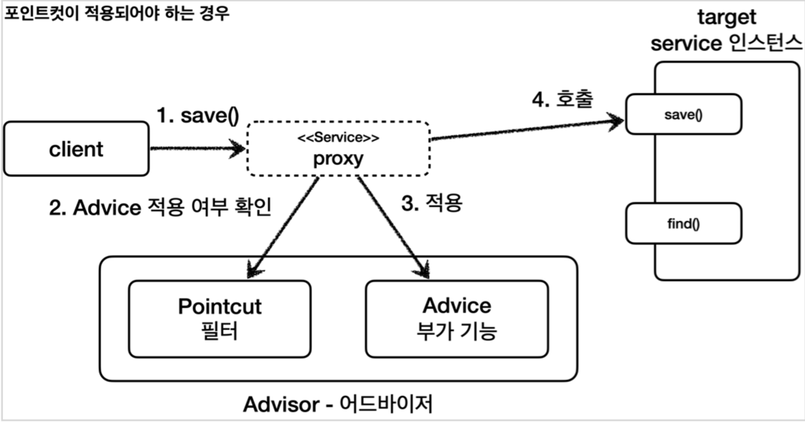

포인트 컷 대상이 아닐 경우
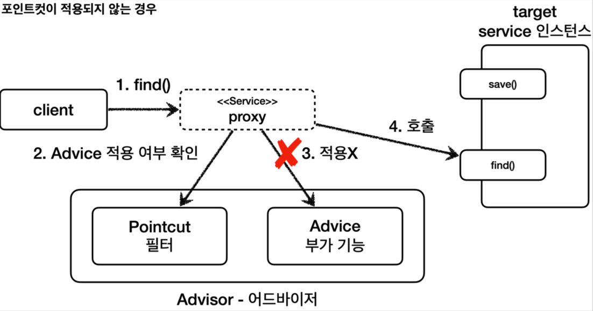

- 어드바이저
  - `AdvisorTest.advisorTest1()` 예제 참고
- 직접 만든 포인트 컷
  - `AdvisorTest.advisorTest2()` 예제 참고
  - 스프링이 제공하는 인터페이스
  ```java
  public interface Pointcut {
    ClassFilter getClassFilter();
    MethodMatcher getMethodMatcher();
  }
  
  public interface ClassFilter {
    boolean matches(Class<?> clazz);
  }
  
  public interface MethodMatcher {
    boolean matches(Method method, Class<?> targetClass);
    //..
  }
  ```
- 스프링이 제공하는 포인트 컷
  - `AdvisorTest.advisorTest3()` 예제 참고
  - 종류
    - `NameMatchMethodPointcut` : 메서드 이름을 기반으로 매칭한다. 내부에서는 PatternMatchUtils 를 사용한다. 예) *xxx* 허용
    - `JdkRegexpMethodPointcut` : JDK 정규 표현식을 기반으로 포인트컷을 매칭한다. 
    - `TruePointcut` : 항상 참을 반환한다.
    - `AnnotationMatchingPointcut` : 애노테이션으로 매칭한다. 
    - **(제일 중요함. 실제 주로 사용!)** `AspectJExpressionPointcut` : aspectJ 표현식으로 매칭한다.
      - aspectJ 표현식과 사용방법은 중요해서 이후 AOP를 설명할 때 자세히 설명
- 여러 어드바이저 함께 사용 
  - `MultiAdvisorTest.multiAdvisorTest1()` 참고
    - 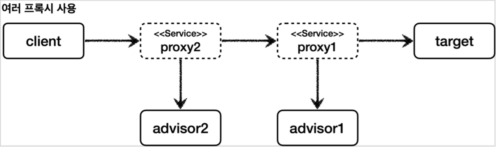
  - `MultiAdvisorTest.multiAdvisorTest2()` 참고
    - 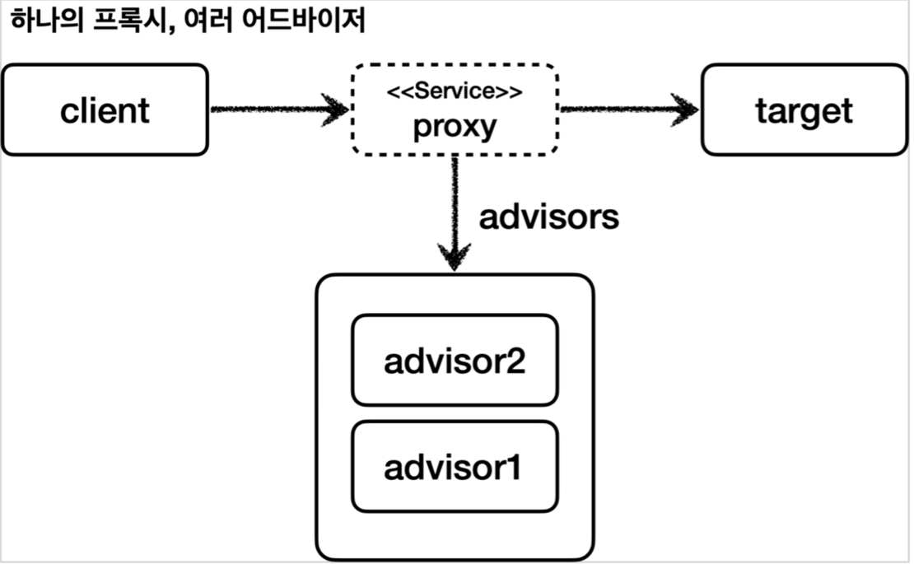
    - (**중요!**) 스프링 AOP는 이 구조로 되어 있다.
    
#### 적용

- `LogTraceAdvice` 참고
  - 추가 로직을 Advice 에 넣음
- `ProxyFactoryConfigV1` 참고
  - JDK 동적 프록시로 생성
- `ProxyFactoryConfigV2` 참고
  - CGLIB 로 프록시 생성

#### 정리

- 남은 문제
  1. 너무 많은 설정
     - 애플리케이션에 빈 100개면? 부가기능 적용하려면 100개의 동적 프록시 생성 코드 필요!(으악!)
  2. 컴포넌트 스캔
     - V3 와 같이 컴포넌트 스캔 사용하는 경우에는 프록시 적용할 방법이 없다!
- 문제 해결책 ===> **빈 후처리기(bean postprocessor)!!**

### 빈 후처리기

#### BeanPostProcessor 소개

- 스프링이 빈 저장소에 등록할 목적으로 생성한 객체를 빈 저장소에 등록하기 직전에 조작하는 용도
- 빈을 생성한 후에 무언가를 처리하는 용도
- 객체를 조작할 수도 있고, 완전히 다른 객체로 바꿔치기 하는 것도 가능

#### 빈 등록 과정

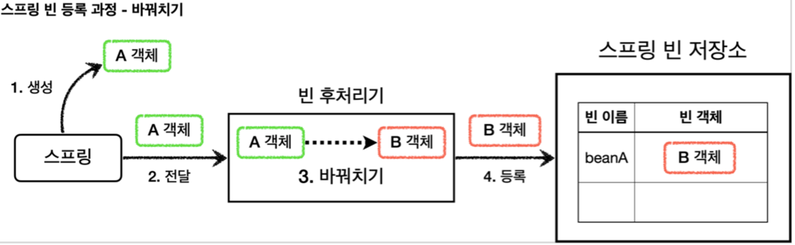

1. 생성: 스프링 빈 대상이 되는 객체를 생성한다. ( @Bean , 컴포넌트 스캔 모두 포함)
2. 전달: 생성된 객체를 빈 저장소에 등록하기 직전에 빈 후처리기에 전달한다.
3. 후 처리 작업: 빈 후처리기는 전달된 스프링 빈 객체를 조작하거나 다른 객체로 바뀌치기 할 수 있다. 
4. 등록: 빈 후처리기는 빈을 반환한다. 전달 된 빈을 그대로 반환하면 해당 빈이 등록되고, 바꿔치기 하면 다른 객체가 빈 저장소에 등록된다.

#### 예제

- `BasicTest.basicConfig()`: 일반적인 스프링 빈 등록 예제 
  - `BasicConfig` 에 등록된 bean 객체만 스프링 컨테이너에서 찾을 수 있음
- `BasicPostProcessorTest.basicConfig()`:  빈 후처리기 적용 예제
  - 빈 후처리기 `AToBPostProcessor`: A 객체를 B 객체로 바꿔치기 함
  ```java
  public interface BeanPostProcessor {
      Object postProcessBeforeInitialization(Object bean, String beanName) throws BeansException
      Object postProcessAfterInitialization(Object bean, String beanName) throws BeansException
  }
  ```
  - 빈 후처리기를 사용하려면 BeanPostProcessor 인터페이스를 구현 -> 빈 등록
  - `postProcessBeforeInitialization` : 객체 생성 이후에 `@PostConstruct` 같은 초기화가 발생하기
    전에 호출되는 포스트 프로세서
  - `postProcessAfterInitialization` : 객체 생성 이후에 `@PostConstruct` 같은 초기화가 발생한
    다음에 호출되는 포스트 프로세서
- 빈 후처리기는 빈을 조작하고 변경할 수 있는 후킹 포인트
- 일반적으로 스프링 컨테이너가 등록하는, 특히 컴포넌트 스캔의 대상이 되는 빈들은 중간에 조작할 방법이 없는데, 빈 후처리기를 사용하면 개발자가 등록하는 모든 빈을 중간에 조작할 수 있다
- **(결론)** 즉! 빈 객체를 프록시로 교체하는 것도 가능하다.

#### 적용

- 참고할 예제 범위
  - `PackageLogTracePostProcessor` : 빈 후처리기
    - 패키지 기준으로 프록시를 적용할지 필터링 하는 코드 존재함
      - 지정한 하위 패키지 내 빈들만 적용
      - 원본 객체는 스프링 빈으로 등록되지 않아야 함
    - `advisor` 는 DI 함
  - `BeanPostProcessorConfig` : `PackageLogTracePostProcessor` 빈 후처리기와 `LogTraceAdvice` 를 등록하는 Config
    - 이제 프록시를 생성하는 코드가 설정 파일에는 필요 없어짐
    - 즉 설정 코드의 중복이 없어짐
- 애플리케이션 로딩 로그로 본 결과
```
#v1 애플리케이션 프록시 생성 - JDK 동적 프록시
create proxy: target=v1.OrderRepositoryV1Impl proxy=class com.sun.proxy. $Proxy50
create proxy: target=v1.OrderServiceV1Impl proxy=class com.sun.proxy.$Proxy51 
create proxy: target=v1.OrderControllerV1Impl proxy=class com.sun.proxy. $Proxy52
#v2 애플리케이션 프록시 생성 - CGLIB
create proxy: target=v2.OrderRepositoryV2 proxy=v2.OrderRepositoryV2$ $EnhancerBySpringCGLIB$$x4
create proxy: target=v2.OrderServiceV2 proxy=v2.OrderServiceV2$ $EnhancerBySpringCGLIB$$x5
create proxy: target=v2.OrderControllerV2 proxy=v2.OrderControllerV2$ $EnhancerBySpringCGLIB$$x6
#v3 애플리케이션 프록시 생성 - CGLIB
create proxy: target=v3.OrderRepositoryV3 proxy=3.OrderRepositoryV3$ $EnhancerBySpringCGLIB$$x1
create proxy: target=v3.orderServiceV3 proxy=3.OrderServiceV3$ $EnhancerBySpringCGLIB$$x2
create proxy: target=v3.orderControllerV3 proxy=3.orderControllerV3$ $EnhancerBySpringCGLIB$$x3
```
  - v1: 인터페이스가 있으므로 JDK 동적 프록시가 적용
  - v2: 구체 클래스만 있으므로 CGLIB 프록시가 적용
  - v3: 구체 클래스만 있으므로 CGLIB 프록시가 적용

#### 정리

서두에 있었던 2가지 문제가 정리됨
- 문제1 - 너무 많이 중복된 프록시 코드 설정
- 문제2 - 컴포넌트 스캔 대상은 프록시 생성 불가능
- 문제 해결 : 
  - 프록시를 생성하는 부분을 하나로 집중
  - 컴포넌트 스캔처럼 스프링이 직접 대상을 빈으로 등록하는 경우에도 중간에 빈 등록 과정을 가로채서 원본 대신에 프록시를 스프링 빈으로 등록 가능해짐
  - 애플리케이션에 수 많은 스프링 빈이 추가되어도 프록시와 관련된 코드는 전혀 변경하지 않아도 됨
- 좀더 깔끔하게 다듬어 보자!
  - 프록시의 적용 대상 여부 로직 조건 : 패키지를 기준 -> 포인트 컷 설정 기준
  - 프록시 적용 대상 여부를 정밀하게 설정할 수 있다.

> 결과적으로 포인트컷은 다음 두 곳에 사용된다.
> 1. 프록시 적용 대상 여부를 체크해서 꼭 필요한 곳에만 프록시를 적용한다. (빈 후처리기 - 자동 프록시 생성)
> 2. 프록시의 어떤 메서드가 호출 되었을 때 어드바이스를 적용할 지 판단한다. (프록시 내부)

### 스프링이 제공하는 빈 후처리기

#### 자동 프록시 생성기 - AutoProxyCreator

```groovy
implementation 'org.springframework.boot:spring-boot-starter-aop'
```
- `aspectjweaver` 라는 `aspectJ` 관련 라이브러리를 등록
- `AopAutoConfiguration` : 스프링 부트가 AOP 관련 클래스를 자동으로 스프링 빈에 등록
- 스프링 부트 자동 설정으로 `AnnotationAwareAspectJAutoProxyCreator` 라는 빈 후처리기가 스프링 빈에 자동으로 등록
- `AnnotationAwareAspectJAutoProxyCreator`: 자동으로 프록시를 생성해주는 빈 후처리기
- 스프링 빈으로 등록된 Advisor 들을 자동으로 찾아서 프록시가 필요한 곳에 자동으로 프록시를 적용
- `Advisor` 만 알고 있으면 그 안에있는 `Pointcut` 으로 어떤 스프링빈에 프록시를 적용해야 할 지 알수 있다. 그리고 `Advice` 로 부가 기능을 적용하면 된다.

#### 자동 프록시 생성기의 작동 과정

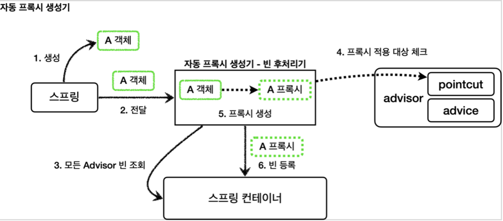
1. 생성: 스프링이 스프링 빈 대상이 되는 객체를 생성한다. ( @Bean , 컴포넌트 스캔 모두 포함)
2. 전달: 생성된 객체를 빈 저장소에 등록하기 직전에 빈 후처리기에 전달한다.
3. 모든 Advisor 빈 조회: 자동 프록시 생성기 - 빈 후처리기는 스프링 컨테이너에서 모든 Advisor 를 조회한다.
4. 프록시 적용 대상 체크: 앞서 조회한 Advisor 에 포함되어 있는 포인트컷을 사용해서 해당 객체가 프록시를 적용할 대상인지 아닌지 판단한다. 이때 객체의 클래스 정보는 물론이고, 해당 객체의 모든 메서드를 포인트컷에 하나하나 모두 매칭해본다. 그래서 조건이 하나라도 만족하면 프록시 적용 대상이 된다. 예를 들어서 10개의 메서드 중에 하나만 포인트컷 조건에 만족해도 프록시 적용 대상이 된다.
5. 프록시 생성: 프록시 적용 대상이면 프록시를 생성하고 반환해서 프록시를 스프링 빈으로 등록한다. 만약 프록시 적용 대상이 아니라면 원본 객체를 반환해서 원본 객체를 스프링 빈으로 등록한다.
6. 빈 등록: 반환된 객체는 스프링 빈으로 등록된다.

#### 중요: 포인트컷은 2가지에 사용

1. 프록시 적용 여부 판단 - 생성 단계
   1. 자동 프록시 생성기는 포인트컷을 사용해서 해당 빈이 프록시를 생성할 필요가 있는지 없는지 체크한다. 
   2. 클래스 + 메서드 조건을 모두 비교한다. 이때 모든 메서드를 체크하는데, 포인트컷 조건에 하나하나 매칭해본다. 만약 조건에 맞는 것이 하나라도 있으면 프록시를 생성한다.
      1. 예) `orderControllerV1` 은 `request()` , `noLog()` 가 있다. 여기에서 `request()` 가 조건에 만족하므로 프록시를 생성한다.
   3. 만약 조건에 맞는 것이 하나도 없으면 프록시를 생성할 필요가 없으므로 프록시를 생성하지 않는다.
2. 어드바이스 적용 여부 판단 - 사용 단계
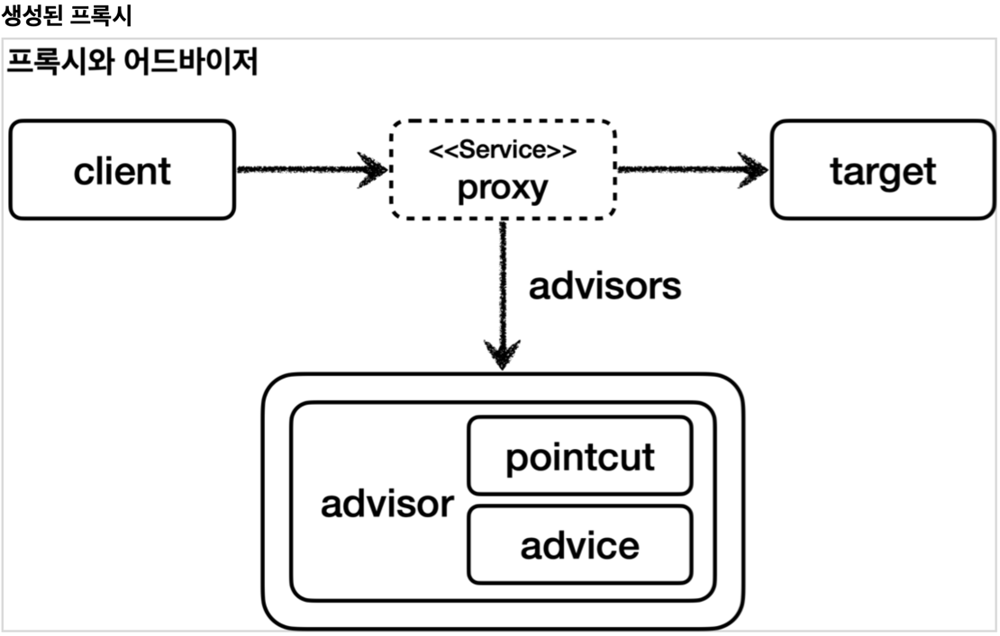
   1. 프록시가 호출되었을 때 부가 기능인 어드바이스를 적용할지 말지 포인트컷을 보고 판단한다.
   2. 앞서 설명한 예에서 `orderControllerV1` 은 이미 프록시가 걸려있다. 
   3. `orderControllerV1` 의 `request()` 는 현재 포인트컷 조건에 만족하므로 프록시는 어드바이스를 먼저 호출하고, target 을 호출한다. 
   4. `orderControllerV1` 의 `noLog()` 는 현재 포인트컷 조건에 만족하지 않으므로 어드바이스를 호출하지 않고 바로 target 만 호출한다.

#### AspectJExpressionPointcut

- AspectJ라는 AOP에 특화된 포인트컷 표현식을 적용
- 특별한 표현식으로 복잡한 포인트컷을 만들 수 있음
- `AutoProxyConfig.advisor2()` 참고

#### 하나의 프록시, 여러 Advisor 적용

- 프록시 자동 생성기 상황별 정리
- `advisor1` 의 포인트컷만 만족 -> 프록시1개 생성, 프록시에 `advisor1` 만 포함
- `advisor1` , `advisor2` 의 포인트컷을 모두 만족 -> 프록시1개 생성, 프록시에 `advisor1`, `advisor2` 모두 포함
- `advisor1` , `advisor2` 의 포인트컷을 모두 만족하지 않음 -> 프록시가 생성되지 않음

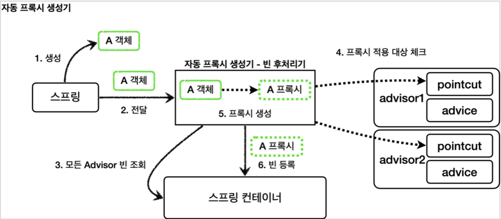


## V6: @Aspect AOP

### @Aspect 프록시 적용

- `LogTraceAspect` 클래스 참고
  - 지금까지 어드바이저를 직접 만들었던 부분을 @Aspect 애노테이션을 사용해서 만들어보자.
  - @Aspect 는 관점 지향 프로그래밍(AOP)을 가능하게 하는 AspectJ 프로젝트에서 제공하는 애노테이션
- `AopConfig` 클래스 참고
  - `@Bean logTraceAspect()` : `@Aspect` 가 있어도 스프링 빈으로 등록을 해줘야 한다. 물론 LogTraceAspect 에 `@Component` 애노테이션을 붙여서 컴포넌트 스캔을 사용해서 스프링 빈으로 등록해도 된다.

### @Aspect 프록시 설명

자동 프록시 생성기는 최종적으로 2가지 일을 함 
1. @Aspect 를 보고 어드바이저( Advisor )로 변환해서 저장한다. 
   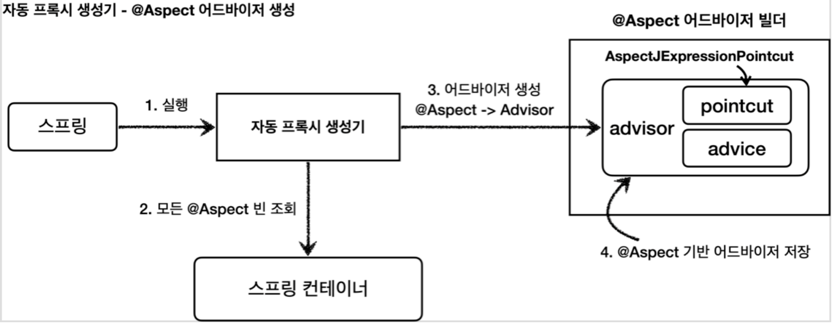
   1. 실행: 스프링 애플리케이션 로딩 시점에 자동 프록시 생성기를 호출한다.
   2. 모든 @Aspect 빈 조회: 자동 프록시 생성기는 스프링 컨테이너에서 @Aspect 애노테이션이 붙은 스프링 빈을 모두 조회한다.
   3. 어드바이저 생성: @Aspect 어드바이저 빌더를 통해 @Aspect 애노테이션 정보를 기반으로 어드바이저를 생성한다.
   4. @Aspect 기반 어드바이저 저장: 생성한 어드바이저를 @Aspect 어드바이저 빌더 내부에 저장한다.
2. 어드바이저를 기반으로 프록시를 생성한다.
   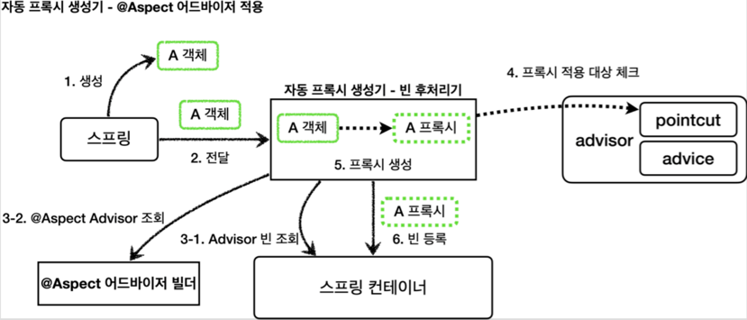
   1. 생성: 스프링 빈 대상이 되는 객체를 생성한다. (`@Bean` , 컴포넌트 스캔 모두 포함)
   2. 전달: 생성된 객체를 빈 저장소에 등록하기 직전에 빈 후처리기에 전달한다.
   3. Advisor 빈 조회
      1. Advisor 빈 조회: 스프링 컨테이너에서 Advisor 빈을 모두 조회한다.
      2. @Aspect Advisor 조회: @Aspect 어드바이저 빌더 내부에 저장된 Advisor 를 모두 조회한다.
   4. 프록시 적용 대상 체크: 앞서 3-1, 3-2에서 조회한 Advisor 에 포함되어 있는 포인트컷을 사용해서 해당 객체가 프록시를 적용할 대상인지 아닌지 판단한다. 이때 객체의 클래스 정보는 물론이고, 해당 객체의 모든 메서드를 포인트컷에 하나하나 모두 매칭해본다. 그래서 조건이 하나라도 만족하면 프록시 적용 대상이 된다. 예를 들어서 메서드 하나만 포인트컷 조건에 만족해도 프록시 적용 대상이 된다.
   5. 프록시 생성: 프록시 적용 대상이면 프록시를 생성하고 프록시를 반환한다. 그래서 프록시를 스프링 빈으로 등록한다. 만약 프록시 적용 대상이 아니라면 원본 객체를 반환해서 원본 객체를 스프링 빈으로 등록한다.
   6. 빈 등록: 반환된 객체는 스프링 빈으로 등록된다.

## 스프링 AOP

### 핵심기능과 부가기능

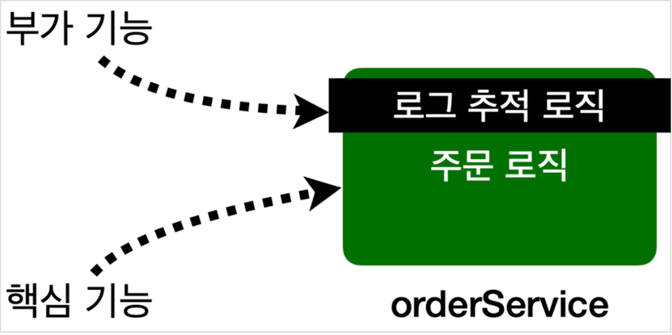

애플리케이션 로직은 크게 **핵심 기능**과 **부가 기능**으로 나눌 수 있다.
- 핵심 기능: 해당 객체가 제공하는 고유의 기능
  - `OrderService` - 주문 로직
- 부가 기능: 핵심 기능을 보조하기 위해 제공되는 기능
  - 로그 추적 로직
  - 트랜잭션 기능
  - 단독으로 사용되지 않고, 핵심 기능과 함께 사용

### 여러 곳에서 공통으로 사용하는 부가 기능

- 횡단 관심사(cross-cutting concerns): 하나의 부가 기능이 여러 곳에 동일하게 사용된다는 뜻
- 부가 기능 적용 문제
  - 부가 기능을 적용할 때 아주 많은 반복이 필요하다.
    부가 기능이 여러 곳에 퍼져서 중복 코드를 만들어낸다. 
  - 부가 기능을 변경할 때 중복 때문에 많은 수정이 필요하다. 
  - 부가 기능의 적용 대상을 변경할 때 많은 수정이 필요하다.
- 어떻게 해결할 것인가?

### Aspect

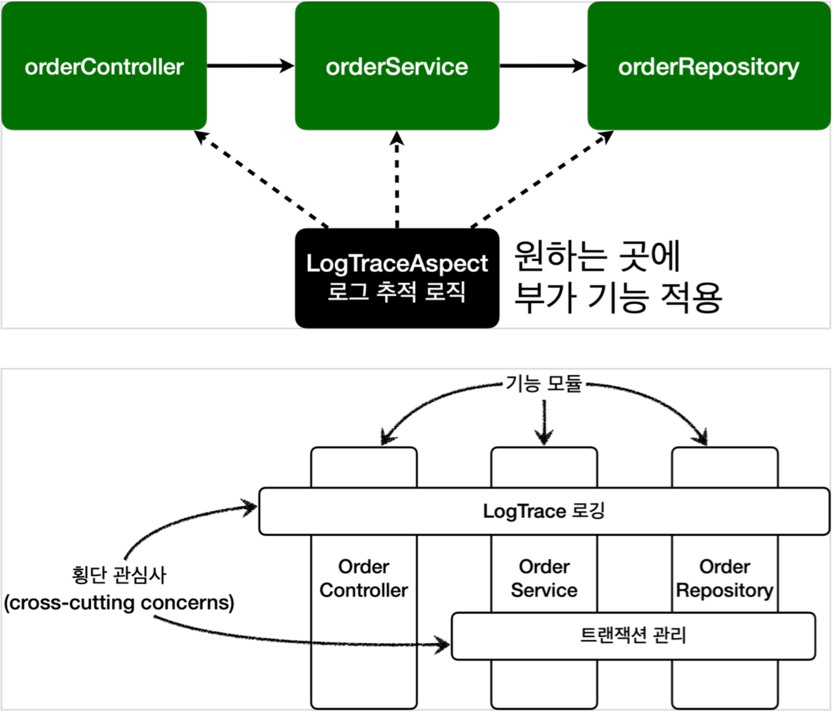

- 부가 기능을 핵심 기능에서 분리하고 한 곳에서 관리
- 해당 부가 기능을 어디에 적용할지 선택하는 기능
- 애스펙트(aspect) = 부가 기능 + 부가 기능을 어디에 적용할지 선택하는 기능
  - 예) 로그 출력 기능을 모든 컨트롤러에 적용해라
- 관점 지향 프로그래밍 AOP(Aspect-Oriented Programming) : 애스펙트를 사용한 프로그래밍 방식
  - OOP를 대체하기 위한 것이 아니라 횡단 관심사를 깔끔하게 처리하기 어려운 OOP의 부족한 부분을 보조하는 목적으로 개발
- **AspectJ** 프레임워크: 
  - AOP의 대표적인 구현
  - 스프링도 AOP를 지원하지만 대부분 AspectJ의 문법을 차용, 
  - AspectJ가 제공하는 기능의 일부만 제공

### AOP 적용 방식

크게 3가지 방법이 있다. 
1. 컴파일 시점
2. 클래스 로딩 시점
3. 런타임 시점(프록시)

위빙(Weaving): 옷감을 짜다. 직조하다. 애스펙트와 실제 코드를 연결해서 붙이는 것

#### 컴파일 시점

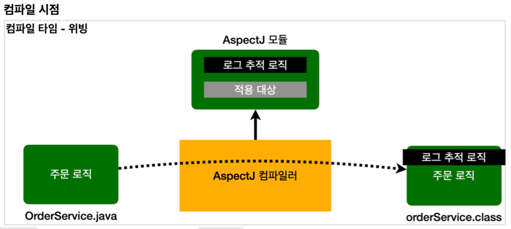

- 실제 대상 코드에 애스팩트를 통한 부가 기능 호출 코드가 포함된다. AspectJ를 직접 사용해야 한다.
- 부가 기능 코드가 핵심 기능이 있는 컴파일된 코드 주변에 실제로 붙어 버린다고 생각하면 된다.
- 단점: 컴파일 시점에 부가 기능을 적용하려면 특별한 컴파일러도 필요하고 복잡하다.

#### 클래스 로딩 시점

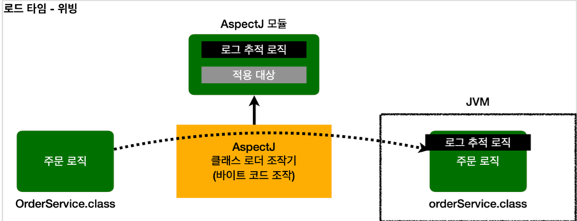

- 실제 대상 코드에 애스팩트를 통한 부가 기능 호출 코드가 포함된다. AspectJ를 직접 사용해야 한다.
- 자바 언어는 .class 파일을 JVM 내부의 클래스 로더에 보관
- 중간에서 .class 파일을 조작한 다음 JVM에 올릴 수 있다
- 많은 모니터링 툴들이 이 방식 사용
- 단점: 로드 타임 위빙은 자바를 실행할 때 특별한 옵션( java -javaagent )을 통해 클래스 로더 조작기를 지정해야 하는데, 이 부분이 번거롭고 운영하기 어렵다.

#### 런타임 시점(프록시)

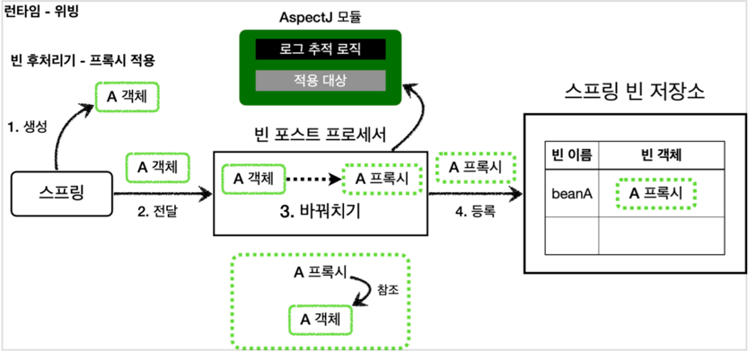

- 실제 대상 코드는 그대로 유지된다. 대신에 프록시를 통해 부가 기능이 적용된다. 따라서 항상 프록시를 통해야 부가 기능을 사용할 수 있다. 스프링 AOP는 이 방식을 사용한다.
- 자바의 메인(`main`) 메서드가 이미 실행된 다음이다. 따라서 자바 언어가 제공하는 범위 안에서 부가 기능을 적용
- 특별한 컴파일러나, 자바를 실행할 때 복잡한 옵션과 클래스 로더 조작기를 설정하지 않아도 된다.
- 단점: 프록시를 사용하기 때문에 AOP 기능에 일부 제약. 생성자나 static 메서드, 필드 값 접근에는 프록시 개념이 적용될 수 없다.

#### AOP 적용 위치

- 조인 포인트(Join point): AOP를 적용할 수 있는 지점
- 컴파일,클래스 로딩 시점:  생성자, 필드 값 접근, static 메서드 접근, 메서드 실행
- 런타임 시점(프록시): 
  - 스프링 AOP의 조인 포인트는 메서드 실행으로 제한
  - 프록시는 메서드 오버라이딩 개념으로 동작한다. 따라서 생성자나 static 메서드, 필드 값 접근에는 프록시 개념이 적용될 수 없다.

> **참고**
> 
> 스프링은 AspectJ의 문법을 차용하고 프록시 방식의 AOP를 적용한다. AspectJ를 직접 사용하는 것이 아니다.

> **중요**
> 
> AspectJ를 사용하려면 공부할 내용도 많고, 자바 관련 설정(특별한 컴파일러, AspectJ 전용 문법, 자바 실행 옵션)도 복잡하다. 반면에 스프링 AOP는 별도의 추가 자바 설정 없이 스프링만 있으면 편리하게 AOP 를 사용할 수 있다. 
> 
> 실무에서는 스프링이 제공하는 AOP 기능만 사용해도 대부문의 문제를 해결할 수 있다. 따라서 스프링 AOP가 제공하는 기능을 학습하는 것에 집중하자.
