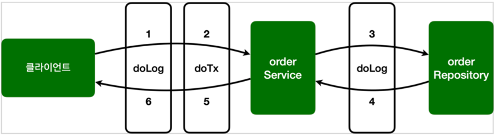
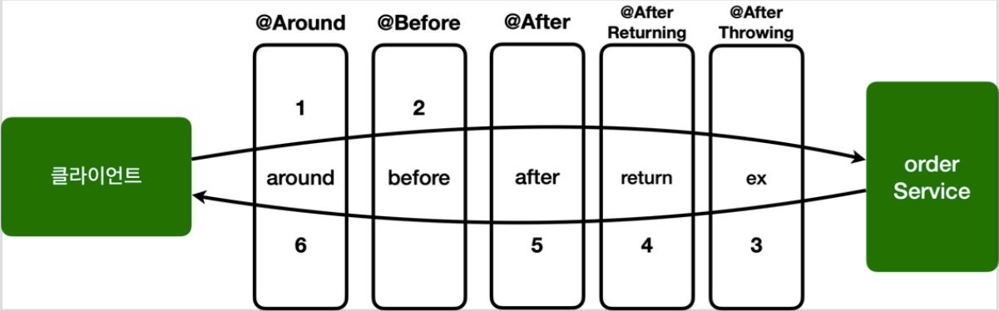

# 스프링 핵심 원리 - 고급편 3

## 스프링 AOP 구현

> 참고
> 
> `@Aspect` 를 사용하려면 `@EnableAspectJAutoProxy` 를 스프링 설정에 추가해야 하지만, 스프링 부트를 사용하면 자동으로 추가된다.

### 예제 프로젝트 만들기

- `AopTest` 기본 테스트 참고
- `OrderRepository`, `OrderService` 구현 로직 참고

### 구현1 - 시작

- `AspectV1` 에스펙트 구현
- `AopTest` 에 `@Import(AspectV1.class)` 추가

### 스프링 AOP 구현2 - 포인트컷 분리

- `AspectV2` 에스펙트 구현
- `AopTest` 에 `@Import(AspectV2.class)` 추가

### 스프링 AOP 구현3 - 어드바이스 추가

- `AspectV3` 에스펙트 구현
- `AopTest` 에 `@Import(AspectV3.class)` 추가

- 포인트것이 적용된 AOP 결과는 다음과 같다. 
  - `orderService` : doLog() , doTransaction() 어드바이스 적용 
  - `orderRepository` : doLog() 어드바이스 적용

### 스프링 AOP 구현4 - 포인트컷 참조

- 포인트컷을 공용으로 사용하기 위해 별도의 외부 클래스에 모아두기
- `AspectV4Pointcut` 에스펙트 구현
- `Pointcuts` 포인트컷 모음
- `AopTest` 에 `@Import(AspectV4Pointcut.class)` 추가

### 스프링 AOP 구현5 - 어드바이스 순서

- 적용 후 실행순서 정하기 `@Order(1)`
- 문제는 class 단위로만 지정됨 -> 그냥 inner class 로 선언하자
- `AspectV5Order` 에스펙트 구현
- `AopTest` 에 `@Import({AspectV5Order.LogAspect.class, AspectV5Order.TxAspect.class})`

### 스프링 AOP 구현6 - 어드바이스 종류

#### 어드바이스 종류

- (가장 강력함 - 아래 4개 기능 모두 포함) `@Around` : 메서드 호출 전후에 수행, 가장 강력한 어드바이스, 조인 포인트 실행 여부 선택, 반환 값 변환, 예외 변환 등이 가능
- `@Before` : 조인 포인트 실행 이전에 실행
- `@AfterReturning` : 조인 포인트가 정상 완료후 실행
- `@AfterThrowing` : 메서드가 예외를 던지는 경우 실행
- `@After` : 조인 포인트가 정상 또는 예외에 관계없이 실행(finally)

#### 예제

- `AspectV6Advice` 코드 참고하기
  - @Around
    - 하나만 있어도 모든 기능을 수행
    - 큰 실수가 도사리고 있음: `joinPoint.proceed()` 호출이 없다면 치명적인 버그 발생
  - @Before, @AfterReturning, @AfterThrowing, @After
    - 기능상의 제약: 좋은 설계는 제약이 있는 것
    - 실수를 미연에 방지
    - 제약 덕분에 역할이 명확: 다른 개발자도 이 코드를 보고 고민해야 하는 범위가 줄어들고 코드의 의도도 파악하기 쉽다.
- 순서

