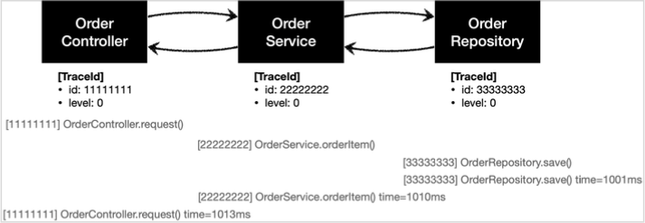
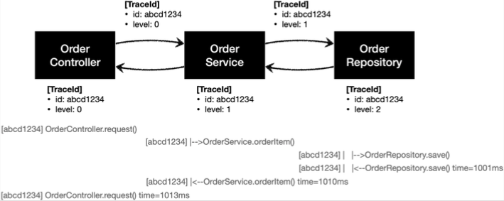

# 스프링 핵심 원리 - 고급편


## 로그 추적기 - 요구사항 분석

### 요구사항

- 모든 PUBLIC 메서드의 호출과 응답 정보를 로그로 출력 
- 애플리케이션의 흐름을 변경하면 안됨
  - 로그를 남긴다고 해서 비즈니스 로직의 동작에 영향을 주면 안됨 
- 메서드 호출에 걸린 시간 
- 정상 흐름과 예외 흐름 구분
  - 예외 발생시 예외 정보가 남아야 함
- 메서드 호출의 깊이 표현 
- HTTP 요청을 구분 
  - HTTP 요청 단위로 특정 ID를 남겨서 어떤 HTTP 요청에서 시작된 것인지 명확하게 구분이 가능해야 함
  - 트랜잭션 ID (DB 트랜잭션X), 여기서는 하나의 HTTP 요청이 시작해서 끝날 때 까지를 하나의 트랜잭션이라 함

### 예시 

```
정상 요청
[796bccd9] OrderController.request()
[796bccd9] |-->OrderService.orderItem()
[796bccd9] |   |-->OrderRepository.save()
[796bccd9] |   |<--OrderRepository.save() time=1004ms
[796bccd9] |<--OrderService.orderItem() time=1014ms
[796bccd9] OrderController.request() time=1016ms

예외 발생
[b7119f27] OrderController.request()
[b7119f27] |-->OrderService.orderItem()
[b7119f27] | |-->OrderRepository.save() 
[b7119f27] | |<X-OrderRepository.save() time=0ms ex=java.lang.IllegalStateException: 예외 발생! 
[b7119f27] |<X-OrderService.orderItem() time=10ms ex=java.lang.IllegalStateException: 예외 발생! 
[b7119f27] OrderController.request() time=11ms ex=java.lang.IllegalStateException: 예외 발생!
```

## 로그 추적기 V1 - 프로토타입 개발

### 관련 소스

- src
  - trace.TraceId
  - trace.TraceStatus
  - trace.hellotrace.HelloTraceV1
- test
  - trace.hellotrace.HelloTraceV1Test

## 로그 추적기 V1 - 적용

### 관련 소스

- src
  - app.v1.OrderControllerV1
  - app.v1.OrderServiceV1
  - app.v1.OrderRepositoryV1


### 정상 실행 로그

```
[c41539c3] OrderController.request()
[7f805f4e] OrderService.orderItem()
[98a03000] OrderRepository.save()
[98a03000] OrderRepository.save() time=1003ms
[7f805f4e] OrderService.orderItem() time=1004ms
[c41539c3] OrderController.request() time=1005ms
```



### 예외 실행 로그

```
[27c333f6] OrderController.request()
[62d40a7f] OrderService.orderItem()
[5fbb6590] OrderRepository.save()
[5fbb6590] OrderRepository.save() time=1ms, ex=java.lang.IllegalStateException: 예외 발생!
[62d40a7f] OrderService.orderItem() time=1ms, ex=java.lang.IllegalStateException: 예외 발생!
[27c333f6] OrderController.request() time=1ms, ex=java.lang.IllegalStateException: 예외 발생!
```

로그를 남기기 위한 코드가 생각보다 복잡하다. 
일단은 요구사항을 맞추는 것에 집중한다.

### 남은 요구사항

- 메서드 호출의 깊이 표현
- HTTP 요청을 구분
  - HTTP 요청 단위로 특정 ID를 남겨서 어떤 HTTP 요청에서 시작된 것인지 명확하게 구분이 가능해야 함
  - 트랜잭션 ID (DB 트랜잭션X)


## 로그 추적기 V2 - 파라미터로 동기화 개발

첫 로그에서 사용한 트랜잭션ID 와 level 을 각 layer 에서 다음 로그에 넘겨준다.



### 관련 소스

- src
  - trace.hellotrace.HelloTraceV2
- test
  - trace.hellotrace.HelloTraceV2Test
  
### beginSync(..)

기존 TraceId 에서 createNextId() 를 통해 다음ID를 구한다. 
- 트랜잭션ID는 기존과 같이 유지한다.
- 깊이를 표현하는 Level은 하나 증가한다. ( 0 -> 1 )

### 정상 실행 로그

```
[5e985874] hello1
[5e985874] |-->hello2
[5e985874] |<--hello2 time=3ms
[5e985874] hello1 time=7ms
```

### 예외 실행 로그

```
[c62f819c] hello1
[c62f819c] |-->hello2
[c62f819c] |<--hello2 time=3ms, ex=java.lang.IllegalStateException
[c62f819c] hello1 time=7ms, ex=java.lang.IllegalStateException
```

같은 트렌잭션 ID를 유지하고 level 을 통해 메서드 호출의 깊이를 표현 가능해졌다.

## 로그 추적기 V2 - 적용

### 관련 소스

- src
  - app.v2.OrderControllerV2
  - app.v2.OrderServiceV2
  - app.v2.OrderRepositoryV2

### 정상 실행 로그

```
[07e5f4df] OrderController.request()
[07e5f4df] |-->OrderService.orderItem()
[07e5f4df] |   |-->OrderRepository.save()
[07e5f4df] |   |<--OrderRepository.save() time=1003ms
[07e5f4df] |<--OrderService.orderItem() time=1004ms
[07e5f4df] OrderController.request() time=1004ms
```

### 예외 실행 로그

```
[55e54f79] OrderController.request()
[55e54f79] |-->OrderService.orderItem()
[55e54f79] |   |-->OrderRepository.save()
[55e54f79] |   |<--OrderRepository.save() time=1ms, ex=java.lang.IllegalStateException: 예외 발생!
[55e54f79] |<--OrderService.orderItem() time=1ms, ex=java.lang.IllegalStateException: 예외 발생!
[55e54f79] OrderController.request() time=1ms, ex=java.lang.IllegalStateException: 예외 발생!
```

### 문제점

- 처음의 요구사항을 모두 만족하지만.. 한가지 문제가 더 남아있다.
- 로그를 출력하는 모든 메서드에 TraceId 파라미터를 추가해야 하는 문제
  - 기존의 모든 코드의 파라미터를 추가해야 한다.
- 직접 클래스와 메서드를 기입해야 하는 문제
  - 1~2개가 적용되는게 아니라 모든 메서드에 적용하는건 불가능에 가깝다.
- 다른 해결책은 없을까?

## Thread Local

### 문제에 대한 해결책

#### FieldLogTrace 클래스

- 적용해야 하는 메서드의 파라메터를 사용하는 것에서 `FieldLogTrace` 클래스의 필드로 `TraceId` 로 사용하도록 변경함
- 추가된 사항
  - `syncTraceId()` 메서드
    - 로그 시작시 : traceId 새로 만들기 & level = 0 으로 시작
    - 직전 로그가 있는경우 : traceId 는 그대로, level 을 한단계 올림
  - `releaseTraceId()` 메서드
    - 직전 로그가 있는경우 : traceId 의 level 을 한단계 낮춤
    - 로그 종료 : level 이 1단계면 추적이 끝나므로 TraceId 필드를 초기화(null)
- 단위 테스트 : `FieldLogTraceTest`

```
[c80f5dbb] OrderController.request()                //syncTraceId(): 최초 호출 level=0 
[c80f5dbb] |-->OrderService.orderItem()             //syncTraceId(): 직전 로그 있음 level=1 증가
[c80f5dbb] | |-->OrderRepository.save()             //syncTraceId(): 직전 로그 있음 level=2 증가
[c80f5dbb] | |<--OrderRepository.save() time=1005ms //releaseTraceId(): level=2->1 감소
[c80f5dbb] |<--OrderService.orderItem() time=1014ms //releaseTraceId(): level=1->0 감소
[c80f5dbb] OrderController.request()    time=1017ms //releaseTraceId(): level==0, traceId 제거
```

#### FieldLogTrace 클래스 적용

- OrderControllerV3, OrderServiceV3, OrderRepositoryV3
- 파라메터로 넘기지 않아서 좀 더 적용하기 편해짐..
- 그러나... 여기엔 동시성 문제가 도사리고 있다!

### 필드 동기화 - 동시성 문제

- 동시성 문제 확인 : 1초 이내에 2회 이상 호출해보자!
- `nio-8080-exec-1` << 스레드 이름
- `[8798ec62]` << traceId
- 요청은 2개인데 traceId는 같은걸로 나온다.

```
[nio-8080-exec-1] d.l.s.trace.logtrace.FieldLogTrace       : [8798ec62] OrderController.request()
[nio-8080-exec-1] d.l.s.trace.logtrace.FieldLogTrace       : [8798ec62] |-->OrderService.orderItem()
[nio-8080-exec-1] d.l.s.trace.logtrace.FieldLogTrace       : [8798ec62] |   |-->OrderRepository.save()
[nio-8080-exec-2] d.l.s.trace.logtrace.FieldLogTrace       : [8798ec62] |   |   |-->OrderController.request()
[nio-8080-exec-2] d.l.s.trace.logtrace.FieldLogTrace       : [8798ec62] |   |   |   |-->OrderService.orderItem()
[nio-8080-exec-2] d.l.s.trace.logtrace.FieldLogTrace       : [8798ec62] |   |   |   |   |-->OrderRepository.save()
[nio-8080-exec-1] d.l.s.trace.logtrace.FieldLogTrace       : [8798ec62] |   |<--OrderRepository.save() time=1004ms
[nio-8080-exec-1] d.l.s.trace.logtrace.FieldLogTrace       : [8798ec62] |<--OrderService.orderItem() time=1004ms
[nio-8080-exec-1] d.l.s.trace.logtrace.FieldLogTrace       : [8798ec62] OrderController.request() time=1004ms
[nio-8080-exec-2] d.l.s.trace.logtrace.FieldLogTrace       : [8798ec62] |   |   |   |   |<--OrderRepository.save() time=1003ms
[nio-8080-exec-2] d.l.s.trace.logtrace.FieldLogTrace       : [8798ec62] |   |   |   |<--OrderService.orderItem() time=1004ms
[nio-8080-exec-2] d.l.s.trace.logtrace.FieldLogTrace       : [8798ec62] |   |   |<--OrderController.request() time=1004ms
```

- 스레드 별로 로그를 나눠보면 이렇다.

```
[nio-8080-exec-1] d.l.s.trace.logtrace.FieldLogTrace       : [8798ec62] OrderController.request()
[nio-8080-exec-1] d.l.s.trace.logtrace.FieldLogTrace       : [8798ec62] |-->OrderService.orderItem()
[nio-8080-exec-1] d.l.s.trace.logtrace.FieldLogTrace       : [8798ec62] |   |-->OrderRepository.save()
[nio-8080-exec-1] d.l.s.trace.logtrace.FieldLogTrace       : [8798ec62] |   |<--OrderRepository.save() time=1004ms
[nio-8080-exec-1] d.l.s.trace.logtrace.FieldLogTrace       : [8798ec62] |<--OrderService.orderItem() time=1004ms
[nio-8080-exec-1] d.l.s.trace.logtrace.FieldLogTrace       : [8798ec62] OrderController.request() time=1004ms
```

```
[nio-8080-exec-2] d.l.s.trace.logtrace.FieldLogTrace       : [8798ec62] |   |   |-->OrderController.request()
[nio-8080-exec-2] d.l.s.trace.logtrace.FieldLogTrace       : [8798ec62] |   |   |   |-->OrderService.orderItem()
[nio-8080-exec-2] d.l.s.trace.logtrace.FieldLogTrace       : [8798ec62] |   |   |   |   |-->OrderRepository.save()
[nio-8080-exec-2] d.l.s.trace.logtrace.FieldLogTrace       : [8798ec62] |   |   |   |   |<--OrderRepository.save() time=1003ms
[nio-8080-exec-2] d.l.s.trace.logtrace.FieldLogTrace       : [8798ec62] |   |   |   |<--OrderService.orderItem() time=1004ms
[nio-8080-exec-2] d.l.s.trace.logtrace.FieldLogTrace       : [8798ec62] |   |   |<--OrderController.request() time=1004ms
```

#### 왜 그런가? 동시성 문제

- FieldLogTrace 는 스프링 컨텍스트 상에서 싱글톤으로 존재함
- 즉 JVM 안에서 인스턴스가 딱 1개 존재한다는 의미
- 2개 이상의 쓰레드가 동시 접근시에 상태를 같이 사용한다는 의미이기도 하다
- 여기서 FieldLogTrace 상태는 2가지이다 : `level`, `traceId`
- 메서드가 호출될 때마다 `level` 을 update(write) 한다.
- 동시에 들어온다면? 서로의 `level` 을 쓰고 읽기 때문에 순서가 우리가 원하는 대로 진행되지 않는다.

### 동시성 문제 테스트

- `FieldServiceTest` 클래스 실행해보기
  - `sleep(2000)` 일때
    - ThreadA, ThreadB 순차적으로 쓰기, 읽기가 진행됨
  - `sleep(100)` 일때
    - ThreadA 쓰기
    - ThreadB 쓰기 (아직 A가 끝나지 않았는데 덮어 쓰기를 하는 상황)
    - ThreadA 읽기 (dirty read 발생)
    - ThreadB 읽기 (자기가 바꾼걸 읽음)
  - ThreadA 입장에서는 일관성이 깨진 상황이다.
- 스프링은 기본이 싱글톤이므로 특히 주의해야 한다.
- 서블릿 컨테이너 내에서 실행되는 MVC 프레임워크에는 멀티 스레드 환경이다.
  - **중요!** 싱글톤에 상태를 write - read 하는 것은 절대 하지 말자
- ThreadLocal
  - 이럴때 사용하는 것!
    - 호출시 파라메터 전달은 하고 싶지 않다
    - 싱글톤의 동시성 문제는 생기게 하고 싶지 않다