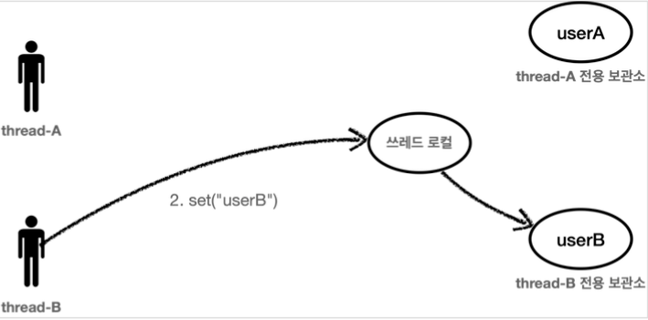
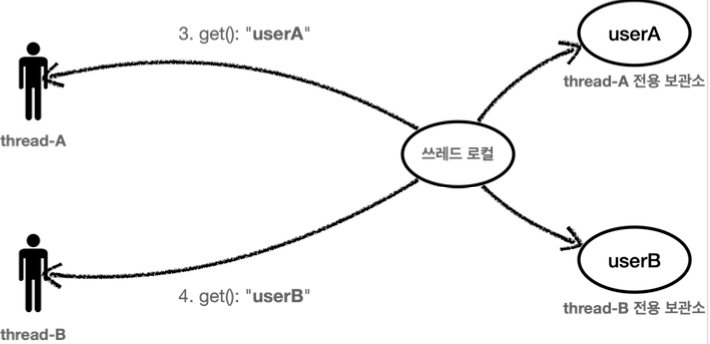
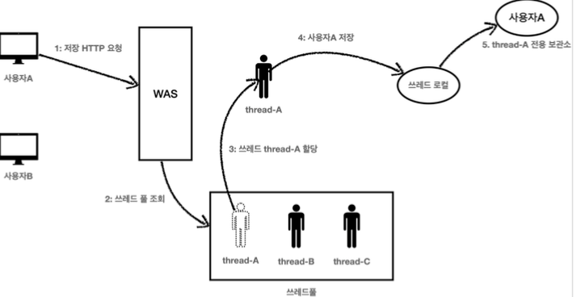
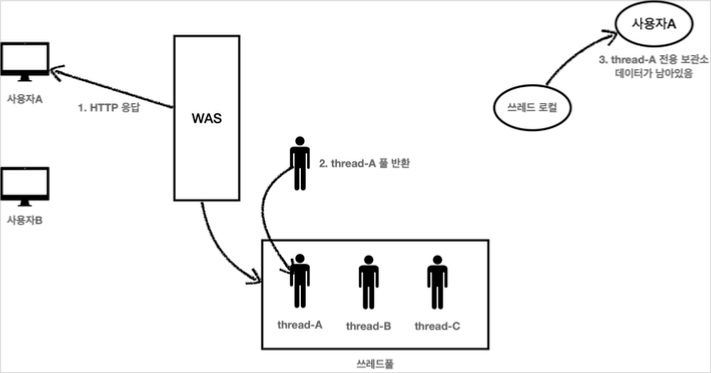
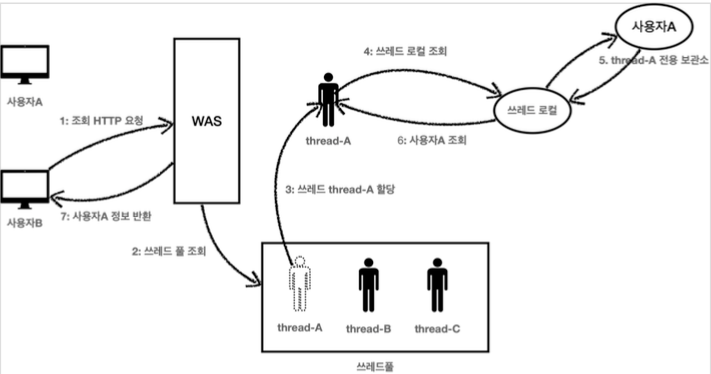
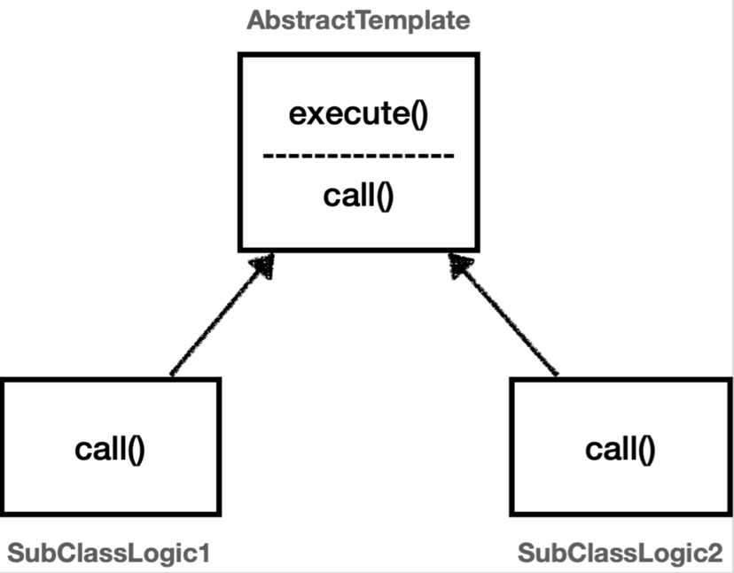
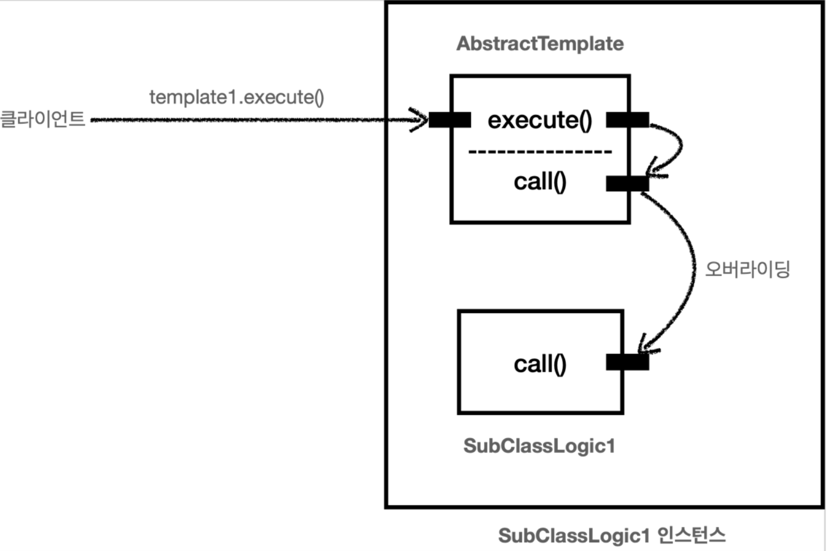
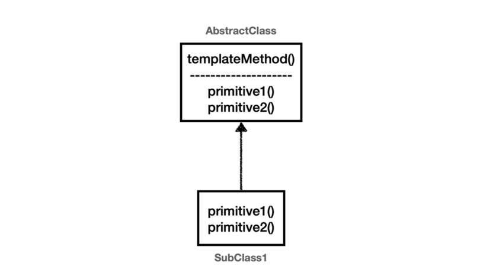
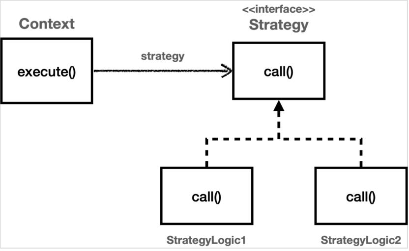

# 스프링 핵심 원리 - 고급편


## 로그 추적기 - 요구사항 분석

### 요구사항

- 모든 PUBLIC 메서드의 호출과 응답 정보를 로그로 출력 
- 애플리케이션의 흐름을 변경하면 안됨
  - 로그를 남긴다고 해서 비즈니스 로직의 동작에 영향을 주면 안됨 
- 메서드 호출에 걸린 시간 
- 정상 흐름과 예외 흐름 구분
  - 예외 발생시 예외 정보가 남아야 함
- 메서드 호출의 깊이 표현 
- HTTP 요청을 구분 
  - HTTP 요청 단위로 특정 ID를 남겨서 어떤 HTTP 요청에서 시작된 것인지 명확하게 구분이 가능해야 함
  - 트랜잭션 ID (DB 트랜잭션X), 여기서는 하나의 HTTP 요청이 시작해서 끝날 때 까지를 하나의 트랜잭션이라 함

### 예시 

```
정상 요청
[796bccd9] OrderController.request()
[796bccd9] |-->OrderService.orderItem()
[796bccd9] |   |-->OrderRepository.save()
[796bccd9] |   |<--OrderRepository.save() time=1004ms
[796bccd9] |<--OrderService.orderItem() time=1014ms
[796bccd9] OrderController.request() time=1016ms

예외 발생
[b7119f27] OrderController.request()
[b7119f27] |-->OrderService.orderItem()
[b7119f27] | |-->OrderRepository.save() 
[b7119f27] | |<X-OrderRepository.save() time=0ms ex=java.lang.IllegalStateException: 예외 발생! 
[b7119f27] |<X-OrderService.orderItem() time=10ms ex=java.lang.IllegalStateException: 예외 발생! 
[b7119f27] OrderController.request() time=11ms ex=java.lang.IllegalStateException: 예외 발생!
```

## 로그 추적기 V1 - 프로토타입 개발

### 관련 소스

- src
  - trace.TraceId
  - trace.TraceStatus
  - trace.hellotrace.HelloTraceV1
- test
  - trace.hellotrace.HelloTraceV1Test

## 로그 추적기 V1 - 적용

### 관련 소스

- src
  - app.v1.OrderControllerV1
  - app.v1.OrderServiceV1
  - app.v1.OrderRepositoryV1


### 정상 실행 로그

```
[c41539c3] OrderController.request()
[7f805f4e] OrderService.orderItem()
[98a03000] OrderRepository.save()
[98a03000] OrderRepository.save() time=1003ms
[7f805f4e] OrderService.orderItem() time=1004ms
[c41539c3] OrderController.request() time=1005ms
```


### 예외 실행 로그

```
[27c333f6] OrderController.request()
[62d40a7f] OrderService.orderItem()
[5fbb6590] OrderRepository.save()
[5fbb6590] OrderRepository.save() time=1ms, ex=java.lang.IllegalStateException: 예외 발생!
[62d40a7f] OrderService.orderItem() time=1ms, ex=java.lang.IllegalStateException: 예외 발생!
[27c333f6] OrderController.request() time=1ms, ex=java.lang.IllegalStateException: 예외 발생!
```

로그를 남기기 위한 코드가 생각보다 복잡하다. 
일단은 요구사항을 맞추는 것에 집중한다.

### 남은 요구사항

- 메서드 호출의 깊이 표현
- HTTP 요청을 구분
  - HTTP 요청 단위로 특정 ID를 남겨서 어떤 HTTP 요청에서 시작된 것인지 명확하게 구분이 가능해야 함
  - 트랜잭션 ID (DB 트랜잭션X)


## 로그 추적기 V2 - 파라미터로 동기화 개발

첫 로그에서 사용한 트랜잭션ID 와 level 을 각 layer 에서 다음 로그에 넘겨준다.


### 관련 소스

- src
  - trace.hellotrace.HelloTraceV2
- test
  - trace.hellotrace.HelloTraceV2Test
  
### beginSync(..)

기존 TraceId 에서 createNextId() 를 통해 다음ID를 구한다. 
- 트랜잭션ID는 기존과 같이 유지한다.
- 깊이를 표현하는 Level은 하나 증가한다. ( 0 -> 1 )

### 정상 실행 로그

```
[5e985874] hello1
[5e985874] |-->hello2
[5e985874] |<--hello2 time=3ms
[5e985874] hello1 time=7ms
```

### 예외 실행 로그

```
[c62f819c] hello1
[c62f819c] |-->hello2
[c62f819c] |<--hello2 time=3ms, ex=java.lang.IllegalStateException
[c62f819c] hello1 time=7ms, ex=java.lang.IllegalStateException
```

같은 트렌잭션 ID를 유지하고 level 을 통해 메서드 호출의 깊이를 표현 가능해졌다.

## 로그 추적기 V2 - 적용

### 관련 소스

- src
  - app.v2.OrderControllerV2
  - app.v2.OrderServiceV2
  - app.v2.OrderRepositoryV2

### 정상 실행 로그

```
[07e5f4df] OrderController.request()
[07e5f4df] |-->OrderService.orderItem()
[07e5f4df] |   |-->OrderRepository.save()
[07e5f4df] |   |<--OrderRepository.save() time=1003ms
[07e5f4df] |<--OrderService.orderItem() time=1004ms
[07e5f4df] OrderController.request() time=1004ms
```

### 예외 실행 로그

```
[55e54f79] OrderController.request()
[55e54f79] |-->OrderService.orderItem()
[55e54f79] |   |-->OrderRepository.save()
[55e54f79] |   |<--OrderRepository.save() time=1ms, ex=java.lang.IllegalStateException: 예외 발생!
[55e54f79] |<--OrderService.orderItem() time=1ms, ex=java.lang.IllegalStateException: 예외 발생!
[55e54f79] OrderController.request() time=1ms, ex=java.lang.IllegalStateException: 예외 발생!
```

### 문제점

- 처음의 요구사항을 모두 만족하지만.. 한가지 문제가 더 남아있다.
- 로그를 출력하는 모든 메서드에 TraceId 파라미터를 추가해야 하는 문제
  - 기존의 모든 코드의 파라미터를 추가해야 한다.
- 직접 클래스와 메서드를 기입해야 하는 문제
  - 1~2개가 적용되는게 아니라 모든 메서드에 적용하는건 불가능에 가깝다.
- 다른 해결책은 없을까?

## Thread Local

### 문제에 대한 해결책

#### FieldLogTrace 클래스

- 적용해야 하는 메서드의 파라메터를 사용하는 것에서 `FieldLogTrace` 클래스의 필드로 `TraceId` 로 사용하도록 변경함
- 추가된 사항
  - `syncTraceId()` 메서드
    - 로그 시작시 : traceId 새로 만들기 & level = 0 으로 시작
    - 직전 로그가 있는경우 : traceId 는 그대로, level 을 한단계 올림
  - `releaseTraceId()` 메서드
    - 직전 로그가 있는경우 : traceId 의 level 을 한단계 낮춤
    - 로그 종료 : level 이 1단계면 추적이 끝나므로 TraceId 필드를 초기화(null)
- 단위 테스트 : `FieldLogTraceTest`

```
[c80f5dbb] OrderController.request()                //syncTraceId(): 최초 호출 level=0 
[c80f5dbb] |-->OrderService.orderItem()             //syncTraceId(): 직전 로그 있음 level=1 증가
[c80f5dbb] | |-->OrderRepository.save()             //syncTraceId(): 직전 로그 있음 level=2 증가
[c80f5dbb] | |<--OrderRepository.save() time=1005ms //releaseTraceId(): level=2->1 감소
[c80f5dbb] |<--OrderService.orderItem() time=1014ms //releaseTraceId(): level=1->0 감소
[c80f5dbb] OrderController.request()    time=1017ms //releaseTraceId(): level==0, traceId 제거
```

#### FieldLogTrace 클래스 적용

- OrderControllerV3, OrderServiceV3, OrderRepositoryV3
- 파라메터로 넘기지 않아서 좀 더 적용하기 편해짐..
- 그러나... 여기엔 동시성 문제가 도사리고 있다!

### 필드 동기화 - 동시성 문제

- 동시성 문제 확인 : 1초 이내에 2회 이상 호출해보자!
- `nio-8080-exec-1` << 스레드 이름
- `[8798ec62]` << traceId
- 요청은 2개인데 traceId는 같은걸로 나온다.

```
[nio-8080-exec-1] d.l.s.trace.logtrace.FieldLogTrace       : [8798ec62] OrderController.request()
[nio-8080-exec-1] d.l.s.trace.logtrace.FieldLogTrace       : [8798ec62] |-->OrderService.orderItem()
[nio-8080-exec-1] d.l.s.trace.logtrace.FieldLogTrace       : [8798ec62] |   |-->OrderRepository.save()
[nio-8080-exec-2] d.l.s.trace.logtrace.FieldLogTrace       : [8798ec62] |   |   |-->OrderController.request()
[nio-8080-exec-2] d.l.s.trace.logtrace.FieldLogTrace       : [8798ec62] |   |   |   |-->OrderService.orderItem()
[nio-8080-exec-2] d.l.s.trace.logtrace.FieldLogTrace       : [8798ec62] |   |   |   |   |-->OrderRepository.save()
[nio-8080-exec-1] d.l.s.trace.logtrace.FieldLogTrace       : [8798ec62] |   |<--OrderRepository.save() time=1004ms
[nio-8080-exec-1] d.l.s.trace.logtrace.FieldLogTrace       : [8798ec62] |<--OrderService.orderItem() time=1004ms
[nio-8080-exec-1] d.l.s.trace.logtrace.FieldLogTrace       : [8798ec62] OrderController.request() time=1004ms
[nio-8080-exec-2] d.l.s.trace.logtrace.FieldLogTrace       : [8798ec62] |   |   |   |   |<--OrderRepository.save() time=1003ms
[nio-8080-exec-2] d.l.s.trace.logtrace.FieldLogTrace       : [8798ec62] |   |   |   |<--OrderService.orderItem() time=1004ms
[nio-8080-exec-2] d.l.s.trace.logtrace.FieldLogTrace       : [8798ec62] |   |   |<--OrderController.request() time=1004ms
```

- 스레드 별로 로그를 나눠보면 이렇다.

```
[nio-8080-exec-1] d.l.s.trace.logtrace.FieldLogTrace       : [8798ec62] OrderController.request()
[nio-8080-exec-1] d.l.s.trace.logtrace.FieldLogTrace       : [8798ec62] |-->OrderService.orderItem()
[nio-8080-exec-1] d.l.s.trace.logtrace.FieldLogTrace       : [8798ec62] |   |-->OrderRepository.save()
[nio-8080-exec-1] d.l.s.trace.logtrace.FieldLogTrace       : [8798ec62] |   |<--OrderRepository.save() time=1004ms
[nio-8080-exec-1] d.l.s.trace.logtrace.FieldLogTrace       : [8798ec62] |<--OrderService.orderItem() time=1004ms
[nio-8080-exec-1] d.l.s.trace.logtrace.FieldLogTrace       : [8798ec62] OrderController.request() time=1004ms
```

```
[nio-8080-exec-2] d.l.s.trace.logtrace.FieldLogTrace       : [8798ec62] |   |   |-->OrderController.request()
[nio-8080-exec-2] d.l.s.trace.logtrace.FieldLogTrace       : [8798ec62] |   |   |   |-->OrderService.orderItem()
[nio-8080-exec-2] d.l.s.trace.logtrace.FieldLogTrace       : [8798ec62] |   |   |   |   |-->OrderRepository.save()
[nio-8080-exec-2] d.l.s.trace.logtrace.FieldLogTrace       : [8798ec62] |   |   |   |   |<--OrderRepository.save() time=1003ms
[nio-8080-exec-2] d.l.s.trace.logtrace.FieldLogTrace       : [8798ec62] |   |   |   |<--OrderService.orderItem() time=1004ms
[nio-8080-exec-2] d.l.s.trace.logtrace.FieldLogTrace       : [8798ec62] |   |   |<--OrderController.request() time=1004ms
```

#### 왜 그런가? 동시성 문제

- FieldLogTrace 는 스프링 컨텍스트 상에서 싱글톤으로 존재함
- 즉 JVM 안에서 인스턴스가 딱 1개 존재한다는 의미
- 2개 이상의 쓰레드가 동시 접근시에 상태를 같이 사용한다는 의미이기도 하다
- 여기서 FieldLogTrace 상태는 2가지이다 : `level`, `traceId`
- 메서드가 호출될 때마다 `level` 을 update(write) 한다.
- 동시에 들어온다면? 서로의 `level` 을 쓰고 읽기 때문에 순서가 우리가 원하는 대로 진행되지 않는다.

### 동시성 문제 테스트

- `FieldServiceTest` 클래스 실행해보기
  - `sleep(2000)` 일때
    - ThreadA, ThreadB 순차적으로 쓰기, 읽기가 진행됨
  - `sleep(100)` 일때
    - ThreadA 쓰기
    - ThreadB 쓰기 (아직 A가 끝나지 않았는데 덮어 쓰기를 하는 상황)
    - ThreadA 읽기 (dirty read 발생)
    - ThreadB 읽기 (자기가 바꾼걸 읽음)
  - ThreadA 입장에서는 일관성이 깨진 상황이다.
- 스프링은 기본이 싱글톤이므로 특히 주의해야 한다.
- 서블릿 컨테이너 내에서 실행되는 MVC 프레임워크에는 멀티 스레드 환경이다.
  - **중요!** 싱글톤에 상태를 write - read 하는 것은 절대 하지 말자
- ThreadLocal
  - 이럴때 사용하는 것!
    - 호출시 파라메터 전달은 하고 싶지 않다
    - 싱글톤의 동시성 문제는 생기게 하고 싶지 않다

### ThreadLocal 소개

- 각 쓰레드 마다 별도의 내부 저장소를 제공!
- 따라서 같은 ThreadLocal 인스턴스와 필드에 쓰기-읽기를 해도 동시성 문제를 겪지 않음

#### 스레드 로컬에서 값을 쓸때



#### 스레드 로컬에서 값을 가져올때



- `ThreadLocal`은 자바 언어 차원에서 지원한다.

### 스레드 로컬 예제

- 사용하는 측 : `ThreadLocalServiceTest`
- 적용된 측 : `ThreadLocalService`
- ThreadLocal 사용시 주의점
  - 쓰레드가 로컬을 모두 사용하고 나면 `ThreadLocal.remove()` 를 호출해서 로컬에 저장된 값을 제거해주어야 함
  - Why? 
    - 메모리 누수문제
    - 쓰레드 풀 환경에서는 이전 상태값이 그대로 남아있어서 오동작을 일으키기 쉽다.([스레드 로컬 사용시 주의사항](#스레드-로컬-사용시-주의사항) 참고)

### 스레드 로컬 동기화

- 구현
  - `TraceId traceIdHolder` 필드를 `ThreadLocal<TraceId> traceIdHolder` 로 바꾸면 된다.
  - `ThreadLocalLogTrace` 클래스에 개발함
  - `releaseTraceId()` 메서드에서 마지막 단계에서 스레드 로컬의 데이터 제거를 위해 `remove()` 를 호출함(**중요**)
- 적용
  - 적용 : LogTraceConfig 의 bean 등록을 단순히 ThreadLocalLogTrace 로 바꿔치기 하면 됨
  - 스프링 DI 컨테이너의 힘!
  - 실제 적용해서 요청을 1초 이내로 해보면 원하는 결과로 나옴

```
[nio-8080-exec-7] d.l.s.t.logtrace.ThreadLocalLogTrace     : [27078086] OrderController.request()
[nio-8080-exec-7] d.l.s.t.logtrace.ThreadLocalLogTrace     : [27078086] |-->OrderService.orderItem()
[nio-8080-exec-7] d.l.s.t.logtrace.ThreadLocalLogTrace     : [27078086] |   |-->OrderRepository.save()
[nio-8080-exec-8] d.l.s.t.logtrace.ThreadLocalLogTrace     : [bdd9a6bc] OrderController.request()
[nio-8080-exec-8] d.l.s.t.logtrace.ThreadLocalLogTrace     : [bdd9a6bc] |-->OrderService.orderItem()
[nio-8080-exec-8] d.l.s.t.logtrace.ThreadLocalLogTrace     : [bdd9a6bc] |   |-->OrderRepository.save()
[nio-8080-exec-7] d.l.s.t.logtrace.ThreadLocalLogTrace     : [27078086] |   |<--OrderRepository.save() time=1001ms
[nio-8080-exec-7] d.l.s.t.logtrace.ThreadLocalLogTrace     : [27078086] |<--OrderService.orderItem() time=1001ms
[nio-8080-exec-7] d.l.s.t.logtrace.ThreadLocalLogTrace     : [27078086] OrderController.request() time=1002ms
[nio-8080-exec-8] d.l.s.t.logtrace.ThreadLocalLogTrace     : [bdd9a6bc] |   |<--OrderRepository.save() time=1005ms
[nio-8080-exec-8] d.l.s.t.logtrace.ThreadLocalLogTrace     : [bdd9a6bc] |<--OrderService.orderItem() time=1005ms
[nio-8080-exec-8] d.l.s.t.logtrace.ThreadLocalLogTrace     : [bdd9a6bc] OrderController.request() time=1005ms
```

분리해서 확인하기

```
[nio-8080-exec-7] d.l.s.t.logtrace.ThreadLocalLogTrace     : [27078086] OrderController.request()
[nio-8080-exec-7] d.l.s.t.logtrace.ThreadLocalLogTrace     : [27078086] |-->OrderService.orderItem()
[nio-8080-exec-7] d.l.s.t.logtrace.ThreadLocalLogTrace     : [27078086] |   |-->OrderRepository.save()
[nio-8080-exec-7] d.l.s.t.logtrace.ThreadLocalLogTrace     : [27078086] |   |<--OrderRepository.save() time=1001ms
[nio-8080-exec-7] d.l.s.t.logtrace.ThreadLocalLogTrace     : [27078086] |<--OrderService.orderItem() time=1001ms
[nio-8080-exec-7] d.l.s.t.logtrace.ThreadLocalLogTrace     : [27078086] OrderController.request() time=1002ms
```

```
[nio-8080-exec-8] d.l.s.t.logtrace.ThreadLocalLogTrace     : [bdd9a6bc] OrderController.request()
[nio-8080-exec-8] d.l.s.t.logtrace.ThreadLocalLogTrace     : [bdd9a6bc] |-->OrderService.orderItem()
[nio-8080-exec-8] d.l.s.t.logtrace.ThreadLocalLogTrace     : [bdd9a6bc] |   |-->OrderRepository.save()
[nio-8080-exec-8] d.l.s.t.logtrace.ThreadLocalLogTrace     : [bdd9a6bc] |   |<--OrderRepository.save() time=1005ms
[nio-8080-exec-8] d.l.s.t.logtrace.ThreadLocalLogTrace     : [bdd9a6bc] |<--OrderService.orderItem() time=1005ms
[nio-8080-exec-8] d.l.s.t.logtrace.ThreadLocalLogTrace     : [bdd9a6bc] OrderController.request() time=1005ms
```

### 스레드 로컬 사용시 주의사항

- WAS 환경은 대부분 효율성을 위해 쓰레드 풀을 두어 다수의 요청을 처리함
- 즉 쓰레드를 미리 만들어두고 재사용한다는 뜻
- 이전에 쓰던 스레드가 살아있다는 뜻은? ThreadLocal 의 내용도 계속 살아있음
- HTTP 요청은 무상태 프로토콜
- 사용자 구분없이 스레드는 요청을 처리하기 때문에, 이전 ThreadLocal 상태값은 간섭을 받을 수 있다.

#### step1) 사용자A 저장 요청



#### step2) 사용자A 저장 요청 종료



#### step3) 사용자B 조회 요청



- 결과적으로 사용자B는 사용자A의 데이터를 확인하게 되는 심각한 문제가 발생
- 해결책) 모든 요청이 종료될 때마다  사용자A의 요청이 끝날 때 쓰레드 로컬의 값을 `ThreadLocal.remove()` 를 통해서 꼭 제거해야 함

## 템플릿 메서드 패턴과 콜백 패턴

### 템플릿 메서드 패턴

#### 시작 - Why?

- 동시성도 해결되었지만, 여전히 로그 추적기 기능은 적용하기 어려움
  - 비즈니스 로직 전후로 로직들이 아직도 많음 
    - `try - catch`
    - TraceStatus 인스턴스의 `begin()`, `end()`, `exception()` 메서드 호출
  - 배보다 배꼽이 더 많은 상황
  - 적용할 곳이 수백곳이면?? 변경 불가능하다.
- **핵심기능 vs 부가기능**
  - 핵심 기능: 해당 객체가 제공하는 고유의 기능. `orderService.orderItem()` 은 주문을 저장하는 기능.
  - 부가 기능: 핵심 기능을 **보조**하기 위해 제공되는 기능. 핵심기능과 **같이** 사용됨. 예) 로그 추적, 트렌젝션

- 해결책이 있을까?
  - 자세히 보면 코드의 어떤 패턴이 존재한다.
  - 전후에 부가기능, 중간에 핵심기능이 호출됨
  - 부가기능은 동일, 핵심기능의 코드만 다름
  - `try-catch` / 전후로 부가기능이 있어서 메시드 추출 리펙토링만으로 해결 불가능
  
- 변하는 것과 변하지 않는 것을 분리
  - 좋은 어플리케이션 설계의 원리
  - 핵심기능: 변함 / 부가기능: 변하지 않음
  - 양쪽 코드를 분리시켜서 모듈화 하는 방법을 알아보자!

#### 템플릿 메서드 예제

- `TemplateMethodTest` 클래스 참고

#### 템플릿 메서드 구조와 예제



- 전체 틀(템플릿)이 있다 - 변하지 않는것
- 자식 클래스에서 상속받는 부분 - 변하는 부분
- 예제
  - 구현부 - `AbstractTemplate`, `SubClassLogic1`, `SubClassLogic2`
  - 실행부 - `TemplateMethodTest.templateMethodV1()`
  - 

#### 템플릿 메서드 패턴을 좀 더 간략히 사용하기

- 템플릿 메서드 단점
  - 자식 클래스를 계속 정의해서 만들어야 함
- 익명 내부 클래스 사용
  - 1타 2피 = 객체 인스턴스 생성 + 상속받은 자식 클래스 정의
  - 지정하는 이름이 없는 클래스
  - 내부에 선언됨
- 예제 : `TemplateMethodTest.templateMethodV2()`

#### 템플릿 메서드 적용

- OrderControllerV4, OrderServiceV4, OrderRepositoryV4
- 변하지 않는 부분의 중복이 없어짐

- OrderServiceV0 : 핵심 기능만
- OrderServiceV3 : 핵심 기능, 부가 기능이 섞여있음
- OrderServiceV4 : 핵심 기능 템플릿을 호출하는 코드가 섞여있음

- 좋은 설계란?
  - `변경` 이 일어날때 드러남
  - 중복을 없애는 코드
  - SRP(단일 책임 원칙)
    - 변경이 일어날 때 더 중요함

#### 템플릿 메서드 패턴 정의



- 작업에서 알고리즘의 골격을 정의하고 일부 단계를 하위 클래스로 연기합니다. 템플릿 메서드를 사용하면
  하위 클래스가 알고리즘의 구조를 변경하지 않고도 알고리즘의 특정 단계를 재정의할 수 있습니다." [GOF]
- 부모 클래스 : 알고리즘의 골격
- 자식 클래스 : 일부 변경되는 로직(특정부분만 재정의)
- 상속으로 문제 해결
- 상속에서 오는 단점 
  - 깨진 기반클래스 문제
  - 부모-자식 클래스간 강결합(의존관계)
  - UML: `자식` -> `부모`
  - 상속보다 위임 -> 전략패턴 (Strategy Pattern)

### 전략 패턴

- 변하지 않는 부분(템플릿) : Context
- 변하는 부분(알고리즘) : Strategy 인터페이스 위임

- 알고리즘 제품군을 정의하고 각각을 캡슐화하여 상호 교환 가능하게 만들자. 전략을 사용하면 알고리즘을
사용하는 클라이언트와 독립적으로 알고리즘을 변경할 수 있다.  [GOF]



- 예제 : `ContextV1`, `Strategy`, `StrategyLogic1`, `StrategyLogic2`
- 스프링 의존관계 주입에서 사용하는 방식과 동일함
- `ContextV1Test.strategyV1()` 에서 조립하고 사용함

#### 전략패턴 - 익명 클래스, 람다 사용

- 익명 클래스로 직접 로직을 구현할 수도 있다.
- 람다 변경 가능: 인터페이스에 메서드 1개만 있을 경우에 가능
- 선 조립, 후 실행 방식
  - 조립이 끝나면 한번만 실행해도 됨
  - 단점 : 조립 이후에는 전략 변경이 번거로움
  - 런타임에도 전략을 바꿀수 있는 더 유연한 패턴은 없을까?
