# Spring-core

이 프로젝트는 인프런 강의 

스프링 핵심 원리 - 기본편
(https://www.inflearn.com/course/%EC%8A%A4%ED%94%84%EB%A7%81-%ED%95%B5%EC%8B%AC-%EC%9B%90%EB%A6%AC-%EA%B8%B0%EB%B3%B8%ED%8E%B8)
을 공부하면서 개발한 프로젝트 입니다.

순수 POJO 기반 개발에서 Spring DI 컨테이너를 어떻게 적용하는지 과정을 볼수 있습니다. 

## 핵심개념

- 이 기술은 왜 만들었는가?

  스프링은 **좋은 객체 지향** 애플리케이션을 개발할 수 있게 도와주는 프레임워크

- 이 기술의 핵심 컨셉은?
    - 객체들의 모임, 객체들간 메시지를 주고 받는다.
    - 유연하고 변경이 용이?
    - 레고 블럭 조립하듯이 → 궁극의 유연함 → 다형성

## 다형성!

다형성의 실세계 비유 (**역할**과 **구현**으로 세상을 구분)


  
- 자동차 역할(인터페이스) : 운전자(client)는 자동차(server)의 역할에 의존한다.
- 새로운 자동차를 몰아도 운전자는 운전을 배울 필요가 없다.

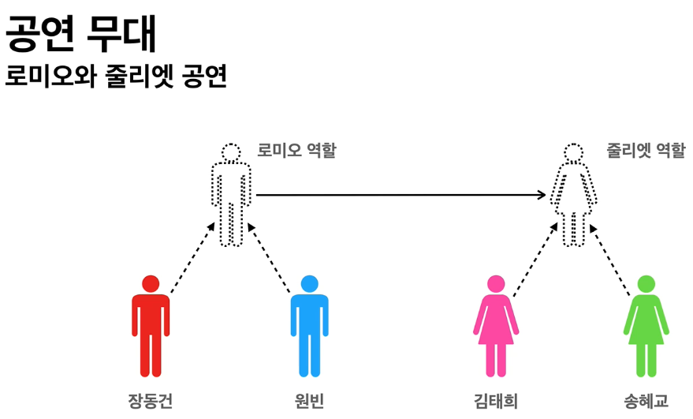

역할과 구현을 분리하면 세상이 단순해지고 유연해지며 변경도 편리해진다.

- 클라이언트는 대상의 **역할(인터페이스)** 만 알면 된다.
- 클라이언트는 구현 대상의 **내부 구조를 몰라도** 된다.
- 클라이언트는 구현 대상의 **내부 구조가 변경**되어도 영향을 받지 않는다.
- 클라이언트는 **구현 대상 자체를 변경**해도 영향을 받지 않는다.

객체는 협력하는 관계

- 클라이언트: 요청, 서버: 응답
- 수 많은 객체 클라이언트, 객체 서버는 서로 협력 관계

  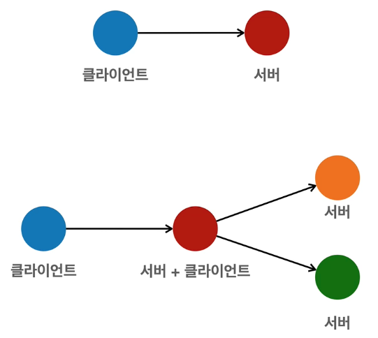

다형성의 본질

- 클라이언트를 변경하지 않고, 서버의 구현 기능을 유연하게 변경할 수 있다.
- 인터페이스를 구현한 객체 인스턴스를 실행 시점에 유연하게 변경할 수 있다.

역할과 구현을 분리 - 한계

- 역할(인터페이스) 자체가 변하면, 모두 변경되어야 한다.
- 인터페이스를 안정적으로 잘 설계하는 것이 중요.

스프링과 객체 지향

- 스프링은 다형성을 극대화해서 이용하도록 돕는다.
- IoC(제어의 역전), DI(의존관계 주입) 은 다형성을 활용해 역활과 구현을 편리하게 다룰 수 있도록 지원

### 사용 영역과 구성 영역의 분리

- DIP, OCP 를 모두 만족

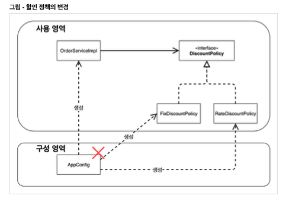

## 스프링 컨테이너와 스프링 빈

빈 이름

- 빈 이름은 메서드 이름을 사용한다.
- 빈 이름을 직접 부여할 수도 있다.
- 빈 이름은 항상 다른 이름을 부여한다.

### 스프링 빈 조회 - 동일한 타입이 둘 이상

타입 조회시 같은 타입의 스프링 빈이 둘 이상이면 오류가 발생한다. 이때는 빈 이름을 지정하자.

### 스프링 빈 조회 - 상속 관계

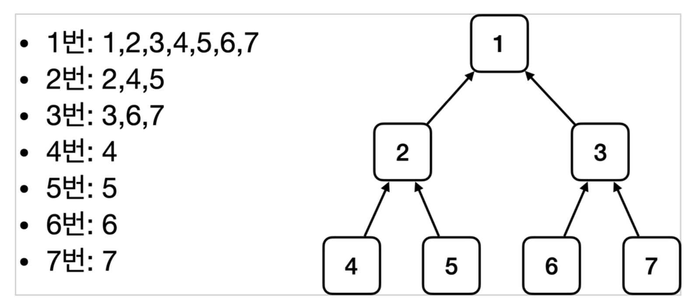

## BeanFactory 와 ApplicationContext

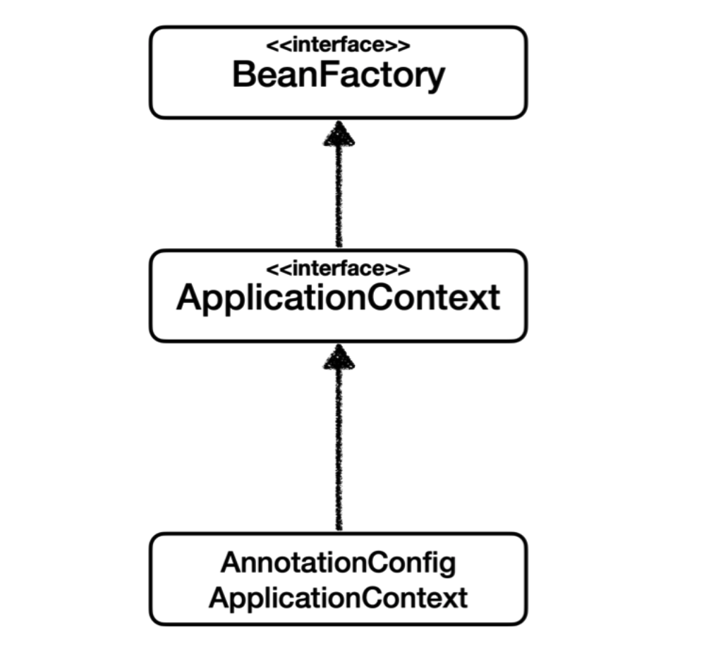

### BeanFactory

스프링 빈을 관리하고 조회하는 역할을 담당

### ApplicationContext

애플리케이션 개발할 때 빈을 관리하고 조회하는 기능 물론, 수 많은 **부가기능**이 필요함

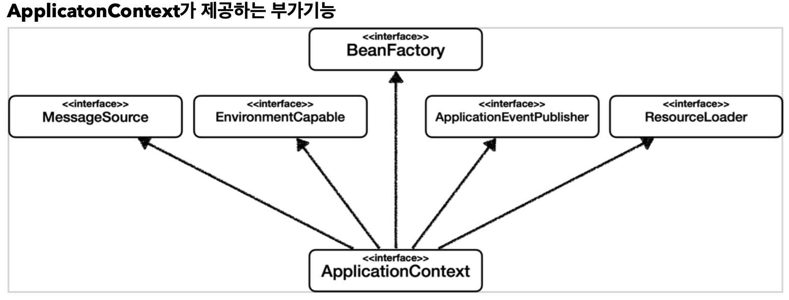

**메시지 소스를 활용한 국제화 기능**

- 예를 들어서 한국에서 들어오면 한국어로, 영어권에서 들어오면 영어로 출력

**환경변수**

- 로컬, 개발, 운영 등을 구분해서 처리

**애플리케이션 이벤트**

- 이벤트를 발행하고 구독하는 모델을 편리하게 지원

**편리한 리소스 조회**

- 파일, 클래스패스, 외부 등에서 리소스를 편리하게 조회

## 다양한 설정 형식 지원 - 자바 코드, XML

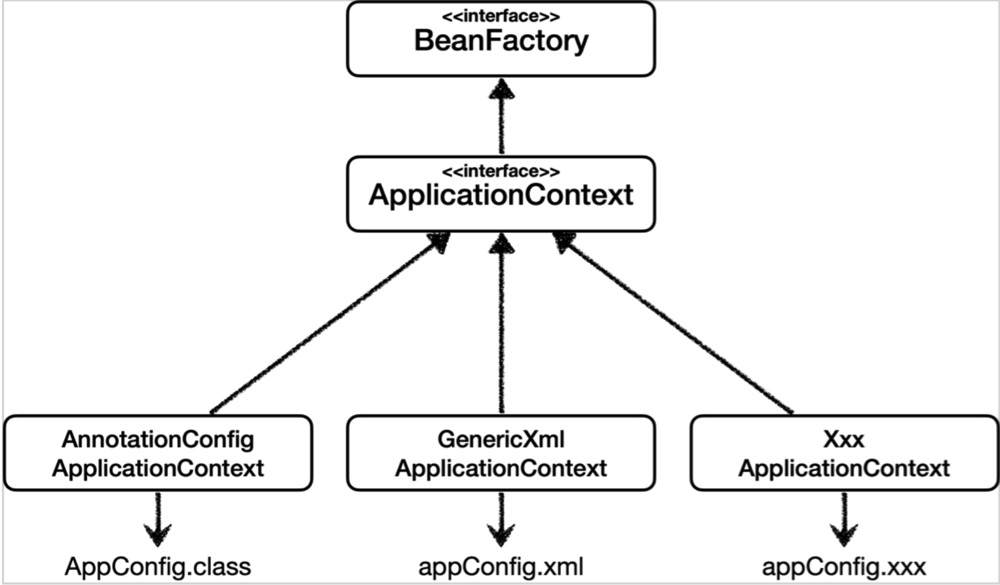

자바 코드 설정 형식이 현제 주류

과거엔 XML 중심이었음

## 스프링 빈 설정 메타 정보 - BeanDefinition

다양한 설정 형식을 지원할 수 있는 이유

역할과 구현을 개념적으로 나눈것

- XML을 읽어서 BeanDefinition을 만들면 된다.
- 자바 코드를 읽어서 BeanDefinition을 만들면 된다.
- 스프링 컨테이너는 자바 코드인지, XML인지 몰라도 된다. 오직 BeanDefinition 만 알면 된다.

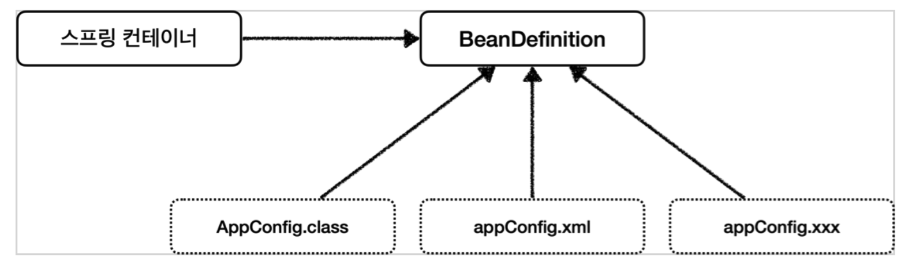

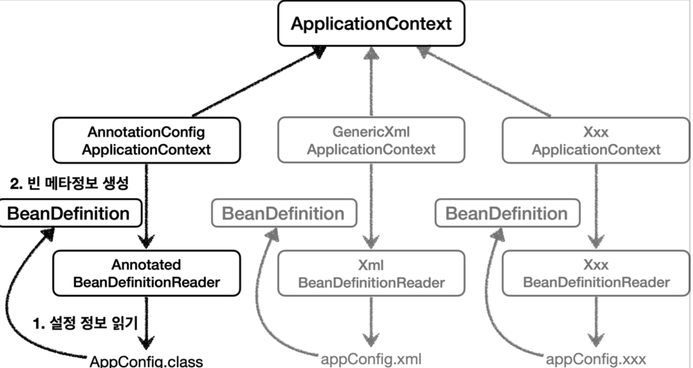

### **BeanDefinition 정보**

- BeanClassName: 생성할 빈의 클래스 명(자바 설정 처럼 팩토리 역할의 빈을 사용하면 없음)
- factoryBeanName: 팩토리 역할의 빈을 사용할 경우 이름, 예) appConfig
- factoryMethodName: 빈을 생성할 팩토리 메서드 지정, 예) memberService
- Scope: 싱글톤(기본값)
- lazyInit: 스프링 컨테이너를 생성할 때 빈을 생성하는 것이 아니라, 실제 빈을 사용할 때 까지 최대한 생성을 지연처리 하는지 여부
- InitMethodName: 빈을 생성하고, 의존관계를 적용한 뒤에 호출되는 초기화 메서드 명
- DestroyMethodName: 빈의 생명주기가 끝나서 제거하기 직전에 호출되는 메서드 명
- Constructor arguments, Properties: 의존관계 주입에서 사용한다. (자바 설정 처럼 팩토리 역할
  의 빈을 사용하면 없음)

### **정리**

- BeanDefinition을 직접 생성해서 스프링 컨테이너에 등록할 수 도 있다. 하지만 실무에서 BeanDefinition을 직접 정의하거나 사용할 일은 거의 없다. 어려우면 그냥 넘어가면 된다^^!
- BeanDefinition에 대해서는 너무 깊이있게 이해하기 보다는, 스프링이 다양한 형태의 설정 정보를 BeanDefinition으로 추상화해서 사용하는 것 정도만 이해하면 된다.
- 가끔 스프링 코드나 스프링 관련 오픈 소스의 코드를 볼 때, BeanDefinition 이라는 것이 보일 때가 있다. 이때 이러한 메커니즘을 떠올리면 된다.

## 싱글톤 컨테이너

## 컴포넌트 스캔

### @ComponentScan

@ComponentScan 은 @Component 가 붙은 모든 클래스를 스프링 빈으로 등록한다.
이때 스프링 빈의 기본 이름은 클래스명을 사용하되 맨 앞글자만 소문자를 사용한다.
**빈 이름 기본 전략:** MemberServiceImpl 클래스 memberServiceImpl

**빈 이름 직접 지정:** 만약 스프링 빈의 이름을 직접 지정하고 싶으면
@Component("memberService2") 이런식으로 이름을 부여하면 된다.

### @Autowired 의존관계 자동 주입

생성자에 @Autowired 를 지정하면, 스프링 컨테이너가 자동으로 해당 스프링 빈을 찾아서 주입한다.
이때 기본 조회 전략은 타입이 같은 빈을 찾아서 주입한다.

getBean(MemberRepository.class) 와 동일하다고 이해하면 된다.

### 탐색 위치와 기본 스캔 대상

**권장하는 방법**

개인적으로 즐겨 사용하는 방법은 패키지 위치를 지정하지 않고, 설정 정보 클래스의 위치를 프로젝트 최상
단에 두는 것이다. 최근 스프링 부트도 이 방법을 기본으로 제공한다.

예를 들어서 프로젝트가 다음과 같이 구조가 되어 있으면

`com.hello`
`com.hello.serivce`
`com.hello.repository`

`com.hello` 프로젝트 시작 루트, 여기에 AppConfig 같은 메인 설정 정보를 두고,
`@ComponentScan` 애노테이션을 붙이고, basePackages 지정은 생략한다.

이렇게 하면 `com.hello` 를 포함한 하위는 모두 자동으로 컴포넌트 스캔의 대상이 된다. 그리고 프로젝트
메인 설정 정보는 프로젝트를 대표하는 정보이기 때문에 프로젝트 시작 루트 위치에 두는 것이 좋다 생각한
다.
참고로 스프링 부트를 사용하면 스프링 부트의 대표 시작 정보인 `@SpringBootApplication` 를 이 프로젝
트 시작 루트 위치에 두는 것이 관례이다. (그리고 이 설정 안에 바로 `@ComponentScan` 이 들어있다!)

**컴포넌트 스캔 기본 대상**

컴포넌트 스캔은 @Component 뿐만 아니라 다음과 내용도 추가로 대상에 포함한다.

- @Component : 컴포넌트 스캔에서 사용
- @Controlller : 스프링 MVC 컨트롤러에서 사용, 스프링 MVC 컨트롤러로 인식
- @Service : 스프링 비즈니스 로직에서 사용
- @Repository : 스프링 데이터 접근 계층에서 사용 , 스프링 데이터 접근 계층으로 인식하고, 데이터 계층의 예외를 스프링 예외로 변환해준다.
- @Configuration : 스프링 설정 정보에서 사용, 앞서 보았듯이 스프링 설정 정보로 인식하고, 스프링 빈이 싱글톤을 유지하도록 추가 처리를 한다.

### **중복 등록과 충돌**

컴포넌트 스캔에서 같은 빈 이름을 등록하면 어떻게 될까?
다음 두가지 상황이 있다.

- 자동빈등록 vs 자동빈등록

컴포넌트 스캔에 의해 자동으로 스프링 빈이 등록되는데, 그 이름이 같은 경우 스프링은 오류를 발생시킨다.
`ConflictingBeanDefinitionException` 예외 발생

- 수동빈등록 vs 자동빈등록

이 경우 수동 빈 등록이 우선권을 가진다. (수동 빈이 자동 빈을 오버라이딩 해버린다.)

```bash
Overriding bean definition for bean 'memoryMemberRepository' with a different
  definition: replacing
```

최근 스프링 부트에서는 수동 빈 등록과 자동 빈 등록이 충돌나면 오류가 발생하도록 기본 값을 바꾸
었다.

**수동 빈 등록, 자동 빈 등록 오류시 스프링 부트 에러**

```bash
Consider renaming one of the beans or enabling overriding by setting
spring.main.allow-bean-definition-overriding=true
```

## 의존관계 자동 주입

**다양한 의존관계 주입 방법**

의존관계 주입은 크게 4가지 방법이 있다.

1. 생성자 주입
2. 수정자 주입(setter 주입)
3. 필드 주입(사용하지 말자!  테스트 코드에서만 쓰자)
4. 일반 메서드 주입

**생성자 주입**

- 이름 그대로 생성자를 통해서 의존 관계를 주입 받는 방법이다.
- 지금까지 우리가 진행했던 방법이 바로 생성자 주입이다.
- 특징
  - **생성자 호출시점에 딱 1번**만 호출되는 것이 보장된다.
  - **불변, 필수 의존관계에 사용**

```java
@Component
  public class OrderServiceImpl implements OrderService {
      private final MemberRepository memberRepository;
      private final DiscountPolicy discountPolicy;
@Autowired
      public OrderServiceImpl(MemberRepository memberRepository, DiscountPolicy
  discountPolicy) {
this.memberRepository = memberRepository;
this.discountPolicy = discountPolicy; }
}
```

중요! 생성자가 딱 1개만 있으면 @Autowired를 생략해도 자동 주입 된다. 물론 스프링 빈에만 해당한다.

수정자 주입(setter 주입)

- setter라 불리는 필드의 값을 변경하는 수정자 메서드를 통해서 의존관계를 주입하는 방법이다.
- 특징
  - **선택, 변경 가능성이 있는 의존관계**에 사용
  - 자바빈 프로퍼티 규약의 **수정자 메서드 방식을 사용**하는 방법이다.

```java
@Component
    public class OrderServiceImpl implements OrderService {
        private MemberRepository memberRepository;
        private DiscountPolicy discountPolicy;

        @Autowired
        public void setMemberRepository(MemberRepository memberRepository) {
						this.memberRepository = memberRepository; 
				}
        
				@Autowired
        public void setDiscountPolicy(DiscountPolicy discountPolicy) {
						this.discountPolicy = discountPolicy; 
				}
}
```

**일반 메서드 주입**

- 일반 메서드를 통해서 주입 받을 수 있다.
- 특징
  - 한번에 여러 필드를 주입 받을 수 있다.
  - 일반적으로 잘 사용하지 않는다.

```java
@Component
public class OrderServiceImpl implements OrderService {
        private MemberRepository memberRepository;
        private DiscountPolicy discountPolicy;

				@Autowired
        public void init(MemberRepository memberRepository, DiscountPolicy
    discountPolicy) {
						this.memberRepository = memberRepository;
						this.discountPolicy = discountPolicy; 
				}
 }
```

### **옵션 처리**

주입할 스프링 빈이 없어도 동작해야 할 때가 있다.
그런데 `@Autowired` 만 사용하면 required 옵션의 기본값이 true 로 되어 있어서 자동 주입 대상이 없으면 오류가 발생한다.

자동 주입 대상을 옵션으로 처리하는 방법은 다음과 같다.

- `@Autowired(required=false)` : 자동 주입할 대상이 없으면 수정자 메서드 자체가 호출 안됨
- `org.springframework.lang.@Nullable` : 자동 주입할 대상이 없으면 null이 입력된다.
- `Optional<>` : 자동 주입할 대상이 없으면 Optional.empty 가 입력된다.

### 생성자 주입을 선택해라!

과거에는 수정자 주입과 필드 주입을 많이 사용했지만, 최근에는 스프링을 포함한 DI 프레임워크 대부분이

생성자 주입을 권장한다. 그 이유는 다음과 같다.

**불변**

- 대부분의 의존관계 주입은 한번 일어나면 애플리케이션 종료시점까지 의존관계를 변경할 일이 없다. 오히려 대부분의 의존관계는 애플리케이션 종료 전까지 변하면 안된다.(불변해야 한다.)
- 수정자 주입을 사용하면, setXxx 메서드를 public으로 열어 두어야 한다.
- 누군가 실수로 변경할 수 도 있고, 변경하면 안되는 메서드를 열어두는 것은 좋은 설계 방법이 아니다.
- 생성자 주입은 객체를 생성할 때 딱 1번만 호출되므로 이후에 호출되는 일이 없다. 따라서 불변하게 설계할 수 있다.

**누락**

- 프레임워크 없이 순수한 자바 코드를 단위 테스트 하는 경우에

기억하자! **컴파일 오류는 세상에서 가장 빠르고, 좋은 오류다!**

> **참고:** 수정자 주입을 포함한 나머지 주입 방식은 모두 생성자 이후에 호출되므로, 필드에 final 키워드를 사용할 수 없다. 오직 생성자 주입 방식만 final 키워드를 사용할 수 있다.

**정리**

- 생성자 주입 방식을 선택하는 이유는 여러가지가 있지만, 프레임워크에 의존하지 않고, 순수한 자바 언어의 특징을 잘 살리는 방법이기도 하다.
- 기본으로 생성자 주입을 사용하고, 필수 값이 아닌 경우에는 수정자 주입 방식을 옵션으로 부여하면 된다. 생성자 주입과 수정자 주입을 동시에 사용할 수 있다.
- 항상 생성자 주입을 선택해라! 그리고 가끔 옵션이 필요하면 수정자 주입을 선택해라. 필드 주입은 사용하지 않는게 좋다.

### 자동, 수동의 올바른 실무 운영 기준

편리한 **자동 기능을 기본**으로 사용하자

결론부터 이야기하면, 스프링이 나오고 시간이 갈 수록 점점 자동을 선호하는 추세다. 스프링은
`@Component` 뿐만 아니라 `@Controller`, `@Service`, `@Repository` 처럼 계층에 맞추어 일반적인 애플
리케이션 로직을 자동으로 스캔할 수 있도록 지원한다. 거기에 더해서 최근 스프링 부트는 컴포넌트 스캔을
기본으로 사용하고, 스프링 부트의 다양한 스프링 빈들도 조건이 맞으면 자동으로 등록하도록 설계했다.

설정 정보를 기반으로 애플리케이션을 구성하는 부분과 실제 동작하는 부분을 명확하게 나누는 것이 이상적
이지만, 개발자 입장에서 스프링 빈을 하나 등록할 때 `@Component` 만 넣어주면 끝나는 일을
`@Configuration` 설정 정보에 가서 `@Bean` 을 적고, 객체를 생성하고, 주입할 대상을 일일이 적어주는 과
정은 상당히 번거롭다.

그러면 수동 빈 등록은 언제 사용하면 좋을까?

애플리케이션은 크게 업무 로직과 기술 지원 로직으로 나눌 수 있다.

- **업무 로직 빈:** 웹을 지원하는 컨트롤러, 핵심 비즈니스 로직이 있는 서비스, 데이터 계층의 로직을 처리하는
  리포지토리등이 모두 업무 로직이다. 보통 비즈니스 요구사항을 개발할 때 추가되거나 변경된다.
- **기술 지원 빈:** 기술적인 문제나 공통 관심사(AOP)를 처리할 때 주로 사용된다. 데이터베이스 연결이나, 공
  통 로그 처리 처럼 업무 로직을 지원하기 위한 하부 기술이나 공통 기술들이다.
- 업무 로직은 **숫자도 매우 많고, 한번 개발해야 하면 컨트롤러, 서비스, 리포지토리 처럼 어느정도 유사한 패
  턴이 있다.** 이런 경우 자동 기능을 적극 사용하는 것이 좋다. 보통 문제가 발생해도 어떤 곳에서 문제가 발생
  했는지 명확하게 파악하기 쉽다.
- **기술 지원 로직**은 업무 로직과 비교해서 그 수가 매우 적고, **보통 애플리케이션 전반에 걸쳐서 광범위하게 영
  향을 미친다**. 그리고 업무 로직은 문제가 발생했을 때 어디가 문제인지 명확하게 잘 들어나지만, 기술 지원
  로직은 **적용이 잘 되고 있는지 아닌지 조차 파악하기 어려운 경우가 많다.** 그래서 이런 기술 지원 로직들은
  가급적 수동 빈 등록을 사용해서 명확하게 들어내는 것이 좋다.

**애플리케이션에 광범위하게 영향을 미치는 기술 지원 객체는 수동 빈으로 등록해서 딱! 설정 정보에 바로 나 타나게 하는 것이 유지보수 하기 좋다.**

**비즈니스 로직 중에서 다형성을 적극 활용할 때**

의존관계 자동 주입 - 조회한 빈이 모두 필요할 때, List, Map을 다시 보자.
DiscountService 가 의존관계 자동 주입으로 Map<String, DiscountPolicy> 에 주입을 받는 상황을
생각해보자. 여기에 어떤 빈들이 주입될 지, 각 빈들의 이름은 무엇일지 코드만 보고 한번에 쉽게 파악할 수
있을까? 내가 개발했으니 크게 관계가 없지만, 만약 이 코드를 다른 개발자가 개발해서 나에게 준 것이라면
어떨까?
자동 등록을 사용하고 있기 때문에 파악하려면 여러 코드를 찾아봐야 한다.

이런 경우 수동 빈으로 등록하거나 또는 자동으로하면 **특정 패키지에 같이 묶어**두는게 좋다! 핵심은 딱 보고
이해가 되어야 한다!

이 부분을 별도의 설정 정보로 만들고 수동으로 등록하면 다음과 같다.

```java
@Configuration
  public class DiscountPolicyConfig {
      @Bean
      public DiscountPolicy rateDiscountPolicy() {
          return new RateDiscountPolicy();
      }
      @Bean
      public DiscountPolicy fixDiscountPolicy() {
          return new FixDiscountPolicy();
      }
}
```

이 설정 정보만 봐도 한눈에 빈의 이름은 물론이고, 어떤 빈들이 주입될지 파악할 수 있다. 그래도 빈 자동 등 록을 사용하고 싶으면 파악하기 좋게 DiscountPolicy 의 구현 빈들만 따로 모아서 특정 패키지 모아두자.

참고로 **스프링과 스프링 부트가 자동으로 등록하는 수 많은 빈들은 예외**다. 이런 부분들은 스프링 자체를 잘 이해하고 스프링의 의도대로 잘 사용하는게 중요하다. 스프링 부트의 경우 DataSource 같은 데이터베이스 연결에 사용하는 기술 지원 로직까지 내부에서 자동으로 등록하는데, 이런 부분은 메뉴얼을 잘 참고해서 스 프링 부트가 의도한 대로 편리하게 사용하면 된다. 반면에 **스프링 부트가 아니라 내가 직접 기술 지원 객체를 스프링 빈으로 등록한다면 수동으로 등록해서 명확하게 들어내는 것이 좋다.**

## 빈 생명주기 콜백

**스프링 빈의 이벤트 라이프사이클**

**스프링 컨테이너 생성 → 스프링 빈 생성 → 의존관계 주입 → 초기화 콜백 → 사용 → 소멸전 콜백 → 스프링
종료**

**초기화 콜백**: 빈이 생성되고, 빈의 의존관계 주입이 완료된 후 호출

**소멸전 콜백**: 빈이 소멸되기 직전에 호출

> **참고: 객체의 생성과 초기화를 분리하자.**

> - 생성자는 필수 정보(파라미터)를 받고, 메모리를 할당해서 객체를 생성하는 책임을 가진다. 반면에 초기화는 이렇게 생성된 값들을 활용해서 외부 커넥션을 연결하는등 무거운 동작을 수행한다.

> - 따라서 생성자 안에서 무거운 초기화 작업을 함께 하는 것 보다는 객체를 생성하는 부분과 초기화 하는 부분 을 명확하게 나누는 것이 유지보수 관점에서 좋다. 물론 초기화 작업이 내부 값들만 약간 변경하는 정도로 단
순한 경우에는 생성자에서 한번에 다 처리하는게 더 나을 수 있다.

**스프링은 크게 3가지 방법으로 빈 생명주기 콜백을 지원한다.**

- 인터페이스(InitializingBean, DisposableBean)
- 설정 정보에 초기화 메서드, 종료 메서드 지정
- @PostConstruct, @PreDestory 애노테이션 지원

### 인터페이스 InitializingBean, DisposableBean

InitializingBean 은 afterPropertiesSet() 메서드로 초기화를 지원한다.

DisposableBean 은 destroy() 메서드로 소멸을 지원한다.

**초기화, 소멸 인터페이스 단점**

- 이 인터페이스는 스프링 전용 인터페이스다. 해당 코드가 스프링 전용 인터페이스에 의존한다.
- 초기화, 소멸 메서드의 이름을 변경할 수 없다.
- 내가 코드를 고칠 수 없는 외부 라이브러리에 적용할 수 없다.

> 참고: 인터페이스를 사용하는 초기화, 종료 방법은 스프링 초창기에 나온 방법들이고, 지금은 다음의 더 나은 방법들이 있어서 거의 사용하지 않는다.

### 빈 등록 초기화, 소멸 메서드 지정

**설정 정보 사용 특징**

- 메서드 이름을 자유롭게 줄 수 있다.
- 스프링 빈이 스프링 코드에 의존하지 않는다.
- 코드가 아니라 설정 정보를 사용하기 때문에 코드를 고칠 수 없는 외부 라이브러리에도 초기화, 종료 메서드 를 적용할 수 있다.

**종료 메서드 추론**

- `@Bean`의 `destroyMethod` 속성에는 아주 특별한 기능이 있다.
- 라이브러리는 대부분 `close` , `shutdown` 이라는 이름의 종료 메서드를 사용한다.
- `@Bean`의 `destroyMethod` 는 기본값이 `(inferred)` (추론)으로 등록되어 있다.
- 이 추론 기능은 `close` , `shutdown` 라는 이름의 메서드를 자동으로 호출해준다. 이름 그대로 종료 메서드
  를 추론해서 호출해준다.
- 따라서 직접 스프링 빈으로 등록하면 종료 메서드는 따로 적어주지 않아도 잘 동작한다.
- 추론 기능을 사용하기 싫으면 `destroyMethod=""` 처럼 빈 공백을 지정하면 된다.

### 애노테이션 @PostConstruct, @PreDestory

**@PostConstruct, @PreDestory 애노테이션 특징**

- 최신 스프링에서 가장 권장하는 방법이다.
- 애노테이션 하나만 붙이면 되므로 매우 편리하다.
- 패키지를 잘 보면 javax.annotation.PostConstruct 이다. 스프링에 종속적인 기술이 아니라 JSR-250
  라는 자바 표준이다. 따라서 스프링이 아닌 다른 컨테이너에서도 동작한다.
- 컴포넌트 스캔과 잘 어울린다.
- **유일한 단점**은 외부 라이브러리에는 적용하지 못한다는 것이다. **외부 라이브러리를 초기화, 종료 해야 하면
  @Bean의 기능을 사용**하자.

**정리**

- **`@PostConstruct`, `@PreDestory` 애노테이션을 사용하자**
- 코드를 고칠 수 없는 외부 라이브러리를 초기화, 종료해야 하면 `@Bean` 의 `initMethod`, `destroyMethod`
  를 사용하자.

## 빈 스코프

**빈 스코프란?**

지금까지 우리는 스프링 빈이 스프링 컨테이너의 시작과 함께 생성되어서 스프링 컨테이너가 종료될 때 까지 유지된다고 학습했다. 이것은 스프링 빈이 기본적으로 싱글톤 스코프로 생성되기 때문이다. 스코프는 번
역 그대로 빈이 존재할 수 있는 범위를 뜻한다.

**스프링은 다음과 같은 다양한 스코프를 지원한다.**

- **싱글톤**: 기본 스코프, 스프링 컨테이너의 시작과 종료까지 유지되는 가장 넓은 범위의 스코프이다.
- **프로토타입**: 스프링 컨테이너는 프로토타입 빈의 생성과 의존관계 주입까지만 관여하고 더는 관리하지 않는
  매우 짧은 범위의 스코프이다.

**웹 관련 스코프**

- **request**: 웹 요청이 들어오고 나갈때 까지 유지되는 스코프이다.
- **session**: 웹 세션이 생성되고 종료될 때 까지 유지되는 스코프이다.
- **application**: 웹의 서블릿 컨텍스와 같은 범위로 유지되는 스코프이다.

### 프로토타입 스코프

**정리**

여기서 **핵심은 스프링 컨테이너는 프로토타입 빈을 생성하고, 의존관계 주입, 초기화까지만 처리한다는 것
이다.** 클라이언트에 빈을 반환하고, 이후 스프링 컨테이너는 생성된 프로토타입 빈을 관리하지 않는다. 프로
토타입 빈을 관리할 책임은 프로토타입 빈을 받은 클라이언트에 있다. 그래서 `@PreDestory` 같은 종료 메
서드가 호출되지 않는다.

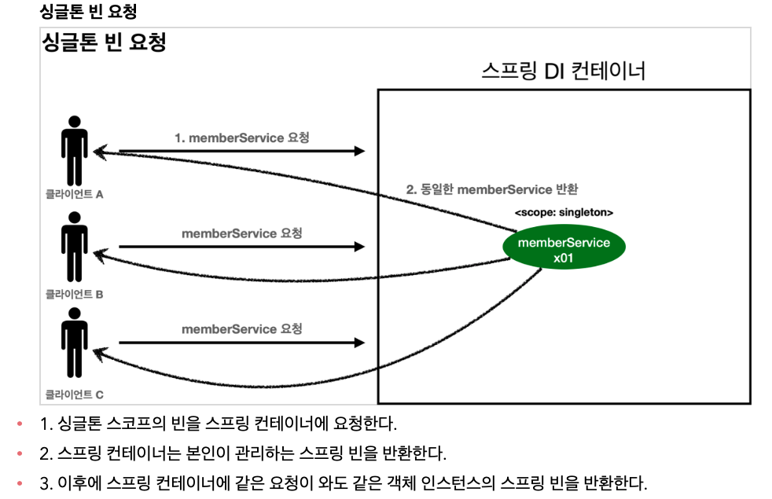

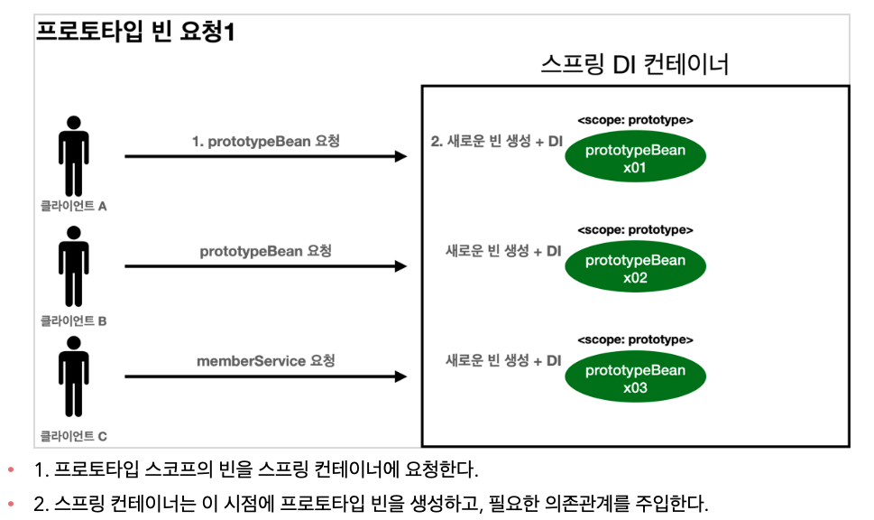

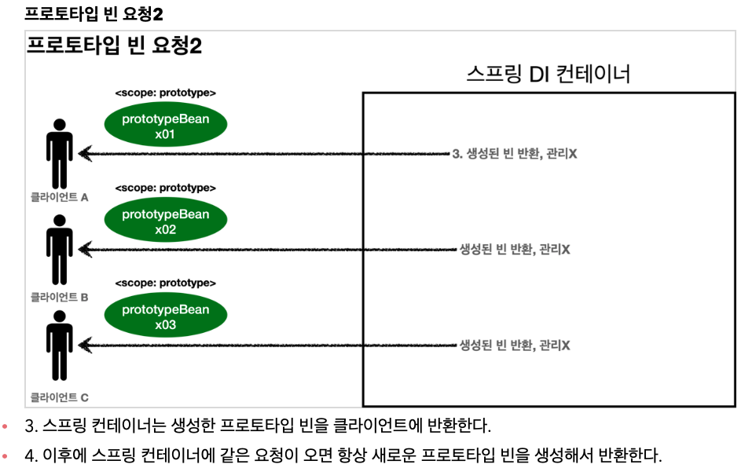

- 싱글톤 빈은 스프링 컨테이너 생성 시점에 초기화 메서드가 실행 되지만, 프로토타입 스코프의 빈은 스프링
  컨테이너에서 빈을 조회할 때 생성되고, 초기화 메서드도 실행된다.
- 프로토타입 빈을 2번 조회했으므로 완전히 다른 스프링 빈이 생성되고, 초기화도 2번 실행된 것을 확인할
  수 있다.
- 싱글톤 빈은 스프링 컨테이너가 관리하기 때문에 스프링 컨테이너가 종료될 때 빈의 종료 메서드가 실행되
  지만, 프로토타입 빈은 스프링 컨테이너가 생성과 의존관계 주입 그리고 초기화 까지만 관여하고, 더는 관리
  하지 않는다. 따라서 프로토타입 빈은 스프링 컨테이너가 종료될 때 @PreDestory 같은 종료 메서드가 전혀
  실행되지 않는다.

**프로토타입 빈의 특징 정리**

- 스프링 컨테이너에 요청할 때 마다 새로 생성된다.
- 스프링 컨테이너는 프로토타입 빈의 생성과 의존관계 주입 그리고 초기화까지만 관여한다.
- 종료 메서드가 호출되지 않는다.
- 그래서 프로토타입 빈은 프로토타입 빈을 조회한 클라이언트가 관리해야 한다. 종료 메서드에 대한 호출도
  클라이언트가 직접 해야한다.

## 프로토타입 스코프 - 싱글톤 빈과 함께 사용시 문제점

### 프로토타입 스코프

### 웹 스코프
