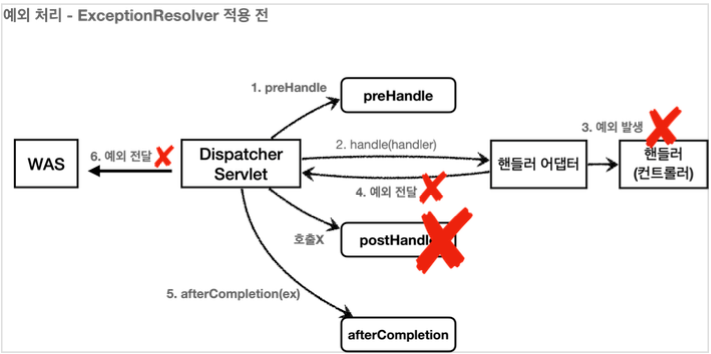
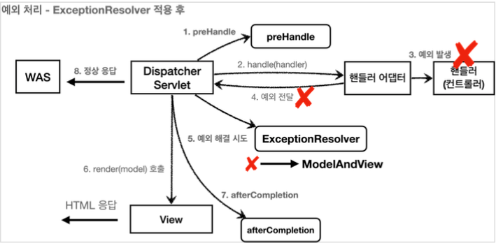

# Spring MVC : 예외 처리

## 서블릿 예외 처리 - 시작

순수 서블릿 컨테이너는 다음 2가지 방식으로 예외를 처리함

- `Exception` (예외)
- `response.sendError(HTTP 상태 코드, 오류 메시지)`

### Exception

자바 직접 실행

- 메인 메서드를 실행 -> `main` 스레드가 실행
- 실행 도중 예외가 `main()` 메서드를 넘어서 예외가 던져지면, 예외정보를 남기고 스레드가 종료된다.

웹 어플리케이션

- 사용자 요청별로 별도의 스레드가 할당됨, 서블릿 컨테이너 안에서 실행
- 에플리케이션이 예외를 잡지 못하고, 서블릿 밖으로 예외가 전달되면?
- `WAS(여기까지 전파) <- 필터 <- 서블릿 <- 인터셉터 <- 컨트롤러(예외발생)`
- **이 경우 서버 내부에서 처리할 수 없는 오류가 발생한 것으로 생각해서 `HTTP 상태 코드 500`을 반환한다.**

### response.sendError(HTTP 상태 코드, 오류 메시지)

- 당장 예외가 발생하는 것은 아니지만, 서블릿 컨테이너에게 오류가 발생했다는 점을 전달할 수 있다.
- 이 메서드를 사용하면 HTTP 상태 코드와 오류 메시지도 추가할 수 있다.

#### sendError 흐름

```
WAS(sendError 호출 기록 확인) <- 필터 <- 서블릿 <- 인터셉터 <- 컨트롤러
(response.sendError())
```

- `response.sendError()` 를 호출하면 response 내부에는 오류가 발생했다는 상태를 저장
- 서블릿 컨테이너는 고객에게 응답 전에 response 에 sendError() 가 호출되었는지 확인
- 호출되었다면 설정한 오류 코드에 맞추어 기본 오류 페이지를 보여준다

## 서블릿 예외 처리 - 오류 화면 제공

서블릿이 제공하는 오류 화면 기능을 사용

과거에는 web.xml 이라는 파일에 다음과 같이 오류 화면을 등록했다.

```xml
<web-app>
      <error-page>
        <error-code>404</error-code>
        <location>/error-page/404.html</location>
      </error-page>
      <error-page>
        <error-code>500</error-code>
        <location>/error-page/500.html</location>
      </error-page>
      <error-page>
        <exception-type>java.lang.RuntimeException</exception-type>
        <location>/error-page/500.html</location>
      </error-page>
</web-app>
```

지금은 스프링 부트 기능을 이용하여 등록할 수 있다.

```java

@Component
public class WebServerCustomizer implements WebServerFactoryCustomizer<ConfigurableWebServerFactory> {
    @Override
    public void customize(ConfigurableWebServerFactory factory) {

        ErrorPage errorPage404 = new ErrorPage(HttpStatus.NOT_FOUND, "/error-page/400");
        ErrorPage errorPage500 = new ErrorPage(HttpStatus.INTERNAL_SERVER_ERROR, "/error-page/500");

        ErrorPage errorPageEx = new ErrorPage(RuntimeException.class, "/error-page/500");

        factory.addErrorPages(errorPage404, errorPage500, errorPageEx);
    }
}
```

- `response.sendError(404)` : errorPage404 호출 
- `response.sendError(500)` : errorPage500 호출 
- `RuntimeException 또는 그 자식 타입의 예외`: errorPageEx 호출
  - **오류 페이지는 예외를 다룰 때 해당 예외와 그 자식 타입의 오류를 함께 처리한다**

## 서블릿 예외 처리 - 오류 페이지 작동 원리

### 예외 발생과 오류 페이지 요청 흐름

```
1. WAS(여기까지 전파) <- 필터 <- 서블릿 <- 인터셉터 <- 컨트롤러(예외발생)
2. WAS `/error-page/500` 다시 요청 -> 필터 -> 서블릿 -> 인터셉터 -> 컨트롤러(/error-page/500) -> View
```

1. 예외가 발생해서 WAS까지 전파된다.
2. WAS는 오류 페이지 경로를 찾아서 내부에서 오류 페이지를 호출한다. 이때 오류 페이지 경로로 필터,
서블릿, 인터셉터, 컨트롤러가 모두 다시 호출된다.

**중요한 점은 웹 브라우저(클라이언트)는 서버 내부에서 이런 일이 일어나는지 전혀 모른다는 점이다. 오직 서버 내부에서 오류 페이지를 찾기 위해 추가적인 호출을 한다.**

WAS는 오류 페이지를 단순히 다시 요청만 하는 것이 아니라, 오류 정보를 request 의 attribute 에 추가해서 넘겨준다.
필요하면 오류 페이지에서 이렇게 전달된 오류 정보를 사용할 수 있다.

## 서블릿 예외 처리 - 필터

### DispatcherType

클라이언트로 부터 발생한 정상 요청인지, 아니면 오류 페이지를 출력하기 위한 내부 요청인지 구분함. DispatcherType 은 서블릿은 이런 문제를 해결하기 위해 존재함.

```java
public enum DispatcherType {
      FORWARD,
      INCLUDE,
      REQUEST,
      ASYNC,
      ERROR
}
```

- **REQUEST** : 클라이언트 요청
- **ERROR** : 오류 요청
- FORWARD : MVC에서 배웠던 서블릿에서 다른 서블릿이나 JSP를 호출할 때 `RequestDispatcher.forward(request, response);`
- INCLUDE : 서블릿에서 다른 서블릿이나 JSP의 결과를 포함할 때 `RequestDispatcher.include(request, response);`
- ASYNC : 서블릿 비동기 호출

### 필터와 DispatcherType

```java
filterRegistrationBean.setDispatcherTypes(DispatcherType.REQUEST, DispatcherType.ERROR)
```

- 필터 호출이 `클라이언트 요청`, `오류 페이지 요청` 둘다 됨
- 기본 값은 `DispatcherType.REQUEST` - 클라이언트의 요청이 있는 경우에만 필터가 적용
- `DispatcherType.ERROR` 만 지정 - 오류 페이지 요청 전용 필터

## 서블릿 예외 처리 - 인터셉터

필터의 경우에는 필터를 등록할 때 어떤 DispatcherType 인 경우에 필터를 적용할 지 선택할 수 있었다.
그런데 인터셉터는 서블릿이 제공하는 기능이 아니라 스프링이 제공하는 기능이다.
따라서 DispatcherType 과 무관하게 항상 호출된다.

대신에 인터셉터는 다음과 같이 요청 경로에 따라서 추가하거나 제외하기 쉽게 되어 있기 때문에, 이러한 설정을 사용해서 오류 페이지 경로를 `excludePathPatterns` 를 사용해서 빼주면 된다.

### 전체 흐름 정리

- /error-ex 오류 요청
  - 필터는 DispatchType 으로 중복 호출 제거 ( dispatchType=REQUEST )
  - 인터셉터는 경로 정보로 중복 호출 제거( excludePathPatterns("/error-page/**") )

```
1. WAS(/error-ex, dispatchType=REQUEST) -> 필터 -> 서블릿 -> 인터셉터 -> 컨트롤러
2. WAS(여기까지 전파) <- 필터 <- 서블릿 <- 인터셉터 <- 컨트롤러(예외발생)
3. WAS 오류 페이지 확인
4. WAS(/error-page/500, dispatchType=ERROR) -> 필터(x) -> 서블릿 -> 인터셉터(x) -> 컨트롤러(/error-page/500) -> View
```

## 스프링 부트 - 오류 페이지

스프링 부트는 이제까지 했던 오류 페이지 설정 과정을 모두 기본으로 제공한다.

- ErrorPage 를 자동으로 등록한다. 이때 /error 라는 경로로 기본 오류 페이지를 설정한다.
  - `new ErrorPage("/error")` , 상태코드와 예외를 설정하지 않으면 기본 오류 페이지로 사용된다. 
  - 서블릿 밖으로 예외가 발생하거나, `response.sendError(...)` 가 호출되면 모든 오류는 `/error` 를 호출하게 된다.
- `BasicErrorController` 라는 스프링 컨트롤러를 자동으로 등록한다. 
  - `ErrorPage` 에서 등록한 `/error` 를 매핑해서 처리하는 컨트롤러다.
- `ErrorMvcAutoConfiguration` 클래스가 오류 페이지를 자동으로 등록

### 뷰 선택 우선순위 - BasicErrorController 의 처리 순서

1. 뷰템플릿
   1. `resources/templates/error/500.html`
   2. `resources/templates/error/5xx.html`
2. 정적리소스(static,public)
   1. `resources/static/error/400.html`
   2. `resources/static/error/404.html`
   3. `resources/static/error/4xx.html`
3. 적용 대상이 없을 때 뷰 이름(error)
   1. `resources/templates/error.html`

### BasicErrorController 가 제공하는 기본 정보들

에러 페이지 뷰 탬플릿은 다음 정보를 전달 받을 수 있다.(BasicErrorController 에 의해 model 에 담김)

- timestamp: Fri Feb 05 00:00:00 KST 2021
- status: 400
- error: Bad Request
- exception: org.springframework.validation.BindException * trace: 예외 trace
- message: Validation failed for object='data'. Error count: 1 * errors: Errors(BindingResult)
- path: 클라이언트 요청 경로 (`/hello`)

> 중요!
>
> 실무에서는 이것들을 노출하면 안된다! 사용자에게는 이쁜 오류 화면과 고객이 이해할 수 있는 간단한 오류 메시지를 보여주고 오류는 서버에 로그로 남겨서 로그로 확인해야 한다.

### application.properties

```properties
server.error.include-exception=true
server.error.include-message=on_param
server.error.include-stacktrace=on_param
server.error.include-binding-errors=on_param
```

- server.error.include-exception=false : exception 포함 여부( true , false )
- server.error.include-message=never : message 포함 여부
- server.error.include-stacktrace=never : trace 포함 여부
- server.error.include-binding-errors=never : errors

기본 값이 naver인 부분은 다음 3가지 옵션을 사용할 수 있다.

- never : 사용하지 않음
- always :항상 사용
- on_param : 파라미터가 있을 때 사용

스프링 부트 오류 관련 옵션

- `server.error.whitelabel.enabled=true` : 오류 처리 화면을 못 찾을 시, 스프링 whitelabel 오류 페이지 적용
- `server.error.path=/error` : 오류 페이지 경로, 스프링이 자동 등록하는 서블릿 글로벌 오류 페이지 경로와 BasicErrorController 오류 컨트롤러 경로에 함께 사용된다.

#  API 예외 처리

## API 예외 처리 - 시작

- 오류 페이지는 단순히 고객에게 오류 화면을 보여주고 끝
- API는 각 오류 상황에 맞는 오류 응답 스펙을 정하고, JSON으로 데이터를 내려주어야 함

`http://localhost:8080/api/members/ex` 호출 시..

- API를 요청했는데, 정상의 경우 API로 JSON 형식으로 데이터가 정상 반환된다.
- 그런데 오류가 발생하면 우리가 미리 만들어둔 오류 페이지 HTML이 반환된다.
- 클라이언트는 정상 요청이든, 오류 요청이든 JSON이 반환되기를 기대한다.

## API 예외 처리 - 스프링 부트 기본 오류 처리

API 예외 처리도 스프링 부트가 제공하는 기본 오류 방식 사용 가능

### BasicErrorController 코드

```java
@Controller
@RequestMapping("${server.error.path:${error.path:/error}}")
public class BasicErrorController extends AbstractErrorController {
    ...생략...

	@RequestMapping(produces = MediaType.TEXT_HTML_VALUE)
	public ModelAndView errorHtml(HttpServletRequest request, HttpServletResponse response) {
		HttpStatus status = getStatus(request);
		Map<String, Object> model = Collections
				.unmodifiableMap(getErrorAttributes(request, getErrorAttributeOptions(request, MediaType.TEXT_HTML)));
		response.setStatus(status.value());
		ModelAndView modelAndView = resolveErrorView(request, response, status, model);
		return (modelAndView != null) ? modelAndView : new ModelAndView("error", model);
	}

	@RequestMapping
	public ResponseEntity<Map<String, Object>> error(HttpServletRequest request) {
		HttpStatus status = getStatus(request);
		if (status == HttpStatus.NO_CONTENT) {
			return new ResponseEntity<>(status);
		}
		Map<String, Object> body = getErrorAttributes(request, getErrorAttributeOptions(request, MediaType.ALL));
		return new ResponseEntity<>(body, status);
	}
    ...생략...
}
```

- /error 동일한 경로를 처리하는 `errorHtml()` , `error()` 두 메서드를 확인할 수 있다.
- `errorHtml()` : produces = MediaType.TEXT_HTML_VALUE : 클라이언트 요청의 Accept 해더 값이 text/html 인 경우에는 errorHtml() 을 호출해서 view를 제공한다.
- `error()` : 그외 경우에 호출되고 ResponseEntity 로 HTTP Body에 JSON 데이터를 반환한다.
- 결론: 같은 `/error` 경로로 오류 요청을 하되 요청의 `Accept` 헤더의 종류에 따라 결과를 오류페이지로 보낼지, json 으로 보낼지 결정된다.

- GET http://localhost:8080/api/members/ex 요청해보자
  - Accept 만 바꿔보기 (application/json, text/html)

### Html 페이지 vs API 오류

- 스프링 부트가 제공하는 BasicErrorController
  - HTML 페이지를 제공하는 경우에는 매우 편리
    - 컨벤션 or 지정한 곳에 HTML 페이지만 정의하면 됨
  - API 오류 처리
    - API 마다, 각각의 컨트롤러나 예외마다 서로 다른 응답 결과를 출력해야 할 수도 있다.
    - API는 유연하게 대처위해 `@ExceptionHandler` 를 사용

## API 예외 처리 - HandlerExceptionResolver 시작

(이제까지완 다르게)이럴땐 어떻게 해야하나?

- 발생하는 예외에 따라서 400, 404 등등 다른 상태코드도 처리하고 싶다.
- 오류 메시지, 형식등을 API마다 다르게 처리하고 싶다.

### HandlerExceptionResolver

`HandlerExceptionResolver` - 컨트롤러 밖으로 던져진 예외를 해결하고, 동작 방식을 변경한다.

ExceptionResolver 적용 전



ExceptionResolver 적용 후



### MyHandlerExceptionResolver 작성, 등록(코드 확인)

HandlerExceptionResolver - 인터페이스

```java
public interface HandlerExceptionResolver {
    ModelAndView resolveException(
      HttpServletRequest request, HttpServletResponse response,
      Object handler, Exception ex);
}
```

반환 값에 따른 동작 방식

`HandlerExceptionResolver` 의 반환 값에 따른 `DispatcherServlet` 의 동작 방식은 다음과 같다.

- **빈 ModelAndView**: new ModelAndView() 처럼 빈 ModelAndView 를 반환하면 뷰를 렌더링 하지 않고, 정상 흐름으로 서블릿이 리턴된다.
- **ModelAndView 지정**: ModelAndView 에 View , Model 등의 정보를 지정해서 반환하면 뷰를 렌더링 한다.
- **null**: null 을 반환하면, 다음 ExceptionResolver 를 찾아서 실행한다. 만약 처리할 수 있는 ExceptionResolver 가 없으면 예외 처리가 안되고, 기존에 발생한 예외를 서블릿 밖으로 던진다.

ExceptionResolver 활용

- 예외 상태 코드 변환
  - 예외를 `response.sendError(xxx)` 호출로 변경해서 서블릿에서 상태 코드에 따른 오류를 처리하도록 위임
  - 이후 WAS는 서블릿 오류 페이지를 찾아서 내부 호출,예를 들어서 스프링부트가 기본으로 설정한 `/error` 가 호출됨
- 뷰 템플릿 처리
  - ModelAndView 에 값을 채워서 예외에 따른 새로운 오류 화면 뷰 렌더링 해서 고객에게 제공
- API 응답 처리
  - `response.getWriter().println("hello");` 처럼 HTTP 응답 바디에 직접 데이터를 넣어주는
  것도 가능하다. 여기에 JSON 으로 응답하면 API 응답 처리를 할 수 있다.

## API 예외 처리 - HandlerExceptionResolver 활용

`ExceptionResolver` 를 사용하면 컨트롤러에서 예외가 발생해도 `ExceptionResolver` 에서 예외를 처리해버린다.
따라서 예외가 발생해도 서블릿 컨테이너까지 예외가 전달되지 않고, 스프링 MVC에서 예외 처리는 끝이난다.
결과적으로 WAS 입장에서는 정상 처리가 된 것이다. 이렇게 예외를 이곳에서 모두 처리할 수 있다는 것이 핵심이다.

## API 예외 처리 - 스프링이 제공하는 ExceptionResolver

HandlerExceptionResolverComposite 에 다음 순서로 등록

1. `ExceptionHandlerExceptionResolver` - `@ExceptionHandler` 설정한 것을 찾아 Exception 처리
2. `ResponseStatusExceptionResolver` - HTTP 응답 코드 변경
3. `DefaultHandlerExceptionResolver` - 스프링 내부 예외 처리 <- 우선 순위가 가장 낮다

### ExceptionHandlerExceptionResolver

`@ExceptionHandler` 을 처리한다. API 예외 처리는 대부분 이 기능으로 해결한다.

[API 예외 처리 - HandlerExceptionResolver 활용](./#API-예외-처리---@ExceptionHandler)
에서 자세히 설명한다.

### ResponseStatusExceptionResolver

예외에 따라서 HTTP 상태 코드를 지정해준다.

- `@ResponseStatus` 가 달려있는 예외
- `ResponseStatusException` 예외

예)

```java
@ResponseStatus(code = HttpStatus.BAD_REQUEST, reason = "잘못된 요청 오류") 
public class BadRequestException extends RuntimeException { }
```

reason 을 `MessageSource` 에서 찾는 기능도 제공한다.

`reason = "error.bad"`

`ResponseStatusException` 는 내가 코드를 수정할 수 없는 라이브러리의 예외 코드에 사용

### DefaultHandlerExceptionResolver

- 스프링 내부에서 발생하는 스프링 예외를 해결
- 파라미터 바인딩은 대부분 클라이언트가 HTTP 요청 정보를 잘못 호출해서 발생하는 문제이다. HTTP 에서는 이런 경우 HTTP 상태 코드 400을 사용하도록 되어 있다. `DefaultHandlerExceptionResolver` 는 이것을 500 오류가 아니라 HTTP 상태 코드 400 오류로 변경한다.

```java
public class DefaultHandlerExceptionResolver extends AbstractHandlerExceptionResolver {

	@Override
	@Nullable
	protected ModelAndView doResolveException(
			HttpServletRequest request, HttpServletResponse response, @Nullable Object handler, Exception ex) {

                ...


			else if (ex instanceof TypeMismatchException) {
				return handleTypeMismatch(
						(TypeMismatchException) ex, request, response, handler);
			}
```

```java
	protected ModelAndView handleTypeMismatch(TypeMismatchException ex,
			HttpServletRequest request, HttpServletResponse response, @Nullable Object handler) throws IOException {

		response.sendError(HttpServletResponse.SC_BAD_REQUEST);
		return new ModelAndView();
	}
```

- 결국 `response.sendError()` 를 통해서 문제를 해결한다.

## API 예외 처리 - @ExceptionHandler

API 오류시 예외 응답은 매우 세밀한 제어가 필요하다.

### API 예외처리의 어려운 점

- `HandlerExceptionResolver` 를 떠올려 보면 `ModelAndView` 를 반환해야 했다. 이것은 API 응답에는
필요하지 않다.
- API 응답을 위해서 `HttpServletResponse` 에 직접 응답 데이터를 넣어주었다. 이것은 매우 불편하다. 스프링 컨트롤러에 비유하면 마치 과거 서블릿을 사용하던 시절로 돌아간 것 같다.
- 특정 컨트롤러에서만 발생하는 예외를 별도로 처리하기 어렵다. 예를 들어서 회원을 처리하는 컨트롤러에서 발생하는 `RuntimeException` 예외와 상품을 관리하는 컨트롤러에서 발생하는 동일한 `RuntimeException` 예외를 서로 다른 방식으로 처리하고 싶다면 어떻게 해야할까?

### @ExceptionHandler

- 스프링은 `ExceptionHandlerExceptionResolver` 를 기본으로 제공한다.
- 기본으로 제공하는 ExceptionResolver 중에 우선순위도 가장 높다. 
- 실무에서 API 예외 처리는 대부분 이 기능을 사용한다.

### @ExceptionHandler 예외 처리 방법

- `@ExceptionHandler` 애노테이션을 선언하고, 해당 컨트롤러에서 처리하고 싶은 예외를 지정해주면 된다. 해당 컨트롤러에서 예외가 발생하면 이 메서드가 호출된다.
- 지정한 예외 또는 그 예외의 자식 클래스는 모두 잡을 수 있다.

### 우선순위

스프링의 우선순위는 항상 자세한 것이 우선권을 가진다. 예를 들어서 부모, 자식 클래스가 있고 다음과 같이 예외가 처리된다.

```java
@ExceptionHandler(부모예외.class) public String 부모예외처리()(부모예외 e) {}
@ExceptionHandler(자식예외.class) public String 자식예외처리()(자식예외 e) {}
```

- 더 자세한 쪽이 우선권을 가진다.
- 물론 부모예외 가 호출되면 부모예외처리() 만 호출 대상이 되므로 부모예외처리()가 호출된다.

### 다양한 예외

다음과 같이 다양한 예외를 한번에 처리할 수 있다.

```java
@ExceptionHandler({AException.class, BException.class})
public String ex(Exception e) {
    log.info("exception e", e);
}
```

### 예외 생략

`@ExceptionHandler` 에 예외를 생략할 수 있다. 생략하면 메서드 파라미터의 예외가 지정된다.

```java
@ExceptionHandler
  public ResponseEntity<ErrorResult> userExHandle(UserException e) {}
```

### 파리미터와 응답

@ExceptionHandler 에는 마치 스프링의 컨트롤러의 파라미터 응답처럼 다양한 파라미터와 응답을 지정할 수 있다.

참고 : https://docs.spring.io/spring-framework/docs/current/reference/html/web.html#mvc-ann-exceptionhandler-args

### 실행 흐름

- 컨트롤러를 호출한 결과 `IllegalArgumentException` 예외가 컨트롤러 밖으로 던져진다. 
- 예외가 발생했으로 `ExceptionResolver` 가 작동한다. 가장 우선순위가 높은 `ExceptionHandlerExceptionResolver` 가 실행된다.
- `ExceptionHandlerExceptionResolver` 는 해당 컨트롤러에 `IllegalArgumentException` 을 처리할 수 있는 `@ExceptionHandler` 가 있는지 확인한다.
- `illegalExHandle()` 를 실행한다. `@RestController` 이므로 `illegalExHandle()` 에도 `@ResponseBody` 가 적용된다. 따라서 HTTP 컨버터가 사용되고, 응답이 다음과 같은 JSON으로 반환된다.
- `@ResponseStatus(HttpStatus.BAD_REQUEST)` 를 지정했으므로 HTTP 상태 코드 400으로 응답한다.

### HTML 오류 화면

다음과 같이 ModelAndView 를 사용해서 오류 화면(HTML)을 응답하는데 사용할 수도 있다.

```java
@ExceptionHandler(ViewException.class)
  public ModelAndView ex(ViewException e) {
      log.info("exception e", e);
      return new ModelAndView("error");
  }
```

## API 예외 처리 - @ControllerAdvice

문제점

정상 코드와 예외 처리 코드가 하나의 컨트롤러에 섞여 있다.

해결책

`@ControllerAdvice` 또는 `@RestControllerAdvice` 를 사용하면 둘을 분리할 수 있다.

**@ControllerAdvice**

- `@ControllerAdvice` 는 대상으로 지정한 여러 컨트롤러에 `@ExceptionHandler` , `@InitBinder` 기능을 부여해주는 역할을 한다.
- `@ControllerAdvice` 에 대상을 지정하지 않으면 모든 컨트롤러에 적용된다. (글로벌 적용)
- `@RestControllerAdvice` 는 @`ControllerAdvice` 와 같고, `@ResponseBody` 가 추가되어 있다. `@Controller` , `@RestController` 의 차이와 같다.

### 대상 컨트롤러 지정 방법

```java
  // Target all Controllers annotated with @RestController
  @ControllerAdvice(annotations = RestController.class)
  public class ExampleAdvice1 {}
  
  // Target all Controllers within specific packages
  @ControllerAdvice("org.example.controllers")
  public class ExampleAdvice2 {}
  
  // Target all Controllers assignable to specific classes
  @ControllerAdvice(assignableTypes = {ControllerInterface.class, AbstractController.class})
  public class ExampleAdvice3 {}
```

- [참고] https://docs.spring.io/spring-framework/docs/current/reference/html/web.html#mvc-ann- controller-advice
- 특정 애노테이션이 있는 컨트롤러를 지정 가능
- 특정 패키지를 직접 지정할 수도 있다.
  - 패키지 지정의 경우 해당 패키지와 그 하위에 있는 컨트롤러가 대상이 된다.
