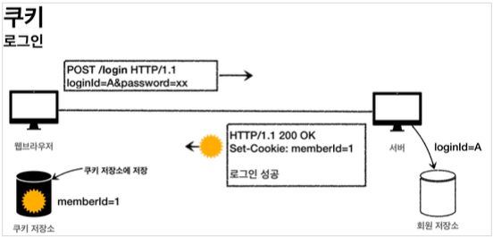
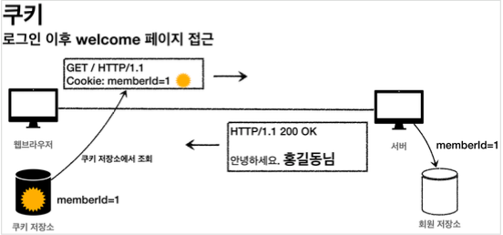
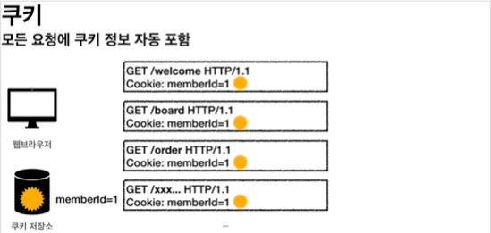
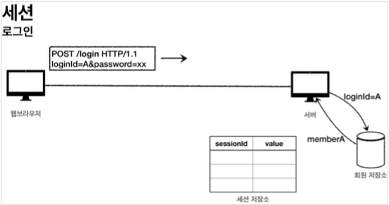
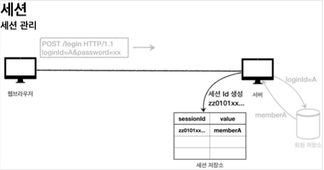
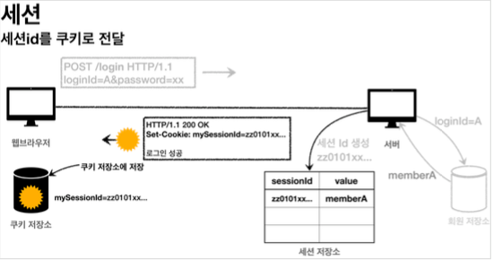
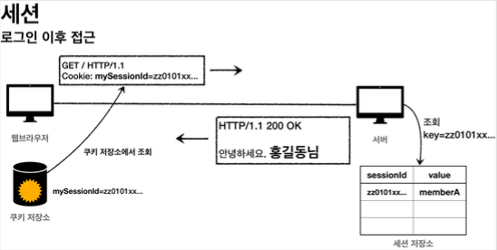
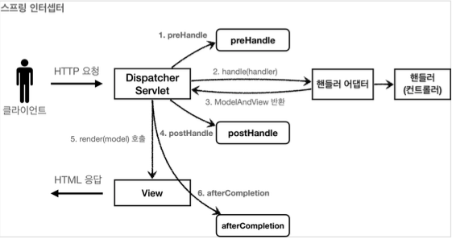
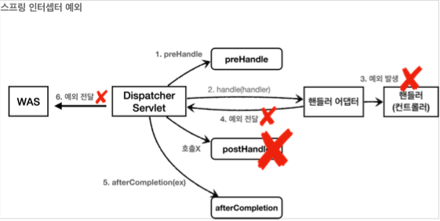

# 스프링 MVC - 로그인 처리

## 로그인 요구사항

- 홈 화면 - 로그인 전 회원 가입
  - 로그인
  - 홈 화면
- 로그인 후
  - 본인 이름(누구님 환영합니다.)
  - 상품 관리
  - 로그 아웃
- 보안 요구사항
  - 로그인 사용자만 상품에 접근하고, 관리할 수 있음
  - 로그인 하지 않은 사용자가 상품 관리에 접근하면 로그인 화면으로 이동
- 회원 가입, 상품 관리

## 로그인 처리하기 - 쿠키 사용

쿠키 생성



클라이언트 쿠키 전달 1



클라이언트 쿠키 전달 2



쿠키 종류
- 영속 쿠키: 만료 날짜를 입력하면 해당 날짜까지 유지
- 세션 쿠키: 만료 날짜를 생략하면 브라우저 종료시 까지만 유지

쿠키 생성 로직

```java
Cookie idCookie = new Cookie("memberId", String.valueOf(loginMember.getId()));
response.addCookie(idCookie);
```

로그인에 성공하면 쿠키를 생성하고 `HttpServletResponse` 에 담는다. 쿠키 이름은 `memberId` 이고, 값은 `회원의 id`를 담아둔다.웹브라우저는 종료전까지 회원의 id를 서버에 계속 보내줄것이다.

로그아웃 기능 - 쿠키 지우기

```java
Cookie cookie = new Cookie(cookieName, null);
cookie.setMaxAge(0);
response.addCookie(cookie);
```

로그아웃도 응답 쿠키를 생성하는데 Max-Age=0 를 확인할 수 있다. 해당 쿠키는 즉시 종료된다.

## 쿠키와 보안 문제

### 보안 문제

- 쿠키 값은 임의로 변경할 수 있다.
  - 클라이언트가 쿠키를 강제로 변경하면 다른 사용자가 된다.
  - 실제 웹브라우저 `개발자모드` > `Application` > `Cookie` 변경으로 확인
  - `Cookie: memberId=1` -> `Cookie: memberId=2` (다른 사용자의 이름이 보임)
- 쿠키에 보관된 정보는 훔쳐갈 수 있다.
  - 만약 쿠키에 개인정보나, 신용카드 정보가 있다면?
  - 이 정보가 웹 브라우저에도 보관되고, 네트워크 요청마다 계속 클라이언트에서 서버로 전달된다.
  - 쿠키의 정보가 나의 로컬 PC가 털릴 수도 있고, 네트워크 전송 구간에서 털릴 수도 있다.
- 해커가 쿠키를 한번 훔쳐가면 평생 사용할 수 있다.
  - 해커가 쿠키를 훔쳐가서 그 쿠키로 악의적인 요청을 계속 시도할 수 있다.

### 쿠키 보안문제의 대안

- 쿠키에 중요한 값을 노출하지 않고, 사용자 별로 예측 불가능한 임의의 **토큰(랜덤 값)**을 노출하고, 서버에서 **토큰과 사용자 id를 매핑**해서 인식한다. 그리고 서버에서 토큰을 관리한다.
- 토큰은 해커가 임의의 값을 넣어도 찾을 수 없도록 **예상 불가능** 해야 한다.
- 해커가 토큰을 털어가도 시간이 지나면 사용할 수 없도록 서버에서 해당 **토큰의 만료시간을 짧게(예: 30분) 유지**한다. 또는 해킹이 의심되는 경우 서버에서 **해당 토큰을 강제로 제거**하면 된다.

## 세션 동작 방식

- 쿠키의 보안 이슈를 해결
- 중요한 정보를 모두 서버에 저장
- 추정 불가능한 임의의 식별자 값으로 연결

로그인



세션 생성


- 세션 ID를 생성하는데, 추정 불가능해야 한다. 
- UUID는 추정이 불가능하다.
  - `Cookie: mySessionId=zz0101xx-bab9-4b92-9b32-dadb280f4b61`
- 생성된 세션 ID와 세션에 보관할 값(`memberA`)을 서버의 세션 저장소에 보관한다.

세션id를 응답 쿠키로 전달



클라이언트와 서버는 결국 쿠키로 연결이 되어야 한다.
- 서버는 클라이언트에 `mySessionId` 라는 이름으로 세션ID 만 쿠키에 담아서 전달한다. 
- 클라이언트는 쿠키 저장소에 `mySessionId` 쿠키를 보관한다.

로그인 이후 접근



- 클라이언트는 요청시 항상 `mySessionId` 쿠키를 전달한다.
- 서버에서는 클라이언트가 전달한 `mySessionId` 쿠키 정보로 세션 저장소를 조회해서 로그인시 보관한 세션 정보를 사용한다.

## 로그인 처리하기 - 직접 만든 세션 적용

- 세션과 쿠키의 개념을 명확하게 이해하기 위해서 직접 만들어 봄
- 세션이라는 것이 뭔가 특별한 것이 아니라 단지 쿠키를 사용하는데, 서버에서 데이터를 유지하는 방법일 뿐이다.
- 프로젝트마다 이러한 세션 개념을 직접 개발하는 것은 상당히 불편할 것
- 서블릿도 세션 개념을 지원한다.이제 직접 만드는 세션 말고, 서블릿이 공식 지원하는 세션을 알아보자. 
- 서블릿이 공식 지원하는 세션은 우리가 직접 만든 세션과 동작 방식이 거의 같다
- 추가로 세션을 일정시간 사용하지 않으면 해당 세션을 삭제하는 기능을 제공한다.

## 로그인 처리하기 - 서블릿 HTTP 세션

HttpSession 소개

- 서블릿은 세션기능을 지원하기 위해 `HttpSession` 을 제공
- 우리가 지금까지 직접 구현한 세션개념이 있다. (`SessionManager` 와 동작 방식이 거의 유사)
- `HttpSession`을 생성하면 쿠키이름이 `JSESSIONID` 이며 값이 추정 불가능한 렌덤값을 가진 쿠키를 생성한다.

세션 생성과 조회

- 세션을 생성하려면 `request.getSession(true)` 를 사용
  - `public HttpSession getSession(boolean create);`
  - 파라메터 생략시 기본값은 `true`
- create 옵션 
  - `request.getSession(true)`
    - 세션이 있으면 기존 세션을 반환한다.
    - 세션이 없으면 새로운 세션을 생성해서 반환한다.
  - `request.getSession(false)`
    - 세션이 있으면 기존 세션을 반환한다.
    - 세션이 없으면 새로운 세션을 생성하지 않는다. `null` 을 반환한다.

세션에 로그인 회원 정보 보관
- `session.setAttribute(SessionConst.LOGIN_MEMBER, loginMember);`
- 하나의 세션에 여러 값을 저장

## 로그인 처리하기 - 서블릿 HTTP 세션 (스프링)

@SessionAttribute

- 스프링에서 세션을 편리하게 사용할수 있도록 지원하는 에노테이션
- `@SessionAttribute(name = "loginMember", required = false) Member loginMember`
- 단 세션을 새로 생성하진 않음

TrackingModes

- `http://localhost:8080/;jsessionid=F59911518B921DF62D09F0DF8F83F872`
- 웹 브라우저가 쿠키를 지원하지 않을 때 쿠키 대신 URL을 통해서 세션을 유지하는 방법
- 이 방법을 사용하려면 URL에 이 값을 계속 포함해서 전달
- 서버 입장에서 웹 브라우저가 쿠키를 지원하는지 하지 않는지 최초에는 판단하지 못하므로, 쿠키 값도 전달하고, URL에 `jsessionid` 도 함께 전달
- application.propteris 에서 해당 모드를 끌수 있음
  - `server.servlet.session.tracking-modes=cookie`

## 세션 정보와 타임아웃 설정

### 세션 타임아웃 설정

- 세션은 사용자가 로그아웃을 직접 호출해서 `session.invalidate()` 가 호출 되는 경우에 삭제됨
- 대부분의 사용자는 로그아웃을 선택하지 않고, 그냥 웹 브라우저를 종료함
- 서버 입장에서는 해당 사용자가 웹 브라우저를 종료한 것인지 아닌지를 인식 불가능(HTTP는 비 연결성 이므로)
- 언제 세션 데이터를 삭제해야 하는지 판단하기 어려움

다음과 같은 문제가 발생할수 있다.

- 세션과 관련된 쿠키( JSESSIONID )를 탈취 당했을 경우 오랜 시간이 지나도 해당 쿠키로 악의적인 요청을 할 수 있다.
- 세션은 기본적으로 메모리에 생성된다. 메모리의 크기가 무한하지 않기 때문에 꼭 필요한 경우만 생성해서 사용해야 한다. 10만명의 사용자가 로그인하면 10만게의 세션이 생성되는 것이다.

### 세션의 종료 시점

- 세션 생성 시점으로부터 30분 정도
  - 문제 : 사이트 이용하다가 30분이 되면 다시 재로그인 해야하는 불편함
- 대안 : 사용자가 서버에 최근에 요청한 시간을 기준으로 30분 정도를 유지해주는 것
  - 사용자가 서비스를 사용하고 있으면, 세션의 생존 시간이 30분으로 계속 늘어나게 됨
  - `HttpSession` 은 이 방식을 사용

### 스프링 부트 세션 설정

스프링 부트로 글로벌 설정

```properties
application.properties server.servlet.session.timeout=60
```
- 초단위 설정. 위의 설정은 60초
- 기본은 1800초(30분)
- 글로벌 설정은 분 단위로 해야 함

특정 세션 단위 시간설정

```java
session.setMaxInactiveInterval(1800); //1800초
```

### 세션 타임아웃 발생

- 세션의 타임아웃 시간은 해당 세션과 관련된 `JSESSIONID` 를 전달하는 HTTP 요청이 있으면 현재 시간으로 다시 초기화 된다. 이렇게 초기화 되면 세션 타임아웃으로 설정한 시간동안 세션을 추가로 사용할 수 있다. 
- `session.getLastAccessedTime()` : 최근 세션 접근 시간
- `LastAccessedTime` 이후로 timeout 시간이 지나면, WAS가 내부에서 해당 세션을 제거한다.

# 스프링 MVC - 필터, 인터셉터

## 서블릿 필터 - 소개

공통 관심사(cross-cutting concern)
  
- 등록, 수정, 삭제, 조회 등등 상품관리의 모든 컨트롤러 로직에 공통으로 로그인 여부를 확인하고 있음
- 등록, 수정, 삭제, 조회 등등 여러 로직에서 공통으로 **인증**에 대해서 관심을 가지고 있는 것
- 애플리케이션 여러 로직에서 공통으로 관심이 있는 있는 것 이것이 **공통 관심사** 이다.
- 웹과 관련된 공통 관심사는 (스프링 AOP 보다는) 지금부터 설명할 서블릿 필터 또는 스프링 인터셉터를 사용하는 것이 좋다.

### 필터 흐름

```
HTTP 요청 -> WAS-> 필터 -> 서블릿(spring 디스페쳐 서블릿) -> 컨트롤러
```

- 필터는 특정 URL 패턴에 적용 가능

### 필터 제한

```
HTTP 요청 -> WAS -> 필터 -> 서블릿 -> 컨트롤러 //로그인 사용자
HTTP 요청 -> WAS -> 필터(적절하지 않은 요청이라 판단, 서블릿 호출X) //비 로그인 사용자
```

- 적절하지 않은 요청을 판단하여 차단한다.

### 필터 체인

```
HTTP 요청 -> WAS -> 필터1 -> 필터2 -> 필터3 -> 서블릿 -> 컨트롤러
```

- 중간에 필터의 추가, 삭제도 가능하다.

### 필터 인터페이스

```java
public interface Filter {
      public default void init(FilterConfig filterConfig) throws ServletException {}
      public void doFilter(ServletRequest request, ServletResponse response,
              FilterChain chain) throws IOException, ServletException;
      public default void destroy() {}
   }
```

필터 인터페이스를 구현하고 등록하면 서블릿 컨테이너가 필터를 싱글톤 객체로 생성하고, 관리한다. 

- `init()`: 필터 초기화 메서드, 서블릿 컨테이너가 생성될 때 호출된다.
- `doFilter()`: 고객의 요청이 올 때 마다 해당 메서드가 호출된다. 필터의 로직을 구현하면 된다. 
- `destroy()`: 필터 종료 메서드, 서블릿 컨테이너가 종료될 때 호출된다.

## 서블릿 필터 - 요청 로그

### LogFilter - 로그 필터

(코드 참고)

### WebConfig - 필터 설정

필터를 등록하는 방법은 여러가지가 있지만, 스프링 부트를 사용한다면 FilterRegistrationBean 을 사용해서 등록하면 된다.

- `setFilter(new LogFilter())` : 등록할 필터를 지정한다.
- `setOrder(1)` : 필터는 체인으로 동작한다. 따라서 순서가 필요하다. 낮을 수록 먼저 동작한다. 
- `addUrlPatterns("/*")` : 필터를 적용할 URL 패턴을 지정한다. 한번에 여러 패턴을 지정할 수 있다.

> 참고
>
> `@ServletComponentScan` `@WebFilter(filterName = "logFilter", urlPatterns = "/*")` 로
필터 등록이 가능하지만 필터 순서 조절이 안된다. 따라서 `FilterRegistrationBean` 을 사용하자.

> 참고
>
> 실무에서 HTTP 요청시 같은 요청의 로그에 모두 같은 식별자를 자동으로 남기는 방법은 **logback mdc**로
검색해보자.

## 서블릿 필터 - 인증 체크

### LoginCheckFilter - 인증 체크 필터

(코드 참고)

### WebConfig - loginCheckFilter() 추가

(코드 참고)

### RedirectURL 처리

(코드 참고)

> 참고
> 
> 필터에는 다음에 설명할 스프링 인터셉터는 제공하지 않는, 아주 강력한 기능이 있는데
`chain.doFilter(request, response);` 를 호출해서 다음 필터 또는 서블릿을 호출할 때 `request` , `response` 를 다른 객체로 바꿀 수 있다. `ServletRequest` , `ServletResponse` 를 구현한 다른 객체를 만들어서 넘기면 해당 객체가 다음 필터 또는 서블릿에서 사용된다. 잘 사용하는 기능은 아니니 참고만 해두자.

## 스프링 인터셉터 - 소개

- 서블릿 필터: 서블릿이 제공하는 기술
- 스프링 인터셉터: 스프링 MVC가 제공하는 기술

### 스프링 인터셉터 흐름

```
HTTP 요청 ->WAS-> 필터 -> 서블릿(스프링 디스페쳐 서블릿) -> 스프링 인터셉터 -> 컨트롤러
```

- 스프링 인터셉터는 스프링 MVC가 제공하는 기능이기 때문에 결국 디스패처 서블릿 이후에 등장하게 된다. 스프링 MVC의 시작점이 디스패처 서블릿이라고 생각해보면 이해가 될 것이다.
- 스프링 인터셉터에도 URL 패턴을 적용할 수 있는데, 서블릿 URL 패턴과는 다르고, 매우 정밀하게 설정할 수 있다.

### 스프링 인터셉터 제한

```
HTTP 요청 -> WAS -> 필터 -> 서블릿 -> 스프링 인터셉터 -> 컨트롤러 //로그인 사용자
HTTP 요청 -> WAS -> 필터 -> 서블릿 -> 스프링 인터셉터(적절하지 않은 요청이라 판단, 컨트롤러 호출 X) // 비 로그인 사용자
```

- 인터셉터에서 적절하지 않은 요청이라고 판단하면 거기에서 끝을 낼 수도 있다. 그래 로그인 여부를 체크하기에 딱 좋다.

### 스프링 인터셉터 체인

```
HTTP 요청 -> WAS -> 필터 -> 서블릿 -> 인터셉터1 -> 인터셉터2 -> 컨트롤러
```

- 서블릿 필터와 호출 되는 순서만 다르고, 제공하는 기능은 비슷해 보인다.
- 스프링 인터셉터는 서블릿 필터보다 편리하고, 더 정교하고 다양한 기능을 지원한다.


```java
public interface HandlerInterceptor {

	default boolean preHandle(HttpServletRequest request, HttpServletResponse response, Object handler) throws Exception {
	}

	default void postHandle(HttpServletRequest request, HttpServletResponse response, Object handler,
			@Nullable ModelAndView modelAndView) throws Exception {
	}

	default void afterCompletion(HttpServletRequest request, HttpServletResponse response, Object handler,
			@Nullable Exception ex) throws Exception {
	}

}
```

- 단계적 세분화
  - 컨트롤러 호출 전(preHandle)
  - 호출 후(postHandle)
  - 요청 완료 이후(afterCompletion)
- 호출 정보의 세분화
  - 어떤 컨트롤러(handler)가 호출되는지
  - 어떤 `modelAndView` 가 반환

### 스프링 인터셉터 호출 흐름



#### 정상 흐름

- `preHandle` : 컨트롤러 호출 전에 호출된다. (더 정확히는 핸들러 어댑터 호출 전에 호출된다.) 
  - `preHandle` 의 응답값
    - `true` 이면 다음으로 진행
    - `false` 이면 더는 진행하지 않는다. `false` 인 경우 나머지 인터셉터는 물론이고, 핸들러 어댑터도 호출되지 않는다. 그림에서 1번에서 끝이 나버린다.
- `postHandle` : 컨트롤러 호출 후에 호출된다. (더 정확히는 핸들러 어댑터 호출 후에 호출된다.) 
- `afterCompletion` : 뷰가 렌더링 된 이후에 호출된다.

#### 예외 발생 흐름



- `preHandle` : 컨트롤러 호출 전에 호출된다.
- `postHandle` : 컨트롤러에서 예외가 발생하면 `postHandle` 은 호출되지 않는다.
- `afterCompletion` : `afterCompletion` 은 항상 호출된다. 이 경우 예외( ex )를 파라미터로 받아서 어떤
예외가 발생했는지 로그로 출력할 수 있다.

afterCompletion은 예외가 발생해도 호출된다.
- 예외가 발생하면 `postHandle()` 는 호출되지 않으므로 예외와 무관하게 공통 처리를 하려면 `afterCompletion()` 을 사용해야 한다.
- 예외가 발생하면 `afterCompletion()` 에 예외 정보( ex )를 포함해서 호출된다.

