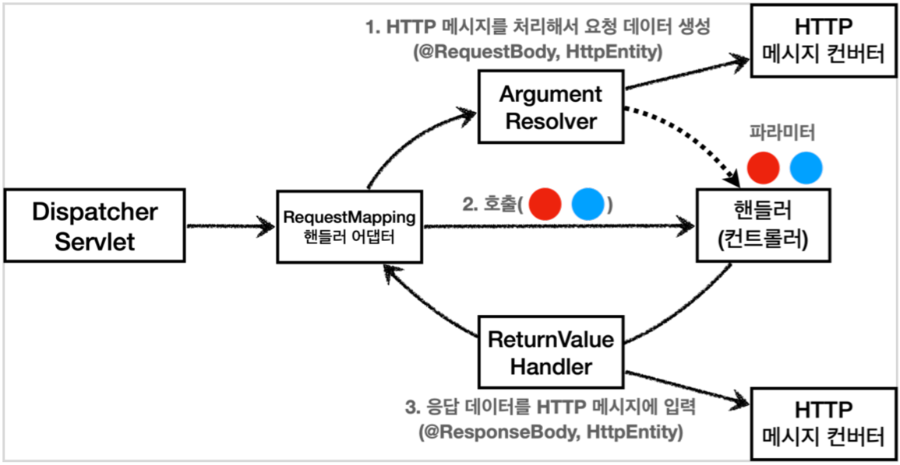

# 

## 로깅!

### 선언

```java
// 직접 선언
private final Logger log = LoggerFactory.getLogger(getClass());

// 롬복으로 선언
@Slf4j
@RestController
public class LogTestController {
...
```

### 로그레벨 설정

```properties
#전체 로그 레벨 설정(기본 info)
logging.level.root=info

#hello.springmvc 패키지와 그 하위 로그 레벨 설정
logging.level.hello.springmvc=debug
```

```java
// 이렇게 사용하지 말것 - 로그 찍기 전에 먼저 + 연산을 실행해 버린다.(필요 없을때도 늘 실행하는 문제)
log.debug("data="+data)

// 이렇게 사용할 것 - 로그가 필요할 때 메시지를 합친다.
log.debug("data={}", data)
```

### 로그 사용시 장점

- 쓰레드 정보 클래스 이름 같은 부가 정보 출력, 출력 모양 조정
- 로그 레벨에 따라 출력 여부를 조정 가능(개발 서버: debug, 운영: info)
- System.out, 파일, 네트워크 등, 로그를 별도의 위치에 남길 수 있다. 파일을 분할하여 로그 남김.
- 성능도 일반 System.out 보다 좋음(내부 버퍼링, 멀티 쓰레드 등등). 실무에서는 꼭 로그를 사용.

### 참고

- SLF4J - http://www.slf4j.org
- Logback - http://logback.qos.ch
- Spring Boot - https://docs.spring.io/spring-boot/docs/current/reference/html/spring-bootfeatures.html#boot-features-logging

## 요청 매핑

- 특정 파라미터 조건 매핑
- 특정 헤더 조건 매핑
- 미디어 타입 조건 매핑
    - HTTP 요청 Content-Type, consume
        - HTTP 요청의 Content-Type 헤더를 기반으로 미디어 타입으로 매핑
        - 맞지 않으면 HTTP 415 상태코드(Unsupported Media Type)을 반환
    - HTTP 요청 Accept, produce
        - HTTP 요청의 Accept 헤더를 기반으로 미디어 타입으로 매핑
        - 맞지 않으면 HTTP 406 상태코드(Not Acceptable)을 반환

## HTTP 요청 - 기본, 헤더 조회

### MultiValueMap
    - MAP과 유사한데, 하나의 키에 여러 값을 받을 수 있다.
    - HTTP header, HTTP 쿼리 파라미터와 같이 하나의 키에 여러 값을 받을 때 사용한다.
    - 예) keyA=value1&keyA=value2

```java
MultiValueMap<String, String> map = new LinkedMultiValueMap();
map.add("keyA", "value1");
map.add("keyA", "value2");
//[value1,value2]
List<String> values = map.get("keyA");
```

### 참고

- @Controller
    - 파라미터 목록 : https://docs.spring.io/spring-framework/docs/current/reference/html/web.html#mvc-annarguments 
    - 응답 값 목록 : https://docs.spring.io/spring-framework/docs/current/reference/html/web.html#mvc-ann-return-types


## HTTP 요청 파라미터(request parameter)

### GET 의 쿼리 파라메터 전송

```http request
http://localhost:8080/request-param?uesrname=hello&age=20
```

### POST 의 HTML Form 전송

```http request
POST /request-param
Content-Type: application/x-www-form-urlencoded

uesrname=hello&age=20
```

### @RequestParam

- @RequestParam 의 `name(value)` 속성이 파라미터 이름으로 사용
- HTTP 파라미터 이름이 변수 이름과 같으면 `@RequestParam(name="xx")` 생략 가능 (이 방식 추천)
- String , int , Integer 등의 단순 타입이면 @RequestParam 도 *생략 가능*
- 파라메터 필수 여부 (`@RequestParam.required`)
    - 기본값은 true
    - 주의! - 파라미터 이름만 사용 
      - /request-param?username=
      - 파라미터 이름만 있고 값이 없는 경우 빈문자로 통과
    - 주의! - 기본형(primitive)에 null 입력
      - /request-param 요청
      - `@RequestParam(required = false) int age`
- default value
- 파라메터를 Map으로 받기
  - @RequestParam Map ,
    - Map(key=value)
  - @RequestParam MultiValueMap
    - MultiValueMap(key=[value1, value2, ...] ex) (key=userIds, value=[id1, id2])

### @ModelAttribute

- 스프링MVC는 @ModelAttribute 가 있으면 다음을 실행
  - HelloData 객체를 생성
  - 요청 파라미터의 이름으로 HelloData 객체의 프로퍼티를 찾는다. 그리고 해당 프로퍼티의 setter를 호출해서 파라미터의 값을 입력(바인딩)
  - 예) 파라미터 이름이 username 이면 setUsername() 메서드를 찾아서 호출하면서 값을 입력
- 바인딩 오류: 파라메터에서 type 이 맞지 않으면 `BindException` 이 발생

> 스프링은 해당 생략시 다음과 같은 규칙을 적용한다.
> - String , int , Integer 같은 단순 타입 = @RequestParam
> - 나머지 = @ModelAttribute (argument resolver 로 지정해둔 타입 외)

## HTTP 요청 메시지

요청 파라미터와 다르게, HTTP *메시지 바디*를 통해 데이터가 직접 데이터가 넘어오는 경우는 `@RequestParam` , `@ModelAttribute` 를 사용할 수 없다.

### 단순 텍스트 요청 메시지

- HttpEntity: HTTP header, body 정보를 편리하게 조회
    - 메시지 바디 정보를 직접 조회
    - 요청 파라미터를 조회하는 기능과 관계 없음 @RequestParam X, @ModelAttribute X
- HttpEntity 는 응답에도 사용 가능
    - 메시지 바디 정보 직접 반환
    - 헤더 정보 포함 가능
    - view 조회X
- HttpEntity 상속
    - RequestEntity
        - HttpMethod, url 정보가 추가, 요청에서 사용
    - ResponseEntity 
        - HTTP 상태 코드 설정 가능, 응답에서 사용 
        - return new ResponseEntity<String>("Hello World", responseHeaders, HttpStatus.CREATED)

### 요청 파라메터 vs 메지시 바디

| 요청 파라메터                      | 메지시 바디     |     
|--------------------------------|--------------|
| @RequestParam @ModelAttribute | @RequestBody |

### @ResponseBody

- 응답결과를 HTTP 메시지 바디에 직접 담아서 전달 할 수 있음
- view 를 사용하지 않음

### JSON 요청 메시지

#### *@RequestBody* 객체 파라메터

- 직접 만든 객체를 지정할 수 있다.
- `HttpEntity` , `@RequestBody` 를 사용하면 HTTP 메시지 컨버터가 HTTP 메시지 바디의 내용을 우리가 원하는 문자나 객체 등으로 변환해준다.
- HTTP 메시지 컨버터는 문자 뿐만 아니라 JSON도 객체로 변환해주는데, 우리가 방금 V2에서 했던 작업을 대신 처리해준다.

> 스프링은 @ModelAttribute , @RequestParam 해당 생략시 다음과 같은 규칙을 적용한다.
> - String , int , Integer 같은 단순 타입 = @RequestParam
> - 나머지 = @ModelAttribute (argument resolver 로 지정해둔 타입 외)

HelloData에 @RequestBody 를 생략하면 @ModelAttribute 가 적용되어버린다.

> `HelloData data` -> `@ModelAttribute HelloData data`

따라서 생략하면 HTTP 메시지 바디가 아니라 요청 파라미터를 처리하게 된다.

> ### 주의
> 
> HTTP 요청시에 content-type이 application/json 이어야 JSON을 처리할 수 있는 HTTP 메시지 컨버터가 실행된다.

#### 바디 메시지 처리 과정

- @RequestBody 요청
  - JSON 요청 -> HTTP 메시지 컨버터 -> 객체 
- @ResponseBody 응답
  - 객체 -> HTTP 메시지 컨버터 -> JSON 응답

## HTTP 응답

### 응답 데이터 종류

- 정적 리소스(HTML, css, js 파일)
- 뷰 텝플릿 사용(동적 HTML - 서버사이드 렌더링)
- HTTP 메시지 사용(HTTP API)

### 정적 리소스

- 프로젝트의 아래 디렉토리의 정적 리소스 제공
  - `/resources`
  - `/static`
  - `/public`
  - `/META-INF/resources`

- 경로
    - 실 경로: resources/static/basic/hello-form.html
    - URL 경로: http://localhost:8080/basic/hello-form.html

### 뷰 템플릿

- 기본 경로: `src/main/resources/templates`
- dev.leonkim.springmvcplayground.basic.response.ResponseViewController 예제 확인
- thymeleaf
    - 기본 설정
        - spring.thymeleaf.prefix=classpath:/templates/
        - spring.thymeleaf.suffix=.html
    - 참고 : https://docs.spring.io/spring-boot/docs/2.4.3/reference/html/appendix-applicationproperties.html#common-application-properties-templating
    
### HTTP API - 메시지 바디에 직접 입력

- HTML(X), 데이터(주로 JSON)를 담는경우
- @RestController =  @Controller + 컨트롤러에 모두 @ResponseBody 가 적용.
- dev.leonkim.springmvcplayground.basic.response.ResponseBodyController 예제 확인

## HTTP 메시지 컨버터

- 인터페이스: org.springframework.http.converter.HttpMessageConverter
- 응답은 HTTP `Accept 헤더` 와 `컨트롤러 반환 타입` 등을 조합해서 HttpMessageConverter 를 선택함

### HTTP 메시지 컨버터 적용 대상

| 요청                            | 응답           |     
|--------------------------------|--------------|
| `@RequestBody` `HttpEntity(RequestEntity)` | `@ResponseBody` `HttpEntity(ResponseEntity)` |

### 스프링 부트 기본 메시지 컨버터

| 순위 | 이름         | 클래스 타입 | 미디어 타입 | 요청 예 | 응답 예|    
|---|--------------|----------|---------|--------|-----|
| 0 | ByteArrayHttpMessageConverter             | byte[]   | */* |`@RequestBody byte[] data`|`@ResponseBody return byte[]`|
| 1 | StringHttpMessageConverter                | String   | */* |`@RequestBody String data`|`@ResponseBody return "ok"`|
| 2 | MappingJackson2HttpMessageConverter       | HashMap or 객체 | application/json |`@RequestBody HelloData data`|`@ResponseBody return helloData`|

### HTTP 요청 데이터 읽기 과정

1. HTTP 요청이 오고, 컨트롤러에서 @RequestBody , HttpEntity 파라미터를 사용한다.
2. 메시지 컨버터가 메시지를 읽을 수 있는지 확인하기 위해 canRead() 를 호출한다.
   1. 대상 클래스 타입을 지원하는가.
       1. 예) @RequestBody 의 대상 클래스 ( byte[] , String , HelloData )
   2. HTTP 요청의 Content-Type 미디어 타입을 지원하는가.
       1. 예) text/plain , application/json , */*
3. canRead() 조건을 만족하면 read() 를 호출해서 객체 생성하고, 반환한다.

### HTTP 응답 데이터 생성 과정

1. 컨트롤러에서 @ResponseBody , HttpEntity 로 값이 반환된다.
2. 메시지 컨버터가 메시지를 쓸 수 있는지 확인하기 위해 canWrite() 를 호출한다.
    1. 대상 클래스 타입을 지원하는가.
        1. 예) return의 대상 클래스 ( byte[] , String , HelloData )
    2. HTTP 요청의 Accept 미디어 타입을 지원하는가.(더 정확히는 @RequestMapping 의 produces )
        1. 예) text/plain , application/json , */*
3. canWrite() 조건을 만족하면 write() 를 호출해서 HTTP 응답 메시지 바디에 데이터를 생성한다.

## RequestMappingHandlerAdepter 구조

- @RequestMapping 달린 핸들러들의 모든 메시지 컨버팅은 RequestMappingHandlerAdepter 에서 이루어진다.



### ArgumentResolver

- 컨트롤러(핸들러)가 필요로 하는 다양한 파라미터의 값(객체)을 생성한다.
- 파리미터의 값이 모두 준비되면 컨트롤러를 호출하면서 값을 넘겨준다.
- `org.springframework.web.method.support.HandlerMethodArgumentResolver`
- 참고 : https://docs.spring.io/spring-framework/docs/current/reference/html/web.html#mvc-annarguments

### ReturnValueHandler

- `ArgumentResolver`와 비슷, 응답 값을 변환하고 처리한다
- `org.springframework.web.method.support.HandlerMethodReturnValueHandler`
- 참고 : https://docs.spring.io/spring-framework/docs/current/reference/html/web.html#mvc-annreturn-types

### HttpMessageConverter

- `ArgumentResolver` 와 `ReturnValueHandler` 가 사용
- HTTP 요청
    - `@RequestBody` 혹은 `HttpEntity` 담당 `ArgumentResolver`
    - 위의 친구들이 메시지 컨버터를 호출해 필요 객체를 생성
- HTTP 응답
    - `@ResponseBody` 혹은 `HttpEntity` 담당 `ReturnValueHandler`
    - 위의 친구들이 메시지 컨버터를 호출해 HTTP 응답 결과를 생성 
- `@RequestBody` `@ResponseBody` 의 컨버팅은 `RequestResponseBodyMethodProcessor`
- `HttpEntity`의 컨버팅은 `HttpEntityMethodProcessor` 이다.

### 스프링 MVC 확장

- 기능 확장은 `WebMvcConfigurer` 를 상속 받아서 스프링 빈으로 등록하면 된다.
- 인터페이스 
    - HandlerMethodArgumentResolver
    - HandlerMethodReturnValueHandler
    - HttpMessageConverter
