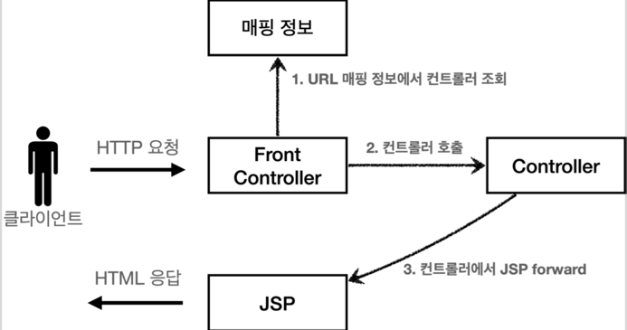
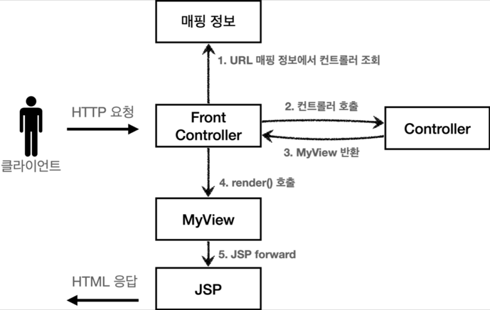
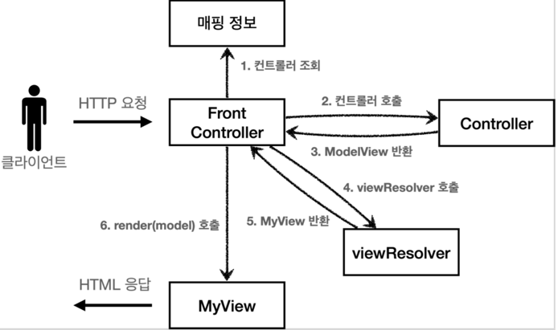
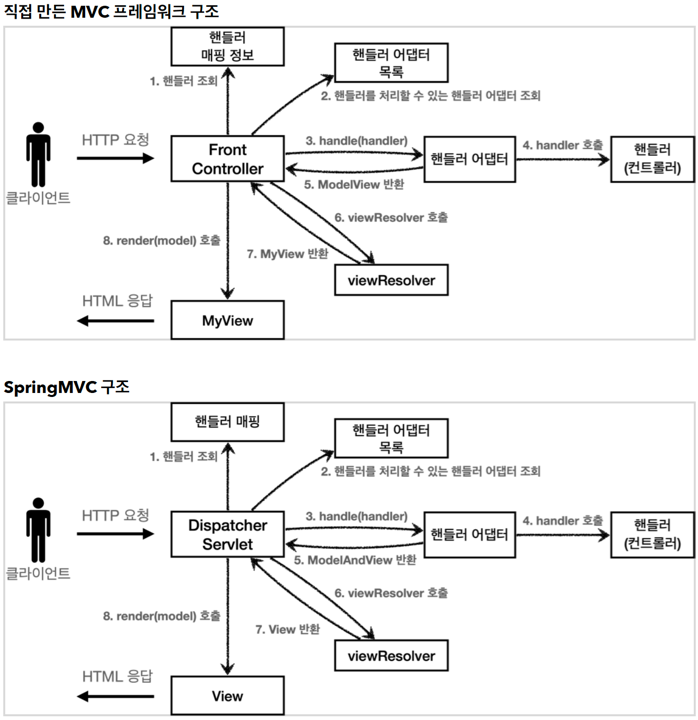
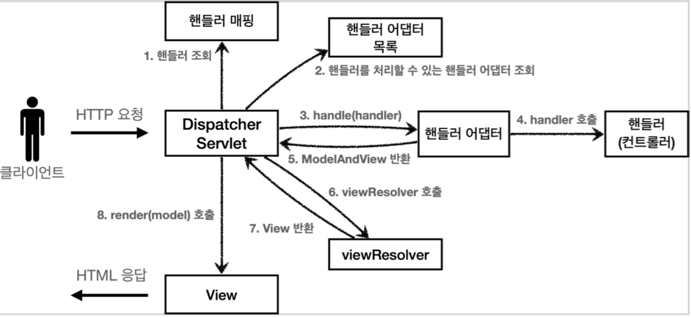

# 스프링 MVC : 백엔드 웹 개발 핵심 기술

아래 강의 실습 프로젝트이다.
https://www.inflearn.com/course/%EC%8A%A4%ED%94%84%EB%A7%81-mvc-1

본 프로젝트는 servlet -> JSP -> MVC 패턴 -> Spring MVC 로 점진적으로 변화하는 코드를 포함하고 있다.

스프링 MVC 의 전체 흐름을 이해하기 위해 반드시 필요한 내용이다.

## Servlet

### HTTP 요청 데이터

1. GET - 쿼리 파라메터
    - /url?username=hello&age=20
    - 메시지 바디 X, URL 쿼리 파라메터에 데이터 포함
    - 예) 검색, 필터, 페이징 등

2. POST HTML Form 전송 방식
    - content-type:application/x-www-form-urlencoded
    - 메시지 바디에 쿼리 파라메터 형식으로 요청

3. HTTP message body 에 데이터 직접 담음
    - HTTP API 사용. JSON, XML, TEXT
    - 주로 JSON
    - POST, PUT, PATCH

### HTTP 응답

- HTTP 응답 코드 지정
- 헤더 생성
- 바디 생성
- 편의 기능 제공
   - Content-type
   - Cookie
   - Redirect

### HTTP 응답 데이터

1. 단순 텍스트
2. HTML 응답
3. HTTP API - MessageBody에 JSON 응답

## MVC 프레임워크 만들기

- v1: 프론트 컨트롤러 도입
    - 기존 구조를 최대한 유지하면서 프론트 컨트롤러 도입
      
- v2: View 분류
    - 단순 반복 뷰 로직 분리
      
- v3: Model 추가
    - 서블릿 종속성 제거
    - 뷰 이름 중복 제거 
    - 프레임워크나 공통 기능이 수고로워야 사용하는 개발자가 편리해진다.
      
- v4: 단순하고 실용적인 컨트롤러
    - v3와 비슷
    - 구현 입장에서 ModelView를 직접 생성해서 반환하지 않도록 편리한 인터페이스 제공
      
- v5: 유연한 컨트롤러
    - 어댑터 도입
    - 어댑터를 추가해서 프레임워크를 유연하고 확장성 있게 설계
      

여기에 에노테이션 스타일로 컨트롤러를 만들려면 에노테이션 어뎁터를 추가하면 된다.

## 스프링 MVC - 구조 이해

### 스프링 MVC 전체 구조

- 구조는 거의 유사하다.

| my MVC            | Spring MVC        |
|-------------------|-------------------|
| FrontController   | DispatcherServlet |
| handlerMappingMap | HandlerMapping    |
| MyHandlerAdapter  | HandlerAdapter    | 
| ModelView         | ModelAndView      | 
| viewResolver      | ViewResolver      | 
| MyView            | View              | 

### DispatcherServlet 구조 살펴보기

- 프론트 컨트롤러 패턴구현
- 프론트 컨트롤러 = DispatcherServlet
- `FrameworkServlet` -> `HttpServletBean` -> `HttpServlet` 을 상속받고 있음
- 스프링 부트는 DispatcherServlet 을 서블릿으로 자동 등록. 모든 경로(urlPattern="/")로 매핑함

#### 요청 흐름

1. `HttpServlet.service()` 호출
2. `FrameworkServlet` 이 `service()`를 오버라이드 해둠
3. `FrameworkServlet.service()` -> `DispatcherServlet.doDispatch()` 가 호출

#### 동작 순서

1. `핸들러 조회`: 핸들러 매핑을 통해 요청 URL에 매핑된 핸들러(컨트롤러)를 조회한다.
2. `핸들러 어댑터 조회`: 핸들러를 실행할 수 있는 핸들러 어댑터를 조회한다.
3. `핸들러 어댑터 실행`: 핸들러 어댑터를 실행한다.
4. `핸들러 실행`: 핸들러 어댑터가 실제 핸들러를 실행한다.
5. `ModelAndView 반환`: 핸들러 어댑터는 핸들러가 반환하는 정보를 ModelAndView로 변환해서
   반환한다.
6. `viewResolver 호출`: 뷰 리졸버를 찾고 실행한다.
   JSP의 경우: InternalResourceViewResolver 가 자동 등록되고, 사용된다.
7. `View 반환`: 뷰 리졸버는 뷰의 논리 이름을 물리 이름으로 바꾸고, 렌더링 역할을 담당하는 뷰 객체를
   반환한다. JSP의 경우 InternalResourceView(JstlView) 를 반환하는데, 내부에 forward() 로직이 있다.
8. `뷰 렌더링`: 뷰를 통해서 뷰를 렌더링 한다.

#### 정리

- 직접 기능 확장할 경우는 거의 없다. -> 먼저 개발된 것이 있는지 찾아봐라.
- 이해해야 하는 이유는 이슈 파악과 해결을 위해서다.
- 커스텀하게 확장하는 포인트는 있다.

### 핸들러 매핑과 핸들러 어댑터

- *HandlerMapping*(핸들러 매핑)
    - 핸들러 매핑에서 이 컨트롤러를 찾을 수 있어야 한다.
    - 예) 스프링 빈의 이름으로 핸들러를 찾을 수 있는 핸들러 매핑이 필요하다.
- *HandlerAdapter*(핸들러 어댑터)
    - 핸들러 매핑을 통해서 찾은 핸들러를 실행할 수 있는 핸들러 어댑터가 필요하다.
    - 예) Controller 인터페이스를 실행할 수 있는 핸들러 어댑터를 찾고 실행해야 한다.

#### 우선순위

- *HandlerMapping*
    - 0 = RequestMappingHandlerMapping : 애노테이션 기반의 컨트롤러인 @RequestMapping에서 사용
    - 1 = BeanNameUrlHandlerMapping : 스프링 빈의 이름으로 핸들러를 찾는다.
    - ...
- *HandlerAdapter*
    - 0 = RequestMappingHandlerAdapter : 애노테이션 기반의 컨트롤러인 @RequestMapping에서 사용
    - 1 = HttpRequestHandlerAdapter : HttpRequestHandler 처리
    - 2 = SimpleControllerHandlerAdapter : Controller 인터페이스(애노테이션X, 과거에 사용) 처리
    - ...

#### @RequestMapping

- 가장 우선순위가 높은 핸들러 매핑과 핸들러 어뎁터는 `RequestMappingHandlerMapping`, `RequestMappingHandlerAdapter`
- 현재 어노테이션 기반의 컨트롤러가 이 기반이다.(99% 사용)

### 뷰 리졸버

#### InternalResourceViewResolver

- 스프링 부트는 InternalResourceViewResolver 라는 뷰 리졸버를 자동으로 등록 
- application.properties 에 등록한 `spring.mvc.view.prefix`, `spring.mvc.view.suffix` 설정 정보를 사용해서 등록

#### 스프링 부트가 자동 등록하는 뷰 리졸버

1. BeanNameViewResolver : 빈 이름으로 뷰를 찾아서 반환한다.
2. InternalResourceViewResolver : JSP를 처리할 수 있는 뷰를 반환한다.
    - 내부애서 자원을 찾을때

## 스프링 MVC

### @RequestMapping

- annotation 을 활용하여, 유연하고 실용적으로 바뀜
- `@RequestMapping` - 에노테이션 기반 컨트롤러
    - 핸들러 매핑 - *RequestMappingHandlerMapping*
    - 핸들러 어뎁터 - *RequestMappingHandlerAdapter*
    - 요청 정보를 매핑. 해당 URL이 호출되면 메서드가 호출됨
- `@Controller`
    - 스프링이 자동으로 스프링 빈 등록
    - 스프링 MVC 에서 애노테이션 기반 컨트롤러로 인식함
- `ModelAndView` - 모델과 뷰 정보를 담아서 반환

### 스프링 MVC 실용적인 방식

- Model 파라미터 
- viewName 직접 반환
- @RequestParam 사용
- @RequestMapping -> @GetMapping, @PostMapping
