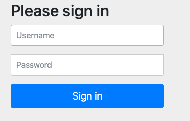
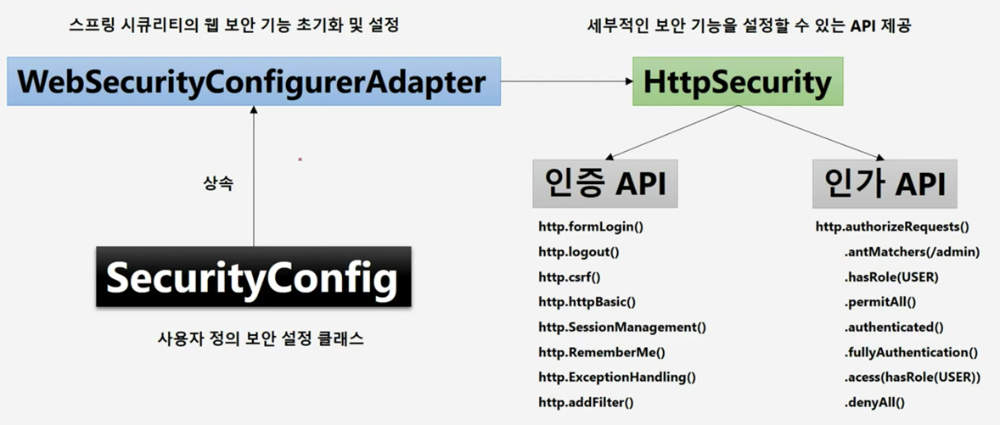
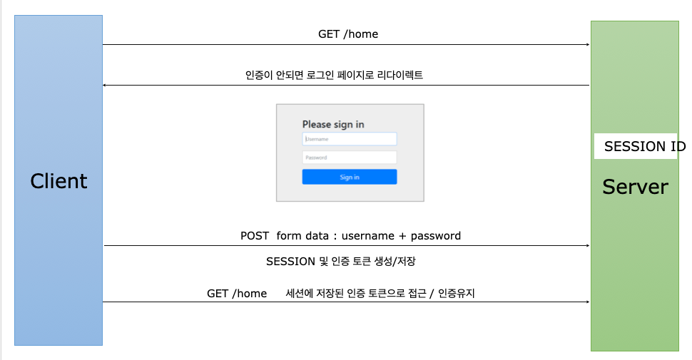

# 스프링 시큐리티

## 스프링 시큐리티 기본 API 및 Filter 이해

### 스프링 시큐리티 의존성 추가

- 스프링 시큐리티 의존성 추가시 일어나는 일들
  - 서버 기동하면 스프링 시큐리티 초기화 작업 및 보안 설정이 이루어짐
  - 별도 구현없이 기본적인 웹 보안 기능이 세팅되어 작동함
    - 모든 요청은 인증이 되어야 자원에 접근 가능해짐
    - 인증 방식은 폼 로그인 방식과 httpBasic 로그인 방식을 제공
    - 기본 로그인 페이지 제공
    - 기본 계정 1개 제공 - username: user / password : 랜덤
    - 

- 문제점
  - 기능의 부족 : 계정 추가, 권한 추가, DB 연동
  - 더 세부적이고 추가적인 보안 기능 필요

### 사용자 정의 보안 기능 구현



- WebSecurityConfigurerAdapter 를 통해 초기화를 진행한다.
- 핵심은 HttpSecurity
  - http 객체의 설정에 따라 인증 인가 기능이 동작한다.
  - 예제
```java
    @Override
    protected void configure(HttpSecurity http) throws Exception {
        http
            .authorizeRequests()
            .anyRequest().authenticated()
        .and()
            .formLogin();
    }
```

- 프로퍼티 설정도 가능

```properties
spring.security.user.name=user
spring.security.user.password=1111
```

### Form Login 인증



- Form Login API 설명

```java
protected void configure(HttpSecurity http) throws Exception {
    http.formLogin()
      .loginPage("/login.html")   		// 사용자 정의 로그인 페이지
      .defaultSuccessUrl("/home")		// 로그인 성공 후 이동 페이지
      .failureUrl("/login.html?error=true")	// 로그인 실패 후 이동 페이지
      .usernameParameter("username")		// 아이디 파라미터명 설정
      .passwordParameter("password")		// 패스워드 파라미터명 설정
      .loginProcessingUrl("/login")             // 로그인 Form Action Url
      .successHandler(loginSuccessHandler())    // 로그인 성공 후 핸들러
      .failureHandler(loginFailureHandler())    // 로그인 실패 후 핸들러
}
```
